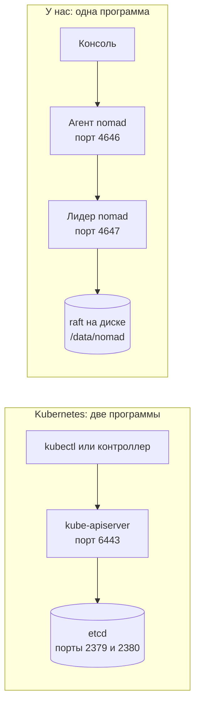
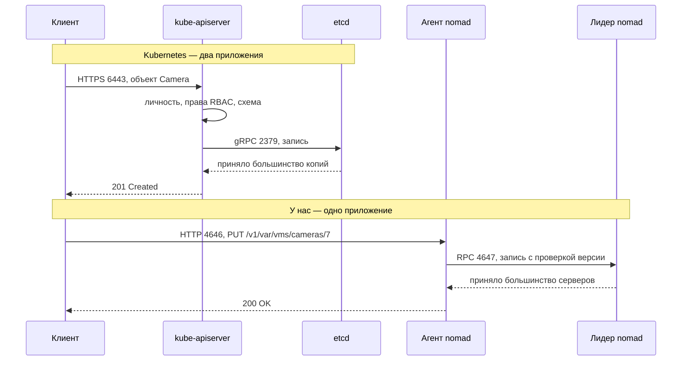

# Что будет вместо Nomad Variables, если нас поставят в Kubernetes

> [!note] Записки поверх репозитория, а не его документация
> Это прикидка, а не описание: чего стоило бы перенести проект в Kubernetes. Разбирается то, чего в репозитории нет и, возможно, не будет.
> **Источник истины — код.** Всё, что здесь про Kubernetes, ничем в проекте не подкреплено.
> Проект описывает себя сам: [`README.md`](../README.md) и указатели модулей.
> Состояние: коммит `4099cd5`, 23 сентября 2026.

[← все записки](README.md)


Вопрос возникает не на пустом месте. Проект с самого начала считает оркестратор (систему, которая запускает процессы на машинах) выбором на установке, а не частью архитектуры — об этом [урок 3](../М10A_Platform/03-RegisterScheme.md). Процесс открывает там хранилище настроек по URL, бэкенд регистрирует себя сам, а версию записи урок объявляет непрозрачной именно потому, что у Kubernetes она строка.

Но бэкенда Kubernetes **не существует**, и урок 3 говорит это прямым текстом. Есть шов, нейтральные имена и набор тестов, который примет новую реализацию. Этот документ отвечает на вопрос, что конкретно окажется под швом, чего мы при переезде добьёмся, а чего не добьёмся.

Читать вместе с двумя соседними записками: [«Куда попадает настройка камеры»](./where-camera-settings-go.md) — откуда взялись номера вопросов, на которые я ссылаюсь, и [«На чьей архитектуре мы стоим»](./whose-architecture.md) — почему совпадение с Kubernetes вообще обсуждается.

## Класс системы

Речь дальше идёт только про плоскость управления, и это **платформенная система**: консоль и контроллер распоряжаются ресурсами для других, решая, какая камера достанется какому воркеру. Отсюда и требования, по которым мы сравниваем хранилища: состояние кластера читается линеаризуемо, а фактическое состояние сводится к желаемому циклом согласования.

Плоскости данных — захвата видео и записи архива — переезд не касается вовсе. Поток от камеры не проходит ни через Nomad Variables, ни через etcd, поэтому смена оркестратора на него не влияет.

## Короткий ответ, если читать некогда

1. **Аналога Variables в Kubernetes нет, и это главное.** Хранилище там — etcd, но к нему не ходят: между нами и etcd всегда стоит API-сервер, а настройки живут не ключами, а объектами со схемой.
2. **Обратное тоже верно: API-сервера нет у нас.** Его занятия разъехались по трём местам — часть делает Nomad, часть наша консоль, а журнал обращений и рассылку изменений не делает никто. Разбор перед частью 1, и читать его стоит первым.
3. **Строка камеры станет собственным типом объекта** (CRD), а не записью в ConfigMap. Причина в правах: наши ACL нарезаны по префиксам ключей, а права в Kubernetes нарезаны по типам объектов, поэтому префикс обязан стать типом.
4. **Лимит вырастет с 64 KiB до ~1 МиБ, но самый срочный дефект мы уже починили сами.** Снапшот больше не единый объект: его нарезали по воркерам, и он растёт вместе с кластером, а не упирается в потолок на 270 камерах. Так что от Kubernetes мы получаем запас, а не спасение.
5. **Переезд сам по себе не лечит ни один вопрос про производительность.** В нашем контракте есть только `get`, `put` и `list`, а `list` возвращает одни пути без версий. Значит `watch` (поток изменений) и диффы останутся недоступны, пока мы не расширим сам контракт.
6. **Два пункта контракта из шести придётся переделывать**: права по префиксам и написание ключа. Слеш в имени объекта Kubernetes запрещён, а права по префиксам он выражать не умеет вовсе.
7. **Единицы развёртывания переписываются целиком**, и это заложено в дизайн: 357 строк в семи jobspec'ах и 107 строк в шести ACL-политиках превращаются в манифесты. Цикл согласования при этом не меняется — на этом и стоит шов.


## Словарь

Термины идут в том порядке, в котором понадобятся.


| Термин            | Что это                                                                                                  |
| ----------------- | -------------------------------------------------------------------------------------------------------- |
| **etcd**          | консенсусное хранилище «ключ-значение» под Kubernetes; та же роль, что у raft под Nomad Variables        |
| **API-сервер**    | единственный процесс, который ходит в etcd; все остальные говорят только с ним                           |
| **объект**        | единица хранения в Kubernetes: у неё есть тип, имя, `spec` (желаемое) и `status` (наблюдённое)           |
| **ConfigMap**     | объект-мешок: набор пар «имя → текст», без схемы и без типов полей                                       |
| **CRD**           | описание собственного типа объекта со схемой; после него `Camera` — такой же полноправный тип, как `Pod` |
| **RBAC**          | права в Kubernetes: кто какими действиями может трогать какой тип объектов                               |
| `resourceVersion` | версия объекта, строка; наш аналог `ModifyIndex`, используется для тех же атомарных правок               |
| `watch`           | подписка на изменения: API-сервер сам присылает события, опрашивать не нужно                             |
| `Lease`           | штатный тип объекта для аренды с истечением; ровно то, чем у нас является слот                           |
| **StatefulSet**   | способ запуска, при котором у каждого экземпляра устойчивый номер; ближайший родственник наших слотов    |


Ещё семь слов документ берёт из нашей части, и их стоит держать рядом:


| Термин        | Что это                                                                                                            |
| ------------- | ------------------------------------------------------------------------------------------------------------------ |
| **CAS**       | правка с проверкой версии: «запиши, только если версия всё ещё такая». При несовпадении хранилище отвечает отказом |
| **raft**      | алгоритм, которым копии хранилища договариваются о записи. Запись принята, когда согласилось большинство           |
| **jobspec**   | файл, которым мы описываем Nomad, что и где запускать                                                              |
| **слот**      | устойчивое имя воркера (`w-1`, `w-2`); вместе с именем воркер получает список своих камер                          |
| **heartbeat** | отчёт воркера о себе раз в десять секунд: какие камеры держит и в каком они состоянии                              |
| **снапшот**   | копия камер кластера и их размещения, которую контроллер пишет для домена: объект на каждого воркера                |
| **информер**  | у клиентов Kubernetes — копия объектов в памяти, которую `watch` держит свежей                                     |


---


## Сразу про API-сервер: у нас его нет

Термин дальше встречается на каждой странице, поэтому разберём его первым. **API-сервер — это процесс Kubernetes, а не наш.** У нас ему не соответствует ничего целиком, и в этом главная разница между двумя системами.

### Физически это две чужие программы

Начнём с того, что это буквально такое, потому что из слова «API-сервер» этого не видно.

`kube-apiserver` **— отдельный исполняемый файл из самого проекта Kubernetes** (репозиторий `kubernetes/kubernetes`, каталог `cmd/kube-apiserver`), на Go, те же авторы, что у kubelet и планировщика. Он слушает HTTPS на порту 6443 и работает на управляющих узлах кластера. При установке через `kubeadm` его поднимает kubelet из файла `/etc/kubernetes/manifests/kube-apiserver.yaml`, то есть на машине видно и процесс, и контейнер. Копий обычно три, за балансировщиком, и состояния они не держат — любая отвечает на любой запрос.

`etcd` **— другое приложение и другой проект** (`etcd-io`), который вне Kubernetes тоже применяют. Свой исполняемый файл, свой контейнер, порт 2379 для клиентов и 2380 для обмена между копиями. Копий тоже обычно три, и между ними raft — та же механика, что у Nomad.

**В etcd физически пишет только** `kube-apiserver`, и держится это не на договорённости. Он единственный, у кого есть сертификат клиента etcd — в установке через `kubeadm` это файл `/etc/kubernetes/pki/apiserver-etcd-client.crt`. Планировщик, менеджер контроллеров, kubelet и `kubectl` адреса etcd не знают и сертификата не имеют.

Вот вся цепочка одной записи: `kubectl` открывает HTTPS на 6443 → `kube-apiserver` проверяет сертификат клиента, потом права RBAC, потом объект по схеме → открывает gRPC на 2379 → лидер etcd проводит запись через raft по трём копиям → ответ идёт обратно тем же путём.

Обе цепочки рядом. Все стрелки — синхронные вызовы, событий здесь нет ни одного:




### Сценарий: одна правка настройки доходит до диска




### У нас обе работы делает один бинарник

`nomad` **— одно приложение HashiCorp, по процессу на машину, и оно совмещает дверь и хранилище.** Более того, на наших трёх машинах он запущен в двух режимах сразу, и в конфигурации так и сказано:

```1:2:М11_ClusterVMS/clustervms/deploy/client.hcl
# reference/client.hcl — Lesson 1: a Nomad client on an appliance server.
# Servers get server.hcl; on the bench the same three boxes run both.
```

Наша цепочка записи короче на одно приложение. Контейнер консоли работает с `network_mode = "host"`, поэтому стучится на `127.0.0.1:4646` — это HTTP API локального агента Nomad на той же машине. Агент проверяет токен задачи против ACL-политики и передаёт запрос по порту 4647 лидеру среди трёх серверов Nomad. Лидер проводит запись через raft, и журнал ложится на диск в `/data/nomad`.


|                     | Kubernetes                                                            | У нас                             |
| ------------------- | --------------------------------------------------------------------- | --------------------------------- |
| дверь к хранилищу   | `kube-apiserver`, порт 6443                                           | `nomad`, порт 4646                |
| само хранилище      | `etcd`, порты 2379 и 2380 — **другая программа**                      | raft **внутри того же** `nomad`   |
| кто физически пишет | только `kube-apiserver`                                               | только лидер среди серверов Nomad |
| что надо поставить  | `kube-apiserver`, `etcd`, планировщик, менеджер контроллеров, kubelet | один `nomad`                      |


Последняя строка — та самая цена, о которой говорит часть 5 записки про архитектуру. Переезд в Kubernetes добавляет в установку два новых приложения со своими сертификатами, обновлениями и резервным копированием. На площадке из двадцати камер это заметно, потому что Nomad отдаёт дверь и хранилище одним процессом, который мы и так запускаем ради контейнеров.

### Что этот процесс делает, и кто делает это у нас

В Kubernetes `kube-apiserver` — единственная дверь к хранилищу. Все остальные — планировщик, kubelet на каждой машине, контроллеры, `kubectl`, любая панель — говорят только с ним. Поэтому он совмещает восемь занятий: проверяет личность, проверяет права, проверяет объект по схеме, подставляет значения по умолчанию, пишет в etcd, ведёт журнал обращений, держит свежую копию объектов в памяти и рассылает подписчикам изменения.

У нас эти занятия разъехались по трём местам, и третье — пустое.


| Занятие API-сервера                               | Кто делает у нас                                                   |
| ------------------------------------------------- | ------------------------------------------------------------------ |
| единственная дверь к хранилищу                    | HTTP API агента Nomad, порт 4646, пути `/v1/var/...`               |
| проверка личности и прав                          | тот же Nomad: токен задачи против ACL-политики по префиксам ключей |
| атомарная правка по версии                        | тот же Nomad: параметр `cas`                                       |
| проверка полей по схеме                           | **наша консоль**, метод `refuse`                                   |
| значения по умолчанию, производные строки, номера | **наша консоль**                                                   |
| защита от повторной отправки                      | **наша консоль**, ключи `vms/idem/*`                               |
| журнал обращений                                  | **никто**                                                          |
| копия объектов в памяти и рассылка изменений      | **никто**                                                          |


Отсюда два вывода, которые стоит держать в голове при чтении остального.

**Наша консоль — это не API-сервер, а клиент.** По роли она ближе к `kubectl` вместе с веб-панелью: принимает запрос от оператора, проверяет поля, переводит в запись и отправляет в Nomad. Экземпляров у неё столько же, сколько серверов (`system`-job), и любой из них равноправен — потому что состояния она не держит.

**Проверка схемы у нас стоит рядом с дверью, а не в двери.** Nomad про камеры ничего не знает и примет любую строку, лишь бы токен разрешал префикс. То есть правильность настроек держится на том, что писать в `vms/cameras/*` умеет только консоль, а не на том, что хранилище отвергло бы неверное поле. В Kubernetes так не бывает: пути к etcd, минующего проверку, не существует вовсе.

Когда ниже написано «API-сервер сделает это за нас», читать надо так: занятие переедет из нашей консоли или из пустой клетки — в чужой процесс, который мы не пишем и не обслуживаем.

---


## Часть 1 — Ключей нет, есть объекты

Первое, что ломает привычку: в Kubernetes нельзя написать «положи вот это по такому пути». Класть можно только объект известного типа, и API-сервер проверит его по схеме, прежде чем допустить до etcd. Поэтому вопрос «что вместо Variables» распадается на три разных ответа, и выбрать надо один.

**Ходить в etcd напрямую — нельзя, и не потому что запрещено.** Технически etcd — обычный KV с CAS, и наш `FileVariables` лёг бы на него почти без правок. Но тогда мы теряем ровно то, за чем в Kubernetes идут: права, схему, `watch`, аудит. Вдобавок доступ к etcd в кластере обычно закрыт наглухо, и просить его у администратора — то же самое, что просить пароль от базы данных вместо доступа к приложению.

**Складывать строки в ConfigMap — можно, и это быстрый путь.** Один ConfigMap на камеру, поля внутри — те же пары «имя → значение», что и `Items` у Variables. CAS работает штатно: мы отдаём `resourceVersion`, и API-сервер отвечает отказом при несовпадении. Такой адаптер мы напишем за день.

Но у быстрого пути есть цена, и она в правах. ConfigMap — один тип объекта, а права в Kubernetes выдаются на тип. Значит токен консоли, которому разрешено писать ConfigMap'ы, сможет писать и размещение, и слоты — то есть разделение, на котором стоит вся наша дисциплина одного писателя, растворяется. Обойти это можно пространствами имён (`vms-rows` против `vms-placement`), но это уже не «один ConfigMap на ключ», а проектирование.

**Заводить свои типы объектов — правильный путь, и он совпадает с нашей спекой.** В спеке уже есть описание полей с типами, и API-сервер умеет проверять ровно такое описание. То есть блок `fields:` из `vms.subsystem.yaml` становится схемой CRD, `refuse` при неверном поле переезжает из нашего кода в API-сервер, а права нарезаются по типам — `Camera` консоли, `Placement` контроллеру.

Дальше в документе я считаю выбранным третий путь, потому что он единственный сохраняет нашу нарезку прав без изобретений.

---


## Часть 2 — Куда переедет каждый наш ключ

Ключей в нашем хранилище немного, и у каждого в Kubernetes есть естественный адресат.


| Наш ключ                    | В Kubernetes                                    | Почему так                                                              |
| --------------------------- | ----------------------------------------------- | ----------------------------------------------------------------------- |
| `vms/cameras/<id>`          | объект `Camera`, поля в `spec`                  | это настройки со схемой, и схему проверяет API-сервер                   |
| `vms/placement/<id>`        | `status` того же объекта `Camera`               | у `status` отдельные права, поэтому консоль не сможет писать размещение |
| `vms/workers/<w>`           | объект `Assignment`, по одному на воркера       | пишет только контроллер, читают все — та же нарезка, что сейчас         |
| `vms/slots/<n>`             | `Lease` из `coordination.k8s.io`                | штатный тип с истечением; изобретать аренду не нужно                    |
| `vms/epoch/<id>`            | поле в `status` камеры либо отдельный `Lease`   | эпоха — наше число, её порядок мы задаём сами                           |
| `vms/next_id`               | `ConfigMap` со счётчиком                        | мешок из одного поля, схема тут не нужна                                |
| `vms/idem/<key>`            | `ConfigMap` на ключ                             | то же самое, плюс вопрос с уборкой (см. часть 6)                        |
| `vms/retention/<id>`        | объект `Retention` либо поле производной строки | у нас это производная строка, и механизм переносится как есть           |
| `vms/snapshot/<worker>` (объектное хранилище) | `ConfigMap` на воркера        | шард на воркера, одного писателя; форму мы уже привели к этой           |
| `vms/heartbeats/<worker>` (объектное хранилище) | `status` воркера плюс `Lease` | частая запись, и Kubernetes для неё завёл отдельный тип — см. часть 4   |


Обратите внимание на вторую строку. Сейчас размещение живёт отдельным ключом именно потому, что права нарезаны по префиксам:

```370:372:vmsserver/w2cplatform/spec.py
    def acl_controller(self) -> list[str]:
        """Placement: what the controller (count = 1) may write — never a unit's row."""
        return [f"{self.name}/workers/*", f"{self.name}/placement/*", f"{self.name}/slots/*"]
```

В Kubernetes то же разделение выходит изящнее: `spec` и `status` одного объекта — это два разных ресурса с точки зрения прав. Консоль получает право писать `cameras`, контроллер — только `cameras/status`. Разделение остаётся тем же, а ключей становится меньше.

---


## Часть 3 — Выдержит ли шов: прогон по семи пунктам контракта

Самое ценное в уроке 3 — что критерий приёмки исполняемый. Бэкенд годен, когда тринадцать тестов `tests/test_variables_contract.py` зелёные против него, а не когда он выглядит правильно. Пройдём по всем семи пунктам.


| Пункт контракта                                             | Kubernetes          | Что придётся сделать                                            |
| ----------------------------------------------------------- | ------------------- | --------------------------------------------------------------- |
| 1. хранилище отдаёт ненаписанный ключ как `(None, 0)`       | да                  | отобразить `404` в `(None, 0)`, а `cas=0` — в создание объекта  |
| 2. `put` возвращает версию, следующее чтение отдаёт её же   | да                  | вернуть `resourceVersion` как есть                              |
| 3. `cas`: N гонщиков, один победитель, N−1 отказов          | да, штатно          | отобразить `409 Conflict` в наш `Conflict`                      |
| 4. писатель пишет только свои префиксы и **получает отказ** | **нет**             | нарезать права по типам и пространствам имён, а не по префиксам |
| 5. версия непрозрачна                                       | да, и строже нашего | ничего: мы уже соблюдаем                                        |
| 6. у ключа ровно одно написание                             | **нет**             | придумать обратимое отображение пути в имя объекта              |
| 7. чтение отдаёт копию, а не само состояние хранилища       | да, даром           | ничего: клиент разбирает свежий объект на каждый ответ          |


Пять пунктов из семи проходят без работы, и это хорошая новость. Два непроходящих стоит разобрать подробно, потому что оба — не мелочь реализации.

### Пункт 4: права по префиксам выразить нельзя

Наши ACL — это список префиксов, и в нём есть звёздочки:

```355:364:vmsserver/w2cplatform/spec.py
    def acl_console(self) -> list[str]:
        """The operator's rows: what a console (one per server, any of them) may write — never placement."""
        out = [f"{self.name}/{self.rows}/*", f"{self.name}/next_id", f"{self.name}/idem/*",   # idem: a retried POST answered the same by ANY instance
               f"{self.name}/policy",                                                         # the administrator's knobs: servers distinct | shared
               f"{self.name}/sweep",                                                          # what the blob sweep marked, and when
               f"{self.name}/requests/*",                                                     # bounded work an operator asked a worker for, outside its ordinary pass
               DRAIN_KEY]                                                                     # "this machine is about to stop": the operator's, and the same row for every subsystem
        for d in self.derived:
            out.append(f"{self.name}/{d.row.split('/')[0]}/*")
        return out
```

RBAC такого не умеет. Права там выдаются на тип объекта, а если нужно сузить до конкретных объектов, то только перечислением точных имён — шаблонов нет. Причём перечисление имён не действует на листинг, то есть «пусть видит все камеры, но правит только эти» через RBAC не выражается вовсе.

Отсюда правило переезда: **каждый наш префикс обязан стать либо типом объекта, либо пространством имён.** Для камер, размещения, назначений и слотов это получается само и даже чище нынешнего. Для мешков вроде `vms/idem/*` придётся выделить пространство имён, иначе токен консоли получит права на все ConfigMap'ы кластера сразу.

Отдельно стоит сказать, что один старый огрех переезд лечит бесплатно. Сейчас грант `objects/vms/*` покрывает и снапшот, поэтому токен воркера имеет право перезаписать чужой объект — это разобрано в первом документе. При переезде heartbeat и снапшот оказываются объектами разных типов, и право на один физически не даёт права на другой.

### Пункт 6: слеша в имени объекта быть не может

Имя объекта в Kubernetes — это доменное имя по RFC 1123: строчные буквы, цифры, дефис, точка, не длиннее 253 знаков. Ни слеша, ни заглавных букв. То есть `vms/cameras/7` именем быть не может.

Значит нужно отображение пути в имя, и требование к нему жёсткое: **обратимое и однозначное.** Шестой пункт контракта появился в наборе как раз потому, что «два ключа, одно место» — это молчаливая порча данных. Файловый бэкенд решает ту же задачу кодированием слеша, причём с оговоркой, которую легко пропустить: сначала он экранирует сам знак экранирования, иначе отображение перестаёт быть обратимым.

При выборе CRD задача упрощается до неузнаваемости. Первый сегмент пути становится пространством имён, второй — типом, третий — именем: `vms/cameras/7` превращается в камеру `camera-7` в пространстве `vms`. Кодировать нечего, потому что структура пути ровно совпадает со структурой адреса объекта. Это ещё один довод за свои типы против ConfigMap'ов.

---


## Часть 4 — Что мы получаем бесплатно

**Лимит вырастает примерно в двадцать раз.** Объект в Kubernetes ограничен примерно мегабайтом, потому что API-сервер по умолчанию не принимает запросы больше ~1.5 МиБ. У Nomad Variables потолок 64 KiB, то есть запас мы получаем заметный.

Но главное место, где этот потолок резал, мы уже расшили сами, и переезд тут опоздал. Снапшот был единственным объектом в платформе, который рос вместе с числом камер, и на проектных шестистах он в 64 KiB не помещался. Его нарезали по воркерам, и причина записана прямо в коде:

```206:211:vmsserver/w2cplatform/contract.py
    # `<name>/snapshot/<worker>` — one object per worker, the same shape the heartbeat key already has.
    # The snapshot used to be ONE object for the whole cluster, and it was the only place in the platform
    # where data grew in a single object: an object store has a ceiling (Nomad Variables: 64 KiB on the
    # whole object), and 600 cameras — the cluster's own design maximum — did not fit under it. Sharded by
    # the worker that holds the unit, it grows the way the cluster grows: more units means more workers
    # means more objects, each the size of one worker's assignment.
```

Теперь шард — это назначение одного воркера, и он не растёт с размером кластера. Так что мегабайт вместо 64 KiB — это запас на будущее, а не лечение известной болезни. Заодно появилось исключение `TooLarge`, которое называет ключ, размер и предел, так что следующий такой упор система сообщит внятно, а не молча.

**Проверку полей делает API-сервер.** Схема живёт в CRD, поэтому API-сервер отвергает неверный тип или неизвестное поле до записи, всегда и у любого клиента. Сейчас за это отвечает наш `refuse`, и работает он только для тех, кто пришёл через консоль.

**Слот перестаёт быть нашим изобретением.** `Lease` — штатный тип с полями «кто держит» и «когда истекает», и продлевают его те же CAS-правками. Совпадение доходит до чисел: у Kubernetes срок аренды узла 40 секунд при продлении раз в 10, у нас слот живёт 45 секунд.

**Пара «желаемое и наблюдённое» получает штатную поддержку.** Наши `revision` и `observed_revision` — это `metadata.generation` и `status.observedGeneration`, и API-сервер сам увеличивает `generation` при каждой правке `spec`. То есть вопрос 22 («UI не показывает, что настройка подействовала») решается тем, что уже есть в платформе.

**Журнал обращений появляется сам, но закрывает только половину аудита.** API-сервер записывает каждое обращение: какая учётная запись, когда, к какому объекту, с каким результатом. У Nomad такого нет вовсе — встроенный `audit`-блок это фича Enterprise, и на прямой вопрос HashiCorp ответили «в OSS не поддерживается, ставьте reverse proxy». То есть пустую клетку из таблицы выше Kubernetes закрывает даром.

Второй половины это не даёт, и путать их не стоит. Журнал назовёт того, кто обратился к API-серверу, а обращается наша консоль — своей учётной записью, а не именем оператора. Имя человека сейчас приходит в заголовке `X-User` и никем не проверяется, так что в журнале окажется «консоль правила камеру 7», а не «Иванов». Значит запись аудита с именем человека по-прежнему наша работа, и она разобрана в [«Аудит настроек и отчёты»](./settings-audit.md); от Kubernetes мы получаем независимый след «что вообще происходило с хранилищем», которого у нас нет ни в каком виде.

---


## Часть 5 — Чего переезд не даст, хотя все ждут обратного

Здесь главный подвох, и он не в Kubernetes, а в нашем собственном контракте. Вот он целиком:

```81:88:vmsserver/w2cplatform/variables.py
class Variables(Protocol):
    # What one path may weigh: the sum of the lengths of every key and every value in it, which is how
    # Nomad measures a Variable. `NO_CEILING` (0) when the store has none. See `limits.py`.
    max_bytes: int

    def get(self, path: str) -> tuple[dict | None, Index]: ...
    def put(self, path: str, items: dict, cas: Index | None = None) -> Index: ...
    def list(self, prefix: str) -> list[str]: ...
```

Три метода, и в них нет `watch`. Больше того, `list` возвращает `list[str]` — одни пути, без версий. То есть даже под Kubernetes наш код продолжит делать `for p in list(): get(p)`, и контроллер по-прежнему потратит порядка 24 000 чтений за проход на 600 камерах.

Вывод стоит сказать резко, потому что он противоречит интуиции. **Переезд в Kubernetes сам по себе не ускоряет ничего.** Ни вопрос 8 (N+1 при обходе ключей), ни вопрос 9 (кэш в памяти), ни вопрос 10 (опрос раз в 10 секунд) он не закрывает — все три живут выше шва, в нашем цикле.

Чтобы получить обещанное, контракт надо расширять, и порядок работ от оркестратора не зависит:

- `list` **должен возвращать версии, а не только пути.** Тогда процесс обновляет кэш диффом и снимает 99 % фонового чтения. Nomad это позволяет уже сегодня — `ModifyIndex` приходит в ответе на листинг и просто выбрасывается.
- **В контракт нужен `watch` или его эквивалент.** У Kubernetes это подписка, у Nomad — блокирующий запрос; обе умеют «ничего не присылать, пока ничего не менялось». Метод в контракте может быть один, а реализации разные.

Отсюда практический совет по очерёдности: **сначала расширить контракт на Nomad, потом думать про Kubernetes.** Обратный порядок означает переезд, после которого ничего не ускорилось, и разговор «зачем мы это делали».

### Выигрыш приходит, даже если до Kubernetes мы не дойдём

Это главный практический вывод документа, поэтому разберём его с числами. Расширение контракта окупается **на нынешнем Nomad**, без единой строки про Kubernetes. Но выигрыш ложится неровно, и знать заранее, куда именно, важно: одному потребителю он снимает задачу целиком, другому почти ничего.

Считаем для проектных 600 камер и двенадцати воркеров в спокойном кластере, где никто ничего не создаёт и не удаляет.

#### Откуда берутся двадцать с лишним тысяч чтений за проход

Сразу оговорка про точность: все числа ниже — оценки порядка, а не замеры. Точный итог зависит от того, какие ветки прохода отработали, но разброс тут в проценты, а не в разы.

Проход контроллера — это четыре вызова подряд, и дорог каждый. Три из них идут одним блоком, а публикация снапшота вынесена в отдельный, чтобы её отказ не путали с отказом размещения:

```193:195:vmsserver/vms/__main__.py
            ctl.ensure_placed()                       # deleted rows unplaced; new units onto the workers it sees
            ctl.redistribute()                        # units of a RELEASED slot (scale-in) onto the rest
            ctl.ensure_home(1)                        # ONE unit a pass back to the server its row names, if it is back
```

| Вызов | Что делает | Чтений |
|---|---|---|
| `ensure_placed()` | снимает размещение с удалённых и завершённых, потом обходит все строки | ~3 000 |
| `redistribute()` | снова снимает удалённые, опрашивает слоты и ресурсы серверов | ~1 700 |
| `ensure_home(1)` | обходит все шестьсот камер, чтобы вернуть домой максимум одну | ~10 700 |
| `publish_snapshot()` | собирает шарды снапшота по воркерам | ~9 000 |
| **итого** | | **~24 000** |

Самая дорогая строка — `ensure_home`, и это неожиданно. Спека VMS говорит `home: near`, то есть камера живёт рядом со своей записью, и контроллер каждый проход проверяет все шестьсот камер на месте ли они, даже когда бюджет переездов равен одному и переезжать некому.

#### Одна функция, из-за которой дорого всё

Под всеми четырьмя вызовами лежит один и тот же примитив — `workers_seen()`. Он стоит тринадцать чтений: листинг плюс `get` на каждый из двенадцати heartbeat'ов. Состояния он не держит принципиально, и это записано прямо в его докстроке:

```422:429:vmsserver/w2cplatform/contract.py
    def workers_seen(self, max_age: float = 45.0) -> dict[str, Heartbeat]:
        """Which workers exist: those that heartbeat recently. Never a list
        the controller keeps — a fact it reads."""
        out = {}
        now = self.wall()
        # One prefix, no filter: `<name>/heartbeats/` holds heartbeats and nothing else.
        for key in self.objects.list(self.sub.heartbeats_prefix()):
            raw = self.objects.get(key)
```

Беда в том, что зовут его не раз за проход, а на каждую камеру — через `server_of`, который состоит ровно из одного обращения к `workers_seen`:

```499:501:vmsserver/w2cplatform/spec.py
    def server_of(self, worker: str) -> str:
        hb = self.workers_seen(max_age=1e12).get(worker)
        return hb.extra.get("server", "?") if hb else "?"
```

`server_of` стоит в цикле по камерам дважды — в `ensure_home` и в сборке шардов снапшота. Это 1 200 вызовов по тринадцать чтений, то есть **около 15 600 из 24 000**. Ещё сотни набегают на пер-воркерных вызовах внутри `_pool`, `without_resource` и `on_draining`. Получается, что две трети прохода контроллер тратит на перечитывание одних и тех же двенадцати heartbeat'ов.

#### Что снимет кэш по версиям

Кэш по версиям бьёт по строкам камер: вместо 601 чтения на `units()` остаётся один листинг, потому что версии в ответе сразу показывают, что не менялась ни одна. Дальше видно, что выигрыш ложится очень неровно.

**Консоли это закрывает задачу целиком.** Сейчас `GET /cameras` стоит 614 чтений: 601 на `units()` плюс 13 на `read_model()`. После правки — 14, то есть **в сорок четыре раза дешевле**. Пять открытых вкладок, опрашивающих список раз в десять секунд, создают не ~307 чтений в секунду, а семь.

**Контроллеру это даёт мало.** `units()` он зовёт трижды за проход, и ещё дважды перебирает строки внутри снятия размещений — всего около 3 000 чтений из 24 000, то есть **порядка 12 %**. Главная его статья расходов, перечитывание heartbeat'ов, версиями строк не лечится: heartbeat'ы лежат в объектном хранилище, у которого версий нет вовсе.

**Воркеров правка не касается вовсе.** Они не зовут `units()`: каждый читает свои ~50 строк напрямую по путям из назначения. Их ~306 чтений в секунду останутся на месте, пока им не сделают отдельный кэш.

#### Что стоит дешевле и даёт больше

Прежде чем трогать контракт, стоит запомнить `workers_seen()` на время одного прохода. Не «вынести из одного цикла», а именно закэшировать в самой функции с коротким сроком жизни: тогда выигрыш получат все её вызывающие сразу — и `server_of`, и `labels_of`, и пер-воркерные проверки в `_pool`. Это снимает **около 16 000 чтений из 24 000**, то есть две трети прохода, и **контракт менять не требует вообще**.

Риск тут ровно один, и его стоит назвать честно. Сейчас каждый вызов видит свежие heartbeat'ы, а с кэшем контроллер весь проход работает со снимком возрастом до нескольких секунд. Для размещения это безопасно: воркер считается живым 45 секунд, так что несколько секунд задержки внутри одного прохода ничего не решают.

Разумный порядок получается такой, и каждый шаг полезен сам по себе:

| Шаг | Проход контроллера | Запрос списка в консоли |
|---|---|---|
| сейчас | ~24 000 | 614 |
| кэш `workers_seen()` на один проход | ~8 000 | 614 |
| плюс версии в `list` и кэш строк камер | ~5 000 | **14** |
| плюс тот же кэш на строки размещения | ~1 500 | 14 |

После третьей строки проход контроллера перестаёт быть заметной статьёй расходов: полторы тысячи чтений раз в пять секунд — это триста в секунду на кластер, вровень с фоном от воркеров. И ни один шаг не ждёт Kubernetes.

#### Про «сделаем только для Nomad»

Буквально только для Nomad не выйдет, потому что `list` объявлен в протоколе, и сигнатуру придётся поменять у обеих реализаций. Но работы это почти не добавляет: у файлового бэкенда версия уже есть, он ведёт свой счётчик и возвращает его из `put`. Так что вторая реализация — несколько строк, а весь выигрыш снимается на нынешнем оркестраторе.

И ещё одно ожидание стоит снять сразу. Поиск по подстроке в имени API-сервер на своей стороне не делает — он умеет выбирать по меткам, но не искать по тексту. Значит модель чтения в памяти нужна и там; в экосистеме Kubernetes её пишут информерами, но пишут.

---


## Часть 6 — Что становится труднее

**Метки сервера доходят до процесса хуже всего.** Воркеру нужно знать, что достаёт его машина — у нас это `LABELS`, и в Nomad оно берётся из `meta.labels` узла. Kubernetes метки **узла** процессу не отдаёт: через служебные поля пода видны только метки самого пода. Значит либо мы читаем объект узла через API-сервер, либо копируем нужные метки в манифест при раскладке. Из пяти нейтральных имён урока 7 это единственное, у которого нет прямого отображения.

**Частая запись через API-сервер дороже, чем кажется.** Heartbeat'ы идут каждые десять секунд, и в Kubernetes каждая такая запись проходит проверки и попадает в etcd. Там на этих грабли уже наступали: до версии 1.13 kubelet обновлял статус узла каждые 10 секунд, и на кластерах в тысячи узлов это клало etcd — ответом стали отдельные объекты `Lease`, маленькие и дешёвые. Наш вывод совпадает: продление аренды кладём в `Lease`, а подробный heartbeat оставляем в объектном хранилище, потому что у него другая цена потери.

**Уборки по времени жизни нет ни там, ни здесь, и касается это надгробий, а не ключей идемпотентности.** Ключи `vms/idem/*` консоль убирает сама: `prune` проходит по ним не чаще раза в минуту и удаляет всё старше суток. А вот удалённая камера остаётся строкой с пометкой `deleted` навсегда, и каждый обход `units()` платит за неё лишним чтением. Kubernetes тут не помогает: он умеет удалять объект вслед за владельцем, но сроком жизни объектов общего вида не управляет. Поэтому вопрос 20 из первого документа при переезде остаётся ровно в том же виде.

**Объём хранилища меньше, чем хочется думать.** Практический потолок etcd в Kubernetes — единицы гигабайт, и высокочастотная запись для него тяжела. Принцип тот же, что и у нас: в консенсусное хранилище кладут настройки, а не данные.

**Единицы развёртывания переписываются целиком.** Это не издержка, а решение урока 7: он сознательно оставил размещение вне шва, потому что абстрагировать его означало бы написать третий оркестратор поверх двух существующих. Практически это значит, что 357 строк в семи jobspec'ах и 107 строк в шести ACL-политиках превращаются в Deployment, StatefulSet, RBAC, ограничения раскладки и автоскейлер — и ни одна строка цикла согласования при этом не меняется.

---


## Часть 7 — Порядок работ, если решимся

Шаги идут по возрастанию риска, и каждый полезен сам по себе.

**Нулевое: запомнить `workers_seen()` на один проход.** Контракта это не касается вовсе, а снимает две трети прохода контроллера — арифметика в части 5. Делать стоит первым просто потому, что дешевле ничего нет.

**Первое: расширить контракт на Nomad.** `list` начинает возвращать версии, и в контракт мы добавляем подписку. Выигрыш видно сразу, ещё на нынешнем оркестраторе: консоль отдаёт список за 14 чтений вместо 614.

**Второе: описать наши типы объектов.** Блок `fields:` из спеки превращается в схему CRD механически, потому что это одно и то же по смыслу. Заодно увидим, чего в схеме не хватает.

**Третье: написать бэкенд и прогнать контракт.** Критерий приёмки уже есть и от нас не зависит:

```bash
CONTRACT_URL=k8s://... python3 tests/run.py
```

Пока этот набор не зелёный, бэкенда нет — независимо от того, насколько он выглядит готовым. Урок 3 формулирует это правилом, и правило стоит соблюсти.

**Четвёртое: переписать единицы развёртывания.** Это самая объёмная и самая предсказуемая часть: чужой опыт есть, неизвестных мало.

### Сколько это стоит по времени

Оценки ниже — для одного разработчика, который знает этот код, и включают тесты. Разброс идёт от неизвестных, а не от объёма печати.

| Шаг | Трудоёмкость | Главный риск |
|---|---|---|
| Нулевое: кэш `workers_seen()` на проход | 1–2 дня | придумать, где обнулять кэш, чтобы он не пережил проход |
| Первое: версии в `list` плюс кэш строк | 1 неделя | поменять сигнатуру у обеих реализаций и всех вызывающих |
| Первое с подпиской вместо опроса | 2–3 недели | подписка — это состояние и переподключение, то есть новый класс отказов |
| Второе: схемы CRD из блока `fields:` | 1 неделя | схема потребует того, чего в спеке пока нет |
| Третье: бэкенд `k8s://` плюс зелёный контракт | 3–5 недель | отображение CAS на `resourceVersion` и права через RBAC |
| Четвёртое: единицы развёртывания | 4–6 недель | метки узла и автоскейлер — им прямого соответствия нет |

Первые два шага складываются примерно в полторы недели и окупаются сразу, на нынешнем Nomad. Всё, что ниже второй строки, имеет смысл начинать только после решения про Kubernetes, потому что раньше эта работа не приносит ничего.

---


## Открытые вопросы

**1. Свои типы объектов или ConfigMap'ы?** Я выбрал в этом документе первое и обосновал правами и написанием ключей. Решение стоит подтвердить или отвергнуть осознанно, потому что второй вариант дешевле на старте и дороже потом.

**2. Куда положить heartbeat?** Варианта два: `status` объекта воркера — тогда его видно штатными средствами Kubernetes; внешнее объектное хранилище — тогда частая запись не грузит etcd. Опыт Kubernetes с `Lease` говорит скорее за второе.

**3. Что делать с метками узла?** Читать объект узла через API-сервер — это ещё одно право и ещё одна зависимость в цикле. Копировать метки в манифест — это ручная работа при каждом изменении парка машин.

**4. Кто задаёт `revision`?** Сейчас его ведём мы сами. В Kubernetes есть `metadata.generation`, который API-сервер увеличивает сам, и держать оба числа — верный способ однажды их рассинхронизировать.

**5. Остаётся ли смысл у снапшота?** Он существует как интерфейс между кластером и доменом. Если под нами API-сервер с листингом по страницам и подпиской, домен может читать камеры напрямую, и отдельный агрегат становится лишним. Это не переезд, а упрощение архитектуры, и обсуждать его надо отдельно.

## Ссылки

- [«Куда попадает настройка камеры»](./where-camera-settings-go.md) — путь одной правки и номера вопросов, на которые ссылается этот документ
- [«На чьей архитектуре мы стоим»](./whose-architecture.md) — почему совпадение с Kubernetes вообще обсуждается
- [урок 3 «Контракт хранилища и второй бэкенд»](../М10A_Platform/03-RegisterScheme.md) — шов по схеме URL, непрозрачный индекс, контракт из семи пунктов
- [урок 7 «Личность через захват»](../М10A_Platform/07-Slot-and-Runtime.md) — пять нейтральных имён окружения и то, чего шов не абстрагирует нарочно
- [variables.py](../vmsserver/w2cplatform/variables.py) — `Variables` как протокол, `Index = str | int`, CAS и `Conflict`
- [objects.py](../vmsserver/w2cplatform/objects.py) — объектное хранилище: `put`, `get`, `list`, и ни CAS, ни версий
- [Kubernetes API concepts](https://kubernetes.io/docs/reference/using-api/api-concepts/) — `resourceVersion`, `watch`, листинг по страницам
- [Custom Resources](https://kubernetes.io/docs/concepts/extend-kubernetes/api-extension/custom-resources/) — свои типы объектов и их схема
- [RBAC](https://kubernetes.io/docs/reference/access-authn-authz/rbac/) — права на типы объектов, перечисление имён и почему шаблонов нет
- [Object names and IDs](https://kubernetes.io/docs/concepts/overview/working-with-objects/names/) — доменное имя по RFC 1123, откуда запрет на слеш
- [Node status and heartbeats](https://kubernetes.io/docs/concepts/architecture/nodes/) — почему heartbeat'ы узлов унесли из статуса в `Lease`
- [Nomad Variables HTTP API](https://developer.hashicorp.com/nomad/api-docs/variables/variables) — лимит 64 KiB, `cas`, блокирующие запросы
