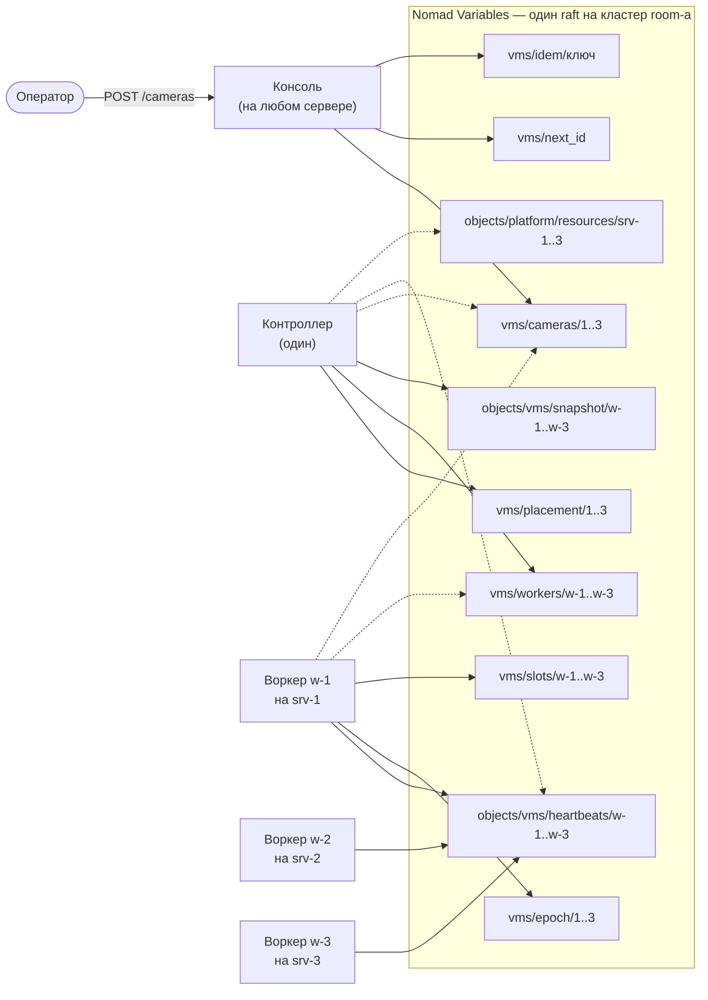

# Три камеры на три сервера: полный путь в запросах

> [!note] Записки поверх репозитория, а не его документация
> Это разбор: я читал код и восстанавливал по нему, как всё устроено, максимально простыми словами.
> **Источник истины — код.** Где записки расходятся с кодом, прав код.
> Проект описывает себя сам: [`README.md`](../../README.md) и указатели модулей.
> Состояние: коммит `e3b8f57`, 26 сентября 2026.

[← карта разбора](README.md) · вперёд: [01-reference.md](01-reference.md)

Один сценарий, разобранный до каждого HTTP-запроса. Оператор создаёт три камеры в кластере из трёх серверов. Контроллер раскладывает их по одной на сервер. Воркеры забирают свои камеры и подтверждают, что запустили.

Документ отвечает на вопрос «кто что кому шлёт и что получает в ответ» — от `POST /cameras` до момента, когда консоль показывает `phase: running` и `observed_revision == revision`. Последняя часть отвечает на другой вопрос: чего такое устройство стоит и на каком размере кластера оно кончается.

## Что здесь взято из кода, а что придумано

**Из кода**: пути ключей, HTTP-методы, порядок вызовов, поля тел запросов и ответов, интервалы проходов, текст причин размещения, правило выбора воркера, права токенов. Кода здесь нет — всё показано так, как оно идёт по сети: запрос, ответ, данные.

**Условное**: имена серверов и кластера, значения `ModifyIndex`, отметки времени, содержимое полей камер. `ModifyIndex` я выбирал так, чтобы за ними было видно порядок записей в raft: число растёт с каждой принятой записью.

**Посчитанное, а не измеренное**: все числа [части 10](10-limits-and-scale.md) про нагрузку. Они выведены арифметикой из кода — сколько чтений делает проход, сколько байт весит запись, — и ни одно из них не снято с работающего кластера. Где для вывода не хватает замера, стоит пометка `[TODO]`.

**Чего здесь нет**: записи в архив (подсистема `rec`), раздачи потоков зрителям (`live`), детекции (`det`) и доменного слоя. Про них — в [части 9](09-whats-missing.md).

---

## Вся система пятью фразами

> [!important] Если запомнить только одно
> **Источник правды для всех процессов — хранилище ключ-значение**, то есть Nomad Variables. Процессы не разговаривают друг с другом вообще: всё, что один знает о другом, — это ключ, который тот записал. Значение ключа — плоский набор строк, и ничего сложнее строк там не лежит.
>
> Две оговорки, иначе картинка съедет. **Видео через хранилище не идёт**: в ключе лежит только адрес вида `rtsp://srv-1:8554/1`, а сам поток идёт мимо, напрямую с воркера. И **фактическое состояние живёт на воркере**, а в хранилище лежит только его рассказ о себе — свежестью в один такт, не свежее.

Воркер при старте берёт себе имя — занимает слот — и дальше раз в десять секунд рассказывает о себе: кто он, на каком сервере стоит, сколько камер потянет, что у него сейчас запущено. Консоль принимает камеру от оператора и кладёт её настройки в хранилище; на этом её работа кончается, потому что где камере работать — не её дело. Контроллер раз в пять секунд смотрит, какие камеры лежат без размещения и какие воркеры о себе рассказали, и раскладывает первое по второму — тоже просто записью в хранилище. Воркер раз в две секунды перечитывает, что ему назначили, и поднимает у себя эти камеры. Ни один из них не зовёт другого напрямую: каждый пишет своё в общее хранилище ключ-значение и читает оттуда чужое.

Почему так, а не вызовами по сети: любой из них может умереть в любую секунду, и тогда вызов некому принять. Запись в хранилище дожидается адресата сама, поэтому упавший процесс ничего не теряет — он вернётся и дочитает.

Четвёртый участник в этом рассказе не назван, хотя без него камеру не разместят. Ресурс — это процесс, который отвечает за диски своего сервера и тоже раз в десять секунд говорит, что жив. Воркер без живого ресурса камеру не получит, потому что ему некуда будет писать события.

### Что из этого следует

Шесть вещей, которые обычно не укладываются в голове с первого раза.

**Никто никого не уведомляет.** Нет ни подписок, ни событий, ни вызова «эй, я тебе камеру назначил». Каждый процесс ходит по кругу и сам смотрит, что изменилось. Поэтому воркер, который лежал в момент размещения, ничего не пропустил — он догонит на ближайшем круге.

**Молчание — это тоже сообщение.** Умерший не успевает сказать, что умер. Поэтому живость меряется свежестью последней записи, а не ответом на запрос: heartbeat старше 45 секунд означает «этого воркера больше не считаем».

**У каждого ключа ровно один писатель.** Настройки камер пишет консоль, размещение — контроллер, отчёты о себе — воркер. Делит их не договорённость в коде, а токен: запись в чужой ключ возвращает `403` от Nomad.

**Желаемое и фактическое лежат в разных ключах.** Строка камеры — что оператор захотел. Heartbeat воркера — что на самом деле работает. Сложить их в один ключ значит завести кэш, который врёт: зелёная строчка в консоли над коробкой, которая ничего не пишет.

**Ни у кого нет состояния в памяти.** Любой процесс можно убить посреди работы и поднять заново — всё, что он знает, он перечитывает из хранилища. Отсюда и то, что двух контроллеров запустить не страшно.

**Споры решает хранилище, а не код.** Везде, где двое могут сделать одно и то же — выдать номер новой камере, занять имя `w-1`, начать писать архив камеры 7, — выигрывает тот, чья запись прошла первой. Один приём, условная запись, закрывает все три случая.

### Жизнь камеры сверху вниз

| Шаг | Кто | Что делает | Сколько ждать |
|---|---|---|---|
| 1 | оператор → консоль | `POST /cameras`; консоль пишет `vms/cameras/1` и честно отвечает «создана, нигде не работает» | сразу |
| 2 | контроллер | видит камеру без размещения, выбирает воркера с наибольшей свободной ёмкостью, пишет `vms/placement/1` и `vms/workers/w-1` | до 5 с |
| 3 | воркер `w-1` | видит себя в назначении, читает строку камеры, берёт эпоху и поднимает пайплайн | до 2 с |
| 4 | воркер `w-1` | пишет heartbeat: камера 1 в фазе `running` на ревизии 1 | до 10 с |
| 5 | консоль | показывает это оператору | до 10 с |

Между шагами 1 и 2 никто никому не звонил. Между 2 и 3 — тоже. Каждая стрелка здесь — это чья-то запись в хранилище и чьё-то чтение оттуда несколькими секундами позже.

---

## Стенд

Кластер `room-a` из трёх серверов. Контроллер один на весь кластер, консоль и ресурс есть на каждом сервере, а воркеров ровно столько, сколько попросил администратор.

| Процесс | Тип задачи в Nomad | Сколько | Токен пишет |
|---|---|---|---|
| консоль | `system` — по одной на сервер | 3 | `vms/cameras/*`, `vms/next_id`, `vms/idem/*`, `vms/retention/*`, `vms/policy`, `platform/drain` |
| контроллер | `service`, `count = 1` | 1 | `vms/workers/*`, `vms/placement/*`, `vms/slots/*`, `objects/vms/snapshot/*` |
| воркер | `service`, `count = 3` | 3 | `vms/epoch/*`, `vms/slots/*`, `objects/vms/heartbeats/*` |
| ресурс | `system` — по одной на сервер | 3 | `objects/platform/resources/<сервер>/heartbeat` |

Разницу между `system` и `service` стоит заметить сразу, потому что дальше от неё зависит весь сценарий. Консоль и ресурс — это `system`: Nomad сам ставит по экземпляру на каждый сервер, и их число равно числу серверов. Воркер — это `service` с числом `count`, и Nomad раскладывает эти `count` экземпляров по серверам сам. Три воркера на трёх серверах получились не автоматически: администратор попросил именно три, а в джобспеке репозитория при первом запуске стоит `count = 2`.

Воркеры взяли себе имена `w-1`, `w-2`, `w-3` — каждый на своём сервере. У всех `CAPACITY=50`. Все три сервера объявили метку `vlan:cctv`.

Сплошная стрелка означает «пишет», пунктирная — «только читает». Все они асинхронные: процесс кладёт запись в хранилище и не ждёт, пока её кто-нибудь заметит.

Между процессами нет ни одной стрелки. Консоль не зовёт контроллер, контроллер не зовёт воркеров. Всё общение идёт через хранилище, потому что так любой из них может умереть и вернуться, ничего никому не сообщая.

## Как читать запросы дальше

Уровней два, и путать их не стоит.

**Уровень 1 — оператор и консоль.** Обычный REST: `POST /cameras`, `GET /where/1`. Это API консоли, его видит браузер.

**Уровень 2 — любой процесс и Nomad.** HTTP API Nomad Variables. Туда ходят все три процесса — консоль, контроллер и воркер, — каждый своим токеном.

Один запрос оператора всегда превращается в несколько запросов к Nomad. Ровно это ниже и расписано.

---

[← карта разбора](README.md) · вперёд: [01-reference.md](01-reference.md)
