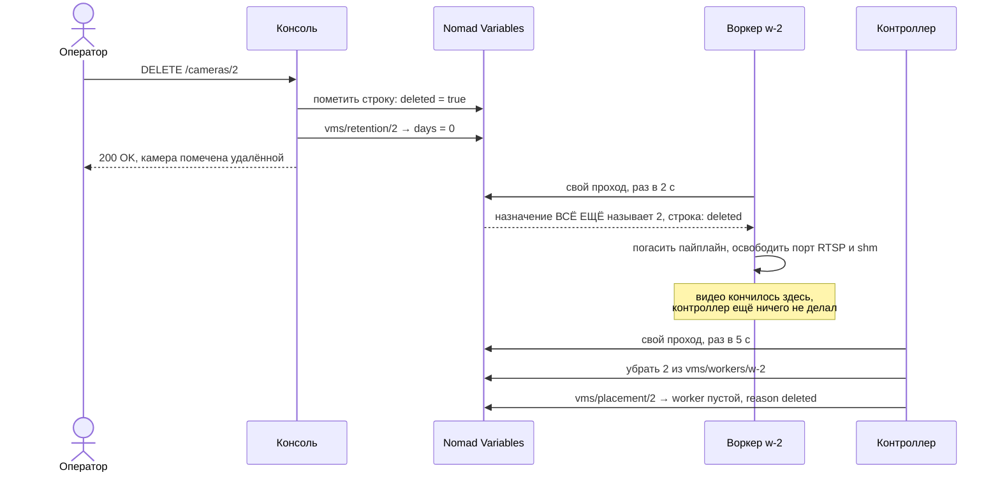

# Часть 7. Оператор правит и удаляет камеру

> [!note] Записки поверх репозитория, а не его документация
> Это разбор: я читал код и восстанавливал по нему, как всё устроено, максимально простыми словами.
> **Источник истины — код.** Где записки расходятся с кодом, прав код.
> Проект описывает себя сам: [`README.md`](../../README.md) и указатели модулей.
> Состояние: коммит `e3b8f57`, 26 сентября 2026.

[← карта разбора](README.md) · назад: [06-confirmation.md](06-confirmation.md) · вперёд: [08-failures.md](08-failures.md)

Тот же кластер, сразу после `T+12.0`: три камеры работают, камера 2 «Парковка» лежит на `w-2`. Теперь оператор правит ей настройку, а потом удаляет её совсем. Создание разобрано в [части 3](03-creating-a-camera.md), размещение — в [части 4](04-placement.md).

Обе операции устроены по одному правилу: **консоль пишет только то, чем владеет, и никому ничего не сообщает.** Всё остальное делают воркер и контроллер, когда сами придут читать.

---

## 7.1. Правка: один запрос оператора — четыре к Nomad

```
PUT /cameras/2
Idempotency-Key: 3f9c1e2a-…

{"name": "Парковка у въезда"}
```

Консоль ходит в Nomad своим токеном четыре раза:

```
1. PUT /v1/var/vms/idem/3f9c1e2a-…?cas=0   занять ключ идемпотентности → 5130
2. GET /v1/var/vms/cameras/2               прочитать строку, ModifyIndex → 4421
3. PUT /v1/var/vms/cameras/2?cas=4421      записать: имя новое, revision 1 → 2 → 5133
4. PUT /v1/var/vms/idem/3f9c1e2a-…         положить ответ рядом с ключом → 5135
```

Отвечает `200 OK` с новой строкой и `revision: 2`. Поля `worker` в ответе **нет**: размещение лежит в другом ключе, и консоль его не касается.

Четыре вызова — это при двух условиях: клиент прислал `Idempotency-Key` (для `PUT` он необязателен) и правленое поле не питает производную строку. Правка `events_retention_days` стоит шести: к ней добавляются чтение и запись `vms/retention/2`.

**Почему шага два, а не один.** Variables пишутся целиком — обновить одно поле нельзя. Нужно прочитать строку, подменить поле и записать обратно, а `cas=4421` защищает от гонки: если кто-то правил ту же камеру между GET и PUT, Nomad ответит `409`, и цикл повторится с новым индексом, до десяти попыток. Тот же механизм на примере двух операторов — в разделе [8.2](08-failures.md).

**Почему ключ идемпотентности, а не ничего.** Повтор запроса может попасть на консоль **другого сервера**. Та увидит занятый ключ, дождётся готового ответа первой и отдаст его, не повторяя запись. Поэтому состояние повторов тоже лежит в Nomad: иначе две консоли о нём бы не знали. Что видит повтор, пришедший в промежутке, разобрано в разделе [8.1](08-failures.md).

### Все настройки камеры — в одной Variable

```json
{"Items": {"id": "2", "revision": "2", "name": "Парковка у въезда",
           "source": "driverpack://acme/10.2.0.12", "enabled": "true", …}}
```

Одна Variable — это один CAS и одна ревизия, поэтому воркер видит либо все настройки старыми, либо все новыми. Разложите их по пяти ключам, и появится состояние «половина применилась».

Ключ делят только когда у настройки **другой читатель**. Такой случай один: `events_retention_days` дублируется в `vms/retention/<id>`, потому что его читает ресурс, которому камера целиком не нужна.

### Что значит «применилось»

Запросов к воркеру никто не делает. Воркер раз в две секунды читает сам — тем же проходом, что разобран в разделе [5.1](05-workers-and-epochs.md):

```
GET /v1/var/vms/workers/w-2   → units: ["2"]
GET /v1/var/vms/cameras/2     → revision 2
```

Ревизия выросла — применяет настройку к пайплайну и пишет в heartbeat `observed_revision: 2`. **Единственное определение «применено» — `observed_revision >= revision`.** Пока оно меньше, настройка задана, но ещё не подействовала.

Отсюда важное: **`200 OK` уходит оператору до того, как настройка доехала до видео.**

### Чего консоль сделать не может

```
PUT /cameras/2  {"worker": "w-9"}
→ 400 "a client may not set ['worker']: placement is decided and stored by the controller"
```

Поля `worker`, `placement`, `epoch`, `revision`, `observed_revision`, `phase` и `id` клиент не присылает никогда. Первое принадлежит контроллеру, остальные воркеру.

---

## 7.2. Удаление: поток гасит воркер, а не контроллер

Это главное и самое неочевидное. Консоль только ставит пометку, видео кончается на проходе воркера, а контроллер приходит потом и занимается одной бухгалтерией.



**Шаг 1. Консоль помечает строку — и всё.** Проверяет, что камера есть и ещё не помечена (иначе `404`), и делает два read-modify-write по CAS. Всего пять вызовов к Nomad:

```
GET /v1/var/vms/cameras/2             проверка: есть и не помечена
GET /v1/var/vms/cameras/2             чтение под CAS, ModifyIndex → 5133
PUT /v1/var/vms/cameras/2?cas=5133    {… "deleted": "true"} → 5140
GET /v1/var/vms/retention/2           чтение под CAS, ModifyIndex → 4424
PUT /v1/var/vms/retention/2?cas=4424  {"days": "0"} → 5142
```

Ключа идемпотентности здесь нет: `DELETE` его не использует никогда. Повтор и так безопасен — вторая попытка упрётся в `404`, «gone is gone».

Строка не удаляется, а помечается:

```745:750:vmsserver/w2cplatform/spec.py
    def delete(self, uid) -> None:
        """The operator's half: the row is marked. Its placement is the controller's
        half, taken back on the next pass (`unplace_deleted`) — a console's token
        cannot touch an assignment, and does not need to."""
        self.write(self._row_key(uid), lambda it: {**it, "deleted": "true"} if it else None)
        self._derived(None, uid, deleted=True)
```

Второй PUT — производная строка `on_delete: {days: 0}` из спецификации, чтобы бакеты событий удалённой камеры ушли сами. Назначение `vms/workers/w-2` консоль не трогала: её токен на это не имеет права, что видно по таблице прав в [справочнике](01-reference.md).

Ответ `200 {"deleted": 2}`. С этого момента камера исчезла из всех списков, потому что `unit()` и `units()` фильтруют по `deleted != "true"`. Но воркер её ещё ведёт.

**Шаг 2. Воркер на следующем опросе — здесь гаснет поток.** Назначение всё ещё называет камеру 2, но её строка помечена, и воркер её пропускает:

```438:442:vmsserver/vms/worker.py
        for unit in a.units:
            items, _ = self.vars.get(self.SUB.config(self.ROWS, unit))
            if items and items.get("deleted") != "true":
                rows.append(self.parse_row(items))
        self.rows = rows
```

Камера не попала в желаемое состояние. Реконсилятор видит её в работающем и не видит в желаемом — гасит пайплайн, освобождает порт RTSP и shm, и из следующего heartbeat'а она исчезает.

**Шаг 3. Контроллер, не позже пяти секунд — только бухгалтерия.**

```
PUT /v1/var/vms/workers/w-2?cas=4452    units без "2"                          ← сначала
PUT /v1/var/vms/placement/2?cas=4449    {"worker":"", "reason":"deleted", …}   ← потом
```

Порядок не случайный. Обнулите размещение первым и упадите — **сироту больше не по чему найти**: назначение её всё ещё называет, а размещение уже ни на кого не указывает. В конце того же прохода переписывается снапшот, уже без второй, — тот самый шаг публикации из раздела [4.5](04-placement.md).

### Что остаётся жить после удаления

| Что | Судьба |
|---|---|
| `vms/cameras/2` | **остаётся навсегда** с `deleted: "true"` |
| `vms/placement/2` | остаётся с пустым воркером |
| бакеты событий | уйдут на следующем проходе ресурса, по `{days: 0}` |
| видеоархив | лежит до своего срока хранения, на диске держателя |
| номер 2 | **не переиспользуется** — `next_id` только растёт |

**Надгробия никто не убирает.** `prune` в системе есть только для ключей идемпотентности и для токенов, а для строк камер — нигде. Значит каждая когда-либо удалённая камера навсегда стоит одного ключа в raft и одного `GET` в каждом обходе `units()`: обход платит не за живые камеры, а за все, что когда-либо были. На площадке с ротацией камер это со временем утяжеляет чтение — во что это обходится на кластере в шестьсот камер, посчитано в разделе [10.2](10-limits-and-scale.md).

Это открытый вопрос, а не решение — он разобран под номером 20 в [«Куда попадает настройка камеры»](../where-camera-settings-go.md), вместе с двумя вариантами: убирать надгробия по сроку или перестать их читать.

---

## 7.3. Одной таблицей

| | Правка | Удаление |
|---|---|---|
| запросов консоли к Nomad | 4 | 5 |
| ключ идемпотентности | необязателен, страница шлёт | не используется никогда |
| что пишет консоль | строку камеры | пометку `deleted` и `retention` |
| когда оператор видит ответ | сразу, до применения | сразу, до остановки видео |
| кто доводит до видео | воркер, ≤ 2 с | воркер, ≤ 2 с |
| что делает контроллер | **ничего** | снимает размещение, ≤ 5 с |
| как проверить, что случилось | `observed_revision >= revision` | камера пропала из heartbeat'а |

Подробный разбор этих же сценариев, вместе с тактом воркера, продлением аренд и стоимостью чтений, — в [«Куда попадает настройка камеры»](../where-camera-settings-go.md), часть 1.

---

[← карта разбора](README.md) · назад: [06-confirmation.md](06-confirmation.md) · вперёд: [08-failures.md](08-failures.md)
