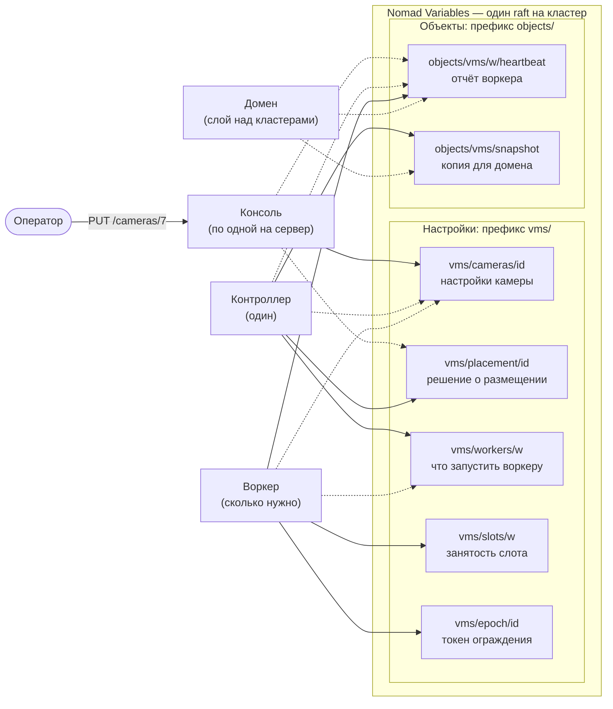
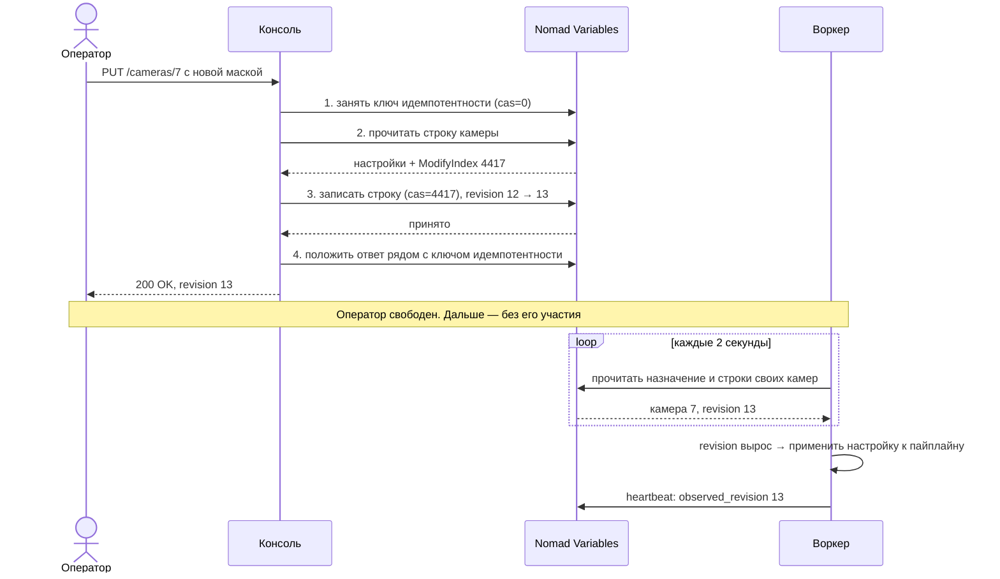
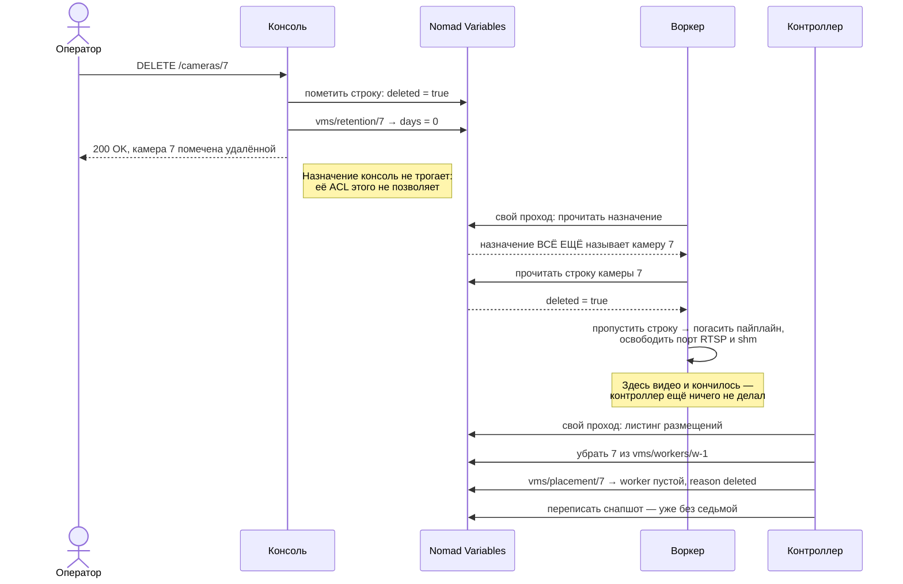
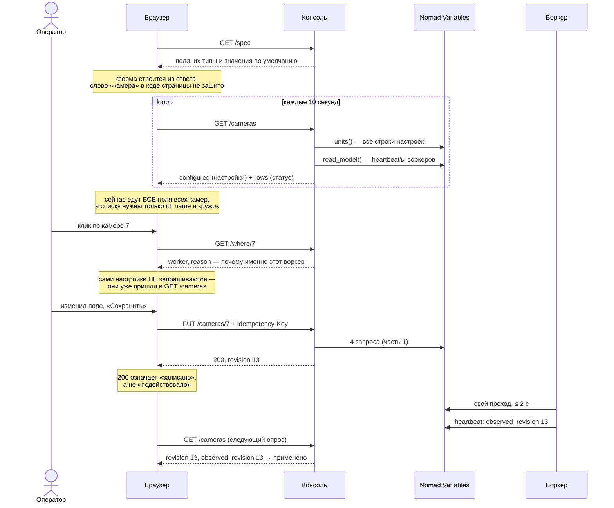

# Куда попадает настройка камеры

Документ для обсуждения. Разбирает один простой вопрос: оператор поменял настройку камеры — что происходит дальше, кто её читает, и кто решает, на каком воркере камера поднимется.

Части 1–3 разбирают то, что **есть в коде**, на уровне конкретных HTTP-запросов: правка настройки, удаление камеры и такт воркера с его арендами (часть 1), чтение для UI (часть 2), проход контроллера (часть 3). В частях 2 и 3 к этому идут разделы про масштаб — там, где код упирается в предел. Такие разделы я помечаю как предложения, чтобы их не спутать с описанием кода.

Часть 4 — случай, которого в коде нет: настройка размером в мегабайт, а вместе с ней общий вопрос про внешние хранилища и про то, где такое вообще запускать. Часть 5 показывает, сколько камер бывает в одном кластере на самом деле, по данным вендоров, и почему десять тысяч камер живут на уровне домена, а не кластера. Часть 6 собирает из всего этого Web UI консоли и проходит путь оператора по шагам: список, выбор камеры, правка, проверка что подействовало.

## Словарь: девять слов, которые дальше встречаются постоянно

| Слово | Что означает |
|---|---|
| **Nomad Variables** | хранилище «ключ → набор полей» внутри Nomad. Единственное место, где живут настройки камер |
| **raft** | алгоритм, которым серверы Nomad договариваются о записи. Запись принята, когда с ней согласилось большинство серверов |
| **кворум** | это самое большинство. Из трёх серверов кворум — два; пока они живы, запись работает |
| **CAS** (compare-and-swap) | запись с условием «только если версия ключа всё ещё такая». Если кто-то успел записать раньше, Nomad отвечает 409, и мы перечитываем и пробуем снова |
| **ревизия** (`revision`) | счётчик правок в строке камеры. Воркер сравнивает его со своим `observed_revision` и так понимает, что настройка изменилась |
| **heartbeat** | отчёт воркера о себе: какие камеры он поднял, в какой фазе каждая, сколько ещё влезет. Воркер пишет его раз в 10 секунд |
| **слот** | имя воркера как строка в хранилище (`w-1`, `w-2`). Процесс берёт имя сам и потом **продлевает аренду**; отпустил или не продлил — имя достаётся сменщику вместе с назначением |
| **эпоха** | номер, который воркер берёт на камеру, прежде чем что-то для неё писать. Защита от двух процессов на одной камере: у кого номер старый, тому писать нельзя |
| **снапшот** | копия всех камер кластера и их размещения одним объектом. Её делает контроллер раз в 5 секунд, а читает домен |
| **jobspec** | файл описания задачи для Nomad (`*.nomad.hcl`): сколько экземпляров запускать, с какими лимитами |
| **ACL токена** | права, с которыми процесс приходит в Nomad. Именно они, а не договорённость в коде, запрещают консоли писать размещение |

Два слова про устройство системы, чтобы дальше не спотыкаться. **Кластер** — это одна площадка: несколько серверов под управлением Nomad, со своим хранилищем настроек. **Домен** — слой над кластерами, который видит их все сразу, но сам настройки не хранит.

## Девять фактов, если читать некогда

1. Единственное хранилище настроек — **Nomad Variables**. Никаких баз данных, никакого внешнего хранилища: строка камеры весит 200–400 байт и требует согласованности, а согласованность Nomad уже даёт своим raft'ом — вторая такая система была бы вторым кворумом без единой выгоды (часть 4). Одна камера — одна Variable, потому что одна Variable = один CAS = одна ревизия, и воркер видит либо все настройки старыми, либо все новыми.
2. **Консоль — это веб-сервер без собственного хранилища.** Она переводит запросы оператора в запросы к Nomad и больше ничего не хранит — поэтому любая консоль отвечает на любой запрос, а смерть одной не теряет ничего.
3. **Никто никому ничего не пушит.** Воркер и контроллер сами читают Variables на своём проходе. Так сделано потому, что процесс, недоступный в момент правки, пропустил бы push, а с чтением он догоняет сам, когда вернётся.
4. **Правка настройки никогда не двигает камеру на другой воркер.** Контроллер выбирает размещение один раз, при создании, потому что переезд рвёт запись: архив камеры лежит на диске того сервера, где она работает.
5. Из ста настроек камеры контроллер читает **одну** — `labels`, потому что только от неё зависит выбор воркера. Остальные для него непрозрачные данные, и это позволяет добавлять настройки, не трогая контроллер.
6. **Снапшот перестаёт публиковаться примерно на 270 камерах, а проектный максимум кластера — около 600.** Это самый срочный дефект в документе, и десять тысяч камер для него не нужны: мы не дотягиваем до собственного числа, записанного в jobspec'е. Снапшот упирается первым, потому что он один на весь кластер. Но **heartbeat'ы упираются в тот же лимит следом**: их размер держится на дефолте `CAPACITY=50`, а при 400 камерах на воркера heartbeat весит ~100 КБ и ломается тоже. Значит правильная форма heartbeat'а — **сводка плюс исключения** (часть 2, вопрос 19), а вариант «перенести конфигурацию в heartbeat» из вопроса 3 отпадает.
7. **Десять тысяч камер в домене мы рассматриваем, и мешает им ровно этот дефект — ценой, а не запретом.** Домен такое количество держит (модель чтения — 2.4 МБ в памяти), но узнаёт о камерах только из снапшотов, поэтому потолок кластера становится делителем: 10 000 раскладываются на ~38 кластеров вместо ~17. Серверов при этом примерно поровну — их число диктует ёмкость воркеров; удваивается число **кластеров**, то есть кворумов, контроллеров и регионов в WAN-gossip'е.
8. **Полный скан упирается вслед за ним — и первым упирается контроллер, а не UI.** Уже на проектных 600 камерах спокойный проход стоит около 13 800 чтений каждые пять секунд. Больше половины этого — одна строка: `snapshot()` зовёт `server_of()` на каждую камеру, а тот заново вычитывает heartbeat'ы всех воркеров. **Вынести этот вызов из цикла — самое дешёвое действие во всём документе с самым большим эффектом.** Фона, кстати, три источника, а не два: воркеры перечитывают свои строки **каждые две секунды**, и это ещё ~306 чтений в секунду — столько же, сколько дают пять консолей. Всё остальное лечится диффом по `ModifyIndex`, который Nomad уже присылает в листинге, а клиент выбрасывает.
9. **Число машин диктует география, а не ёмкость** (часть 5). Живая конфигурация «Интеллекта» — 2502 камеры на 207 объектах конфигурации, причём **часть из них рабочие места, а не видеосерверы**. Большие числа живут на уровне домена, а не единицы: вендор сам ставит пороги «500 на сервер» и «1500 на домен». Облачные продукты единицу либо держат в пределах 300 (мост Eagle Eye), либо упраздняют (Verkada — одна камера, Kinesis — квота региона). Для нас отсюда два вопроса, и ни один не про «хватит ли 600 на кластер»: **не слишком ли три сервера кворума для маленькой площадки**, и **где вообще живут раскладки экранов** — у нас их нет нигде.

---

## Кто есть кто

Три процесса, и разделены они по одному признаку: **что каждому разрешено писать**.

| Процесс | Сколько | Что пишет | Что перестаёт работать, если он умрёт |
|---|---|---|---|
| **консоль** | по одной на каждый сервер | настройки камер | перестаёт отвечать адрес этого сервера; консоль на любом другом сервере — та же консоль |
| **контроллер** | один | размещение (какая камера на каком воркере) | новые камеры не размещаются; запись и правки продолжаются |
| **воркер** | сколько нужно по нагрузке | свой heartbeat и свои эпохи | его камеры переезжают на другой воркер |

Ключи разделены так, что **консоль и контроллер никогда не трогают один ключ**:

| Ключ | Кто пишет |
|---|---|
| `vms/cameras/<id>` — настройки камеры | консоль |
| `vms/next_id`, `vms/idem/*`, `vms/retention/*`, `vms/policy` | консоль |
| `vms/placement/<id>` — решение о размещении и его причина | контроллер |
| `vms/workers/<w>` — что должен запустить воркер | контроллер |
| `vms/slots/<w>` — занятость слота | воркер (берёт и продлевает) и контроллер (только `retire`) — **единственный общий ключ**, и оба пишут в него через CAS |
| `vms/epoch/<id>` — токен ограждения | воркер |
| `objects/vms/<w>/heartbeat` — отчёт воркера | воркер |
| `objects/vms/snapshot` — копия для домена | контроллер |

Это не соглашение в коде, а **ACL токена**. Консоль, попытавшаяся записать размещение, получит от Nomad 403.

Та же картина одним рисунком. Сплошная стрелка — запись, пунктирная — чтение:



Главное, что видно на рисунке: **между процессами нет ни одной стрелки.** Консоль не зовёт контроллер, контроллер не зовёт воркера. Все связи идут через хранилище, потому что так каждый процесс может умереть и вернуться, ничего никому не сообщая.

---

## Часть 1 — Оператор меняет настройку

### Один запрос оператора превращается в четыре к Nomad

Оператор правит одно поле:

```
PUT /cameras/7 HTTP/1.1
Content-Type: application/json
Idempotency-Key: 3f9c1e2a-…

{"mask": "0,0 640,0 640,360 0,360"}
```

Консоль делает четыре вызова к Nomad своим workload-токеном:

```
1. PUT /v1/var/vms/idem/3f9c1e2a-…?cas=0     занять ключ идемпотентности
2. GET /v1/var/vms/cameras/7                 прочитать строку и её ModifyIndex → 4417
3. PUT /v1/var/vms/cameras/7?cas=4417        записать: mask новый, revision 12 → 13
4. PUT /v1/var/vms/idem/3f9c1e2a-…           положить ответ рядом с ключом
```

Отвечает оператору:

```
HTTP/1.1 200 OK
{"id": 7, "name": "cam7", "source": "driverpack://file/a.mp4",
 "enabled": true, "mask": "0,0 640,0 640,360 0,360", "revision": 13}
```

В ответе **нет** поля `worker`. Размещение живёт в другом ключе, и консоль его не касается.

### Тот же сценарий целиком: от запроса до работающего пайплайна

Диаграмма показывает и то, что оператор видит сразу, и то, что происходит после ответа. Обратите внимание на разрыв посередине: **ответ 200 уходит до того, как настройка доехала до видео.**



Последняя строка и есть определение «применилось»: **пока `observed_revision` меньше `revision`, настройка задана, но ещё не подействовала.** Никто воркеру ничего не присылал — он сам пришёл и прочитал.

### Почему шагов 2 и 3 два, а не один

Nomad Variables пишутся **целиком**. Обновить одно поле нельзя — нужно прочитать всю строку, подменить поле и записать обратно. `cas=4417` защищает от гонки: если кто-то правил ту же камеру между нашими GET и PUT, Nomad ответит 409, и цикл повторится с новым индексом (до десяти попыток).

### Почему шагов 1 и 4 два, а не ноль

Это защита от повторной обработки ретрая. Повтор может попасть на консоль **другого сервера** — та увидит занятый ключ, дождётся готового ответа первой и отдаст его, не повторяя запись. Поэтому состояние ретраев тоже в Nomad: иначе две консоли о нём бы не знали.

### Одна камера — одна Variable

Все настройки лежат в одной Variable плоским набором строк:

```json
{"Items": {"id": "7", "revision": "13", "name": "cam7",
           "source": "driverpack://file/a.mp4", "enabled": "true",
           "labels": "vlan:cctv-a", …}}
```

**Почему одна, а не по ключу на группу настроек — из-за атомарности.** Одна Variable = один CAS = одна ревизия. Воркер видит либо все настройки старыми, либо все новыми. Разложите их по пяти ключам — появится состояние «половина применилась».

Ключ делят только когда у настройки **другой читатель**. Такой случай один: `events_retention_days` дублируется в `vms/retention/<id>`, потому что его читает resource-job, которому камера целиком не нужна.

### Как правка доходит до пайплайна

Никаких запросов к воркеру. Воркер на своём проходе сам читает:

```
GET /v1/var/vms/workers/w-2      → units: ["7", "9", "12"]
GET /v1/var/vms/cameras/7        → revision 13
```

Видит, что ревизия выросла, применяет и пишет в heartbeat `observed_revision: 13`. **Единственное определение «применено» — `observed_revision >= revision`.**

### Чего консоль сделать не может

```
PUT /cameras/7  {"worker": "w-9"}
→ 400 "a client may not set ['worker']: placement is decided and stored by the controller"
```

Поля `worker, placement, epoch, revision, observed_revision, phase, id` клиент не присылает никогда. Первое — контроллера, остальные — воркера.

### А если камеру удаляют

Удаление устроено интереснее, чем правка, и главное в нём неочевидно: **поток гасит не контроллер.** Сначала рисунок, потом запросы по шагам:



**Шаг 1. Консоль помечает строку — и всё.** Проверяет, что камера есть (`GET /v1/var/vms/cameras/7`; если нет или уже помечена — 404), и делает два read-modify-write по CAS:

```
PUT /v1/var/vms/cameras/7?cas=41
    {"Items": {"id":"7","name":"Ворота 1","source":"rtsp://…","revision":"13", …, "deleted":"true"}}

PUT /v1/var/vms/retention/7?cas=3
    {"Items": {"days": "0"}}
```

Строка **не удаляется, а помечается**:

```442:447:vmsserver/w2cplatform/spec.py
    def delete(self, uid) -> None:
        """The operator's half: the row is marked. Its placement is the controller's
        half, taken back on the next pass (`unplace_deleted`) — a console's token
        cannot touch an assignment, and does not need to."""
        self.write(self._row_key(uid), lambda it: {**it, "deleted": "true"} if it else None)
        self._derived(None, uid, deleted=True)
```

Второй PUT — производная строка: `on_delete: {days: 0}` из спеки, чтобы бакеты событий удалённой камеры ушли сами, без удаления файлов руками. Чего консоль **не** трогала: `vms/workers/w-1`. Её токен на это не имеет права.

Ответ `200 {"deleted": 7}`. С этого момента камера исчезла из всех списков — `unit()` и `units()` фильтруют по `deleted != "true"` — но воркер её ещё ведёт.

**Шаг 2. Воркер на следующем опросе — здесь гаснет поток.**

```
GET /v1/var/vms/workers/w-1        → назначение ВСЁ ЕЩЁ называет 7
GET /v1/var/vms/cameras/7          → deleted: "true"  → строка пропускается
```

```335:339:vmsserver/vms/worker.py
        for unit in a.units:
            items, _ = self.vars.get(self.SUB.config(self.ROWS, unit))
            if items and items.get("deleted") != "true":
                rows.append(self.parse_row(items))
        self.rows = rows
```

Камера не попала в желаемое состояние, реконсилятор видит её в работающем и не видит в желаемом — гасит пайплайн, освобождает порт RTSP и shm. Из следующего heartbeat'а она исчезает. **То есть удаление доезжает до видео без всякого участия контроллера** — ровно то же свойство, что у обычной правки.

**Шаг 3. Контроллер на следующем проходе (≤ 5 с) — только бухгалтерия.** Это шаг 2 части 3, разобранный там подробно:

```
GET  /v1/vars?prefix=vms/placement/     листинг размещений
GET  /v1/var/vms/placement/7            → worker: "w-1"
GET  /v1/var/vms/cameras/7              → помечена → считается исчезнувшей

PUT  /v1/var/vms/workers/w-1?cas=88     units без "7", rev+1      ← сначала
PUT  /v1/var/vms/placement/7?cas=12     {"worker":"","reason":"deleted","at":…,"rev":13}   ← потом
```

Порядок не случайный, и в курсе сказано почему: если сначала обнулить размещение и упасть, **сироту больше не по чему найти** — назначение её называет, а размещение уже ни на кого не указывает. В конце того же прохода переписывается снапшот, уже без седьмой.

**Что остаётся жить после удаления:**

| Что | Судьба |
|---|---|
| `vms/cameras/7` | **остаётся навсегда** с `deleted: "true"` |
| `vms/placement/7` | остаётся с пустым воркером |
| бакеты событий | уйдут на следующем проходе ресурса, по `{days: 0}` |
| видеоархив | лежит до своего срока хранения, на диске держателя |
| номер 7 | **не переиспользуется** — `next_id` только растёт |

Последние две строки таблицы — это отдельный вопрос к обсуждению (вопрос 20). **Надгробия никто не убирает.** Надгробие — это строка, помеченная удалённой, но оставшаяся в хранилище; `prune` в системе есть только для ключей идемпотентности и для токенов, а для строк камер — нигде.

Значит каждая когда-либо удалённая камера навсегда стоит одного ключа в raft и **одного GET в каждом обходе `units()`** — обход платит не за живые камеры, а за все, что когда-либо были. На площадке с ротацией камер это со временем утяжеляет N+1 — обход, где на один листинг приходится по чтению на каждый найденный ключ (часть 2).

### Такт воркера: раз в две секунды, и три разных срока внутри

Выше несколько раз сказано «воркер на своём проходе» — пора назвать число. Проход — **раз в две секунды**, и это дефолт, который оба развёртывания берут как есть (`w.run(stop=stop)` в `vmsserver/vms/__main__.py` и в `cluster/__main__.py`):

```630:630:vmsserver/vms/worker.py
    def run(self, poll: float = 2.0, stop=None) -> None:
```

Отсюда сразу ответ на самый частый вопрос оператора: **правка настройки доходит до видео не дольше двух секунд.** Но внутри одного цикла живут три разных такта, и путать их не стоит:

```641:651:vmsserver/vms/worker.py
        while not stop.is_set():
            try:
                self.reconcile_once()
                self.pump_once()
                if self.clock() - last_lease >= lease_every:
                    self.lease_pass(); last_lease = self.clock()
                if self.clock() - last_hb >= 10.0:
                    self.heartbeat_once(); last_hb = self.clock()
            except Exception:                              # noqa: BLE001
                log.exception("%s: pass failed; will retry", self.name)
            stop.wait(poll)
```

| Что делает | Как часто | Зачем именно так |
|---|---|---|
| `reconcile_once` — читает назначение и строки камер | **раз в 2 с** | это задержка применения настройки, и её видит оператор |
| `lease_pass` — **продлевает аренду** | ≈ раз в 8.3 с | втрое чаще, чем истекает право писать: есть три попытки |
| `heartbeat_once` — отчёт о себе | раз в 10 с | контроллер считает воркера живым, если отчёт моложе 45 с |

Восемь с третью — не магия, а `(30 − 5) / 3`: треть от срока аренды за вычетом запаса. Дальше разберём, что это за аренда, потому что по названию непонятно.

### Продление аренды: что именно воркер продлевает и почему этого два вида

Слово «аренда» в коде означает **две разные вещи**, и в этом вся путаница. Обе продлеваются в одном `lease_pass`, но отвечают на разные вопросы.

| | Аренда слота | Аренда единицы |
|---|---|---|
| Вопрос, на который отвечает | **«я всё ещё `w-1`?»** | **«мне всё ещё можно писать камеру 7?»** |
| Ключ | `vms/slots/w-1` | `vms/epoch/7` |
| Срок | **45 с** | **30 с, из них рабочих 25** |
| Часы | настенные — сравнивать между машинами | монотонные — сравнивать внутри процесса |
| Одна на | процесс | **каждую камеру** |
| **Что пишет при продлении** | **`PUT` новой границы `until`** | **ничего — только `GET`** |

Последняя строка — ключ ко всему разделу, и её стоит прочитать дважды. **Продление слота — это запись в хранилище. Продление аренды камеры — это чистое чтение.**

Причина в том, кому адресован срок. Границу слота должны видеть **другие**: сменщик обязан понять, протух слот или ещё жив, а для этого число должно лежать в хранилище и быть в настенных часах — единственных, которые сравнимы между машинами. Срок аренды камеры не нужен никому, кроме самого воркера: он отвечает на вопрос «можно ли мне писать **прямо сейчас**». Поэтому он живёт в памяти процесса на монотонных часах, которые не прыгают от перевода времени и синхронизации NTP.

Контракт говорит это прямо:

```62:63:vmsserver/w2cplatform/contract.py
# - `until` is wall-clock while leases are monotonic: slots are compared across processes and boxes, leases
#   only within one process.
```

#### Один такт продления, в запросах

Вот что уходит в Nomad за один такт продления — раз в 8.3 секунды, у воркера `w-1`, который держит камеры 7, 9 и 12:

```
# 1. Слот: читаем, проверяем, что держатель — это я, и ПИШЕМ новую границу

GET /v1/var/vms/slots/w-1
→ {"holder": "w-1-alloc-abc", "until": "1737200045.0",
   "released": "false", "gen": "2"}          ModifyIndex: 8814

PUT /v1/var/vms/slots/w-1?cas=8814
   {"holder": "w-1-alloc-abc", "until": "1737200090.0",
    "released": "false", "gen": "2"}          ← until сдвинулся на 45 с вперёд
→ 200 OK

# 2. Аренда каждой камеры: только читаем номер эпохи. Ни одной записи

GET /v1/var/vms/epoch/7    → {"epoch": "3"}   мой 3 → продлено (штамп времени в памяти)
GET /v1/var/vms/epoch/9    → {"epoch": "1"}   мой 1 → продлено
GET /v1/var/vms/epoch/12   → {"epoch": "5"}   а мой был 4 → ОГРАЖДЕНИЕ
```

Итого за такт: **одно чтение и одна запись на слот, плюс по одному чтению на камеру.** Больше ничего.

Три следствия из этого расклада.

**Строку `vms/epoch/7` воркер пишет один раз на запуск камеры** — в момент, когда её забирает, через `next_epoch` (`GET` плюс `PUT` с CAS, часть 3). Пока камера работает, он эту строку только перечитывает. Поэтому «продлить аренду камеры» не означает «обновить запись»: номер в хранилище неподвижен, а срок тикает в памяти.

**Ограждение работает от того, что номер сменился.** Второй процесс, взявшийся за камеру 12, поднял эпоху с 4 на 5 своим `next_epoch`. Первый узнаёт об этом на ближайшем чтении — и `fenced` ставится навсегда, без обратного пути.

**Цена этого такта на весь кластер невелика, но она есть.** Двенадцать воркеров по 50 камер дают `12 × 50 / 8.3 ≈ 72` чтения в секунду, а записей всего `12 / 8.3 ≈ 1.4` в секунду — по одному слоту на воркера. Для сравнения: перечитывание строк камер каждые две секунды даёт ~306 чтений в секунду (часть 2). Заметим, что диффы по `ModifyIndex` здесь **не помогут**: воркеру нужно само значение эпохи, а не факт её изменения.

#### Аренда слота: «я всё ещё тот, кем себя считаю»

Слот — это строка с четырьмя полями: кто держит, до какого времени, отпустил ли по-хорошему и какое это по счёту владение.

```236:243:vmsserver/w2cplatform/contract.py
class Slot:
    """A worker's name, as a row: who holds it, until when (wall clock), and
    whether the last holder let go of it on purpose."""
    name: str
    holder: str = ""
    until: float = 0.0
    released: bool = True
    gen: int = 0
```

Продление — это буквально «перечитать строку и убедиться, что держатель по-прежнему я»:

```520:535:vmsserver/w2cplatform/contract.py
    def renew_slot(self) -> bool:
        """Still me? Read the slot; if another instance holds it now, the
        instance is fenced as a whole. Extends `until` by CAS otherwise."""
        if self.slot is None:
            return True
        items, idx = self.vars.get(self.sub.slot_key(self.name))
        cur = Slot.from_items(self.name, items)
        if cur.holder != self.instance:
            return False
        new = Slot(self.name, self.instance, self.wall() + self.slot_ttl, False, cur.gen)
        try:
            self.vars.put(self.sub.slot_key(self.name), new.to_items(), cas=idx)
        except Conflict:
            return False
        self.slot = new
        return True
```

Зачем вообще имя брать в аренду, а не выдавать. **Потому что имя — это ключ назначения.** Назначение лежит в `vms/workers/w-1`, и кто взял слот `w-1`, тот унаследовал список камер, который контроллер туда положил. Сменщику не нужно ничего объяснять: он берёт имя и вместе с ним получает работу. Контроллер при этом имён не раздаёт — процесс берёт имя сам.

#### Аренда единицы: право писать конкретную камеру

Здесь ключ — эпоха камеры, и проверка такая: номер в хранилище всё ещё мой?

```90:101:vmsserver/w2cplatform/epoch.py
    def renew(self) -> bool:
        if self.fenced:
            return False
        try:
            live = current_epoch(self.vars, self.key)
        except Exception:                      # noqa: BLE001 — the store is unreachable; keep going until TTL − margin
            return self.may_write()
        if live != self.epoch:
            self.fenced, self.conflicts = True, self.conflicts + 1
            return False
        self.last_renewal = self.clock()
        return True
```

Две детали здесь важнее остального.

**Недоступность хранилища сама по себе не останавливает запись.** Если Nomad не ответил, воркер не ограждает себя, а продолжает писать до конца окна. Останавливает его не ошибка, а истёкшее время — и это ровно то, что нужно: запись видео не должна падать от того, что кворум пять секунд думал.

**Запас в 5 секунд — это зазор безопасности, а не округление.** Писать разрешено, пока с последнего продления прошло меньше `30 − 5 = 25` секунд:

```105:106:vmsserver/w2cplatform/epoch.py
    def may_write(self) -> bool:
        return not self.fenced and (self.clock() - self.last_renewal) < (self.ttl - self.margin)
```

То есть старый держатель **сам перестаёт писать на 25-й секунде**, а его аренда считается истёкшей на 30-й. Пять секунд между этими моментами — гарантия, что два процесса никогда не пишут архив одной камеры одновременно.

#### Что происходит, когда продлить не удалось: три разных случая

Вот это и есть самое неочевидное место, потому что реакция зависит от того, что именно потерялось:

```418:431:vmsserver/vms/worker.py
    def lease_pass(self) -> list[str]:
        """Renew every lease. A lost lease on a camera that is no longer
        assigned to me is a reassignment: let it go. A lost lease on a camera
        that IS still mine means another instance of ME took it: I am the
        zombie, and the whole instance fences."""
        if not self.renew_slot():
            self.fence(f"slot {self.name} is held by another instance now")
            return list(self.epochs)
        lost = self.renew_leases()
        if not lost:
            return []
        assigned = set(self.assignment().units)
        for unit in lost:
            if unit not in assigned:
```

| Что потерялось | Что это значит | Реакция |
|---|---|---|
| **слот** | моё имя взял другой процесс | **огородить весь экземпляр**: погасить все пайплайны, я зомби |
| аренда камеры, которой **уже нет** в моём назначении | камеру просто передали другому | погасить только её и забыть — это норма |
| аренда камеры, которая **есть** в моём назначении | эпоху увёл другой экземпляр **меня же** | **огородить весь экземпляр** — снова я зомби |

Логика третьей строки стоит того, чтобы её проговорить. Если камера по-прежнему записана на меня, но эпоху у неё кто-то поднял, значит где-то работает второй процесс с тем же именем. Который из двух подлинный, мне не узнать, — и правильный ответ «замолчать», потому что писать архив вдвоём хуже, чем не писать вовсе.

#### Зачем всё это нужно: отличить остановку от падения

Вся конструкция существует ради одного различия, и без него контроллер вёл бы себя неправильно.

**Остановка по-хорошему.** Nomad присылает SIGTERM (уменьшили `count`, выводим сервер), и воркер отмечает это в строке:

```540:543:vmsserver/w2cplatform/contract.py
    def release_slot(self) -> None:
        """An orderly stop (SIGTERM from the scheduler: scale-in, or a drain).
        Says so in the row — `released` — which is what tells scale-in from a
        crash. A crash says nothing, and the slot merely lapses."""
```

Контроллер видит `released: true` с непустым назначением и **раздаёт эти камеры другим** — это шаг 4 части 3.

**Падение.** Процесс умер и ничего сказать не успел. Слот просто истёк, и `released` в нём по-прежнему `false`. Контроллер такие слоты **не разбирает специально**, потому что Nomad поднимет процесс под тем же именем, и тот подберёт своё назначение сам:

```376:382:vmsserver/w2cplatform/contract.py
    def released_slots(self) -> list[str]:
        """Slots whose holder let go on purpose (scale-in, or `retire`) and
        that still have an assignment: what a subsystem redistributes. A slot
        that merely lapsed is NOT here — that is a crash, and the scheduler
        brings its process back under the same name."""
        return sorted((n for n, s in self.slots().items() if s.released and self.assignment(n).units),
                      key=slot_number)
```

Разница практическая. При падении камеры вернутся туда же и быстро — как только планировщик поднимет процесс. При остановке по-хорошему они разъедутся по другим воркерам, потому что возвращаться некуда. **Одно поле `released` отделяет «подожди, он вернётся» от «его больше не будет».**

Отдельный случай — когда процесс не вернётся, но сказать об этом не успел: тогда решение принимает человек командой `retire`, и она просто ставит тот же флаг. Контроллер сам по одному молчанию такого не решает, и в докстринге сказано почему: молчание воркера и молчание его сервера — разные события, и выводы из них разные.

---

## Часть 2 — Web UI читает настройки

У консоли есть веб-страница, которая показывает настройки и даёт их править. Ей нужно читать из Nomad Variables, и здесь важно, что **источников два, а не один**.

| Что показываем | Откуда | Смысл |
|---|---|---|
| **форма редактирования** | `vms/cameras/<id>` — Variables | что оператор задал (желаемое) |
| **статус, фаза, отставание** | heartbeat'ы воркеров | что происходит на самом деле |

Это разделение принципиальное: желаемое состояние лежит в хранилище, а фактическое консоль каждый раз выводит из heartbeat'ов. Если сложить статус в Variables, получится кэш, который врёт: зелёная консоль над коробкой, которая ничего не пишет.

### Что происходит при открытии страницы

```
GET /spec        → список полей с типами и дефолтами; страница строит формы из него
                   и слова «камера» не знает
GET /cameras     → {rows: [...], configured: [...]}
GET /metrics     → строка статуса: сколько воркеров живо, сколько камер работает
```

`GET /cameras` возвращает **оба** источника сразу:

```json
{"rows":       [{"id": 7, "phase": "running", "revision": 13, "observed_revision": 13,
                 "worker": "w-2", "server": "srv-1", "age": 2.1, "worker_state": "live"}],
 "configured": [{"id": 7, "name": "cam7", "source": "driverpack://file/a.mp4",
                 "enabled": true, "mask": "…", "revision": 13}]}
```

`configured` — из Variables, этим заполняется форма. `rows` — из heartbeat'ов, это статус. Если ревизии разошлись (13 против 12), страница честно показывает «сохранено, ещё не применилось».

### Во что это превращается на стороне Nomad

И вот нюанс, который стоит обсудить. `configured` собирается так:

```466:472:vmsserver/w2cplatform/spec.py
    def units(self) -> list[dict]:
        out = []
        for p in self.vars.list(self.sub.config(self.spec.rows) + "/"):
            it, _ = self.vars.get(p)
            if it and it.get("deleted") != "true":
                out.append(self.spec.row(it))
        return sorted(out, key=lambda r: _unit_key(str(r["id"])))
```

То есть на один `GET /cameras`:

```
GET /v1/vars?prefix=vms/cameras/     → список путей (без значений!)
GET /v1/var/vms/cameras/1            → значения
GET /v1/var/vms/cameras/2
…  по одному запросу на каждую камеру
```

**Это N+1, и он вынужденный:** листинг Nomad возвращает только метаданные путей, без `Items`. Значения приходится забирать по одному.

| Камер | Запросов к Nomad на один такой список |
|---|---|
| 10 | 11 |
| 100 | 101 |
| 1000 | **1001** |
| 10 000 | **10 001** |

Статусная часть (`rows`) дешёвая — один листинг объектов плюс запрос на воркера, то есть десятки, а не тысячи.

### Проекция полей не помогает. Пагинация помогает

Первая мысль при виде этой таблицы — «пусть UI просит только нужные поля, например имя и адрес». **Это не даёт ничего**, и причину стоит понять один раз: Nomad отдаёт Variable **целиком**. Попросить его вернуть только поле `source` из `vms/cameras/*` нельзя — `GET /v1/var/vms/cameras/7` всегда возвращает все `Items`.

| Что просит UI | Запросов к Nomad на 10 000 камер |
|---|---|
| все сто настроек каждой камеры | 1 листинг + 10 000 |
| только `name` и `source` | 1 листинг + **10 000** |
| только `id` | 1 листинг + **10 000** |

Интуиция из SQL и GraphQL — «выбери меньше колонок, будет быстрее» — здесь не работает: единица чтения не поле, а вся Variable. Проекция экономит байты до браузера, но не запросы к Nomad.

Пагинация, наоборот, помогает, и причина в первой строке листинга: **он один и возвращает все пути без значений.** Пути оказываются в памяти, отсортировать их бесплатно. Но дальше граница жёсткая:

| Что хочет UI | Цена на 10 000 камер |
|---|---|
| страница из 50, сортировка по `id` | **1 листинг + 50 чтений** |
| фильтр по `id` или диапазону `id` | **1 листинг + 50 чтений** |
| сортировка по `name` | 1 листинг + **10 000 чтений** |
| фильтр «камеры в подсети 10.2.х» | 1 листинг + **10 000 чтений** |
| фильтр «выключенные» | 1 листинг + **10 000 чтений** |

**Бесплатны только та пагинация и сортировка, которые опираются на путь.** Любой фильтр или порядок по значению поля требует прочитать всё: отобрать 50 из 10 000 нельзя, не посмотрев на 10 000.

Мелочь, о которую легко споткнуться: Nomad отдаёт пути лексикографически (`1, 10, 100, 1000, …, 2`), а `units()` сортирует численно уже после чтения. Для пагинации по `id` сортировать надо пути, до чтения значений.

И это ещё не вся цена, потому что **страница не загружается один раз — она опрашивает сервер каждые десять секунд** (`console.html`, `loadUnits`). То есть таблица выше — не стоимость открытия страницы, а стоимость десяти секунд работы одной открытой вкладки. Ниже, в разделе про кэш, из этого получится число, которое стоит увидеть.

### Как это решено на уровне домена

Интересно, что для доменной консоли эта задача уже решена, и решена **не через Variables**. Доменная модель чтения читает `objects/vms/snapshot` — один объект со всеми камерами сразу — плюс heartbeat'ы, держит результат в памяти и отдаёт список с поиском и пагинацией, не делая ни одного запроса к воркеру или контроллеру:

```111:118:М12_DomainVMS/domainvms/domain/readview.py
    def list(self, q: str = "", page: int = 1, size: int = 50, cluster: str | None = None) -> dict:
        rows = [r for r in self.rows() if (not cluster or r.cluster == cluster)
                and (not q or q.lower() in r.name.lower() or q == str(r.camera))]
        total = len(rows)
        page_rows = rows[(page - 1) * size: page * size]
        return {"total": total, "page": page, "size": size, "rows": [r.to_json() for r in page_rows],
                "clusters": {n: ("unreachable" if n in self.cluster_down_since else "ok") for n in self.fed.clusters},
                "complete": not self.cluster_down_since}
```

Фильтр и срез страницы — по данным, уже лежащим в памяти. Записка М12 формулирует это правилом: список камер для UI собирается из heartbeat'ов и снапшота, **никогда фан-аутом по консолям и никогда из Variables**.

Пагинация «в памяти после полного чтения» выглядит наивно, но она правильная — **когда полное чтение дешёвое**. Снапшот это один объект, поэтому дешёвое; Variables по одной — нет. Вся разница здесь.

### Отсюда двухуровневая модель

Ответ на «UI хочет 10 000 камер, и не все поля» — не параметр `fields` в API, а разделение двух разных экранов:

| Экран | Источник | Цена | Что видно |
|---|---|---|---|
| **список** (10 000 строк, поиск, страницы) | снапшот, одно чтение, дальше память | **1 запрос** | поля из списка `snapshot:` в YAML, с отставанием до 5 с |
| **карточка** (оператор открыл одну камеру) | `GET /v1/var/vms/cameras/7` | **1 запрос** | все поля, свежие, без отставания |

При такой раскладке «какие поля мне нужны» перестаёт быть вопросом производительности и становится вопросом трафика до браузера — то есть его нормально сделать как `?fields=name,source`, фильтруя уже прочитанное.

И заметьте: **серверная проекция в дизайне уже есть** — проекция значит «отдавать не всю запись, а только перечисленные поля». Вот только список полей здесь выбран при проектировании, а не в момент запроса:

```101:101:vmsserver/vms/vms.subsystem.yaml
snapshot: [name, source, enabled, events_retention_days, priority, labels, ref, live]
```

Восемь полей плюс `id`, `revision`, `worker`, `server` от контроллера — то есть **все поля оператора целиком** (`OPERATOR_FIELDS` — ровно блок `fields:` спеки). Чего в снапшоте нет, так это фактического состояния: ни `phase`, ни `observed_revision`, ни причины размещения. Это не упущение, а граница — они не настройки, и живут в heartbeat'ах и в строках размещения.

### Главное: модель не надо перечитывать целиком

Двухуровневая модель отвечает, *откуда* UI берёт список, но не отвечает на главное возражение: **чтобы отфильтровать 10 000 камер по подстроке в имени, кто-то должен прочитать все 10 000 строк.** Если этот кто-то делает это на каждый запрос или на каждый проход — концепция Variables и отзывчивый UI действительно несовместимы.

Они совместимы, и механизм лежит в ответе, который мы уже получаем и выбрасываем.

#### Листинг возвращает `ModifyIndex` на каждый путь

Nomad на `GET /v1/vars?prefix=…` отдаёт по записи на каждую переменную: `Namespace`, `Path`, `CreateIndex`, `CreateTime`, **`ModifyIndex`**, `ModifyTime`. Значений нет — но версия каждой строки есть. А клиент оставляет только путь:

```86:88:М11_ClusterVMS/clustervms/cluster/variables.py
    def list(self, prefix: str) -> list[str]:
        status, body = self._req("GET", f"{self.addr}/v1/vars?prefix={quote(prefix, safe=chr(47))}&namespace={self.namespace}")
        return [v["Path"] for v in (body or [])]
```

`[v["Path"] for v in body]` — и `ModifyIndex` каждой из 10 000 камер уходит в мусор. Между тем **один этот ответ точно говорит, какие камеры изменились с прошлого раза.**

Отсюда правило: держать у себя `{путь: ModifyIndex}` с прошлого прохода, сравнить с новым листингом и прочитать **только те строки, у которых индекс вырос**.

| | Сейчас | С диффом по `ModifyIndex` |
|---|---|---|
| холодный старт | 10 001 | 10 001, **один раз** |
| проход, ничего не менялось | 10 001 | **1** |
| проход, оператор правил 3 камеры | 10 001 | **4** |
| поиск по подстроке в имени | 10 001 | **0** — данные уже в памяти |

Это то же самое, чем живёт `observed_revision` у воркера, только на уровне хранилища: **не сравнивай содержимое, сравнивай версию.**

#### Опрос убирается тоже

Дальше работает то, что в ссылках этого документа уже помечено как «пока не используем»: **blocking queries**. Запрос `GET /v1/vars?prefix=vms/cameras/&index=<последний>&wait=5m` не отвечает, пока в префиксе ничего не изменилось. То есть в покое это ноль запросов, а не один на каждые десять секунд, и реакция на правку — мгновенная вместо «до десяти секунд».

#### Сколько раз мы вообще читаем хранилище

Речь дальше о **кэше — копии строк в памяти процесса, которая обновляется по мере изменений.** Не источник истины: её можно выбросить и построить заново из Variables. Новой сущностью это не будет — **в проекте уже есть ровно такая вещь**, `ReadView` на домене: он читает heartbeat'ы и снапшоты всех кластеров, держит строки в памяти и обслуживает из них список, поиск и страницы, не обращаясь ни к воркеру, ни к контроллеру ни на один запрос. В его docstring так и написано — *«a cache that admits to being one»*. Вопрос только в том, чтобы то же самое появилось внутри кластера, где сейчас каждый запрос идёт в хранилище напрямую.

А нужно это потому, что **сканируем мы не по клику оператора, а по таймеру.** Консолей пять (`system`-job, по одной на сервер), и страница опрашивает `GET /<rows>` каждые десять секунд:

```283:285:vmsserver/w2cplatform/console.html
// from `_workers_live` and `_<running gauge>`. Runs at load and every 10 s.
async function loadUnits() {
  const d = await (await fetch(ROWS())).json();
```

А этот один запрос стоит `read_model()` плюс `units()` — 613 чтений на 600 камерах. Пять открытых вкладок на разных серверах дают **около 306 чтений в секунду на полностью спокойном кластере, где никто ничего не трогает.** Это не цена поиска и не цена нагрузки, это фон.

#### Как это сделать: кэш внутри `units()`, и больше ничего

Здесь и выясняется, что отдельный процесс заводить не нужно, и я зря предлагал выбирать между ним и контроллером. **Все дорогие пути проходят через одну функцию:**

```466:472:vmsserver/w2cplatform/spec.py
    def units(self) -> list[dict]:
        out = []
        for p in self.vars.list(self.sub.config(self.spec.rows) + "/"):
            it, _ = self.vars.get(p)
            if it and it.get("deleted") != "true":
                out.append(self.spec.row(it))
        return sorted(out, key=lambda r: _unit_key(str(r["id"])))
```

Её зовёт консоль на каждый опрос списка — и её же зовёт контроллер **трижды за проход** (`ensure_placed`, `ensure_home`, `snapshot`), плюс `unplaceable` из консоли и `servers_taken` при размещении, причём последний — **на каждую размещаемую камеру**, так что при включённом `spread_by` обход становится квадратичным. То есть и «UI тормозит», и «контроллер упирается раньше UI» из части 3 — это одна и та же строка кода, `for p in list(): get(p)`.

Отсюда рекомендация, и она скучная: **завести кэш `{путь: ModifyIndex} + {id: строка}` прямо внутри `units()`** и обновлять его диффом. Листинг говорит, что изменилось, и процесс дочитывает только изменившиеся строки. Ни одно место вызова править не надо — ни консоль, ни вызовы контроллера, — потому что сигнатура та же.

| | Сейчас | С кэшем в `units()` |
|---|---|---|
| опрос списка одной консолью | 613 чтений | **1 листинг** |
| пять консолей, спокойный кластер | **~306 чтений/с** | **0.5 листинга/с** |
| проход контроллера (600 камер) | ~13 800 чтений — см. часть 3, там есть причина хуже этой | **1 листинг** плюс чтения размещений |

Нужное изменение ровно одно и лежит этажом ниже: `list()` должен возвращать `ModifyIndex`, а не только путь. Всё остальное — словарь в памяти `SpecController`.

**И пять копий при этом перестают быть проблемой.** Умножение на пять пугало, пока каждая консоль *сканировала*; пять *кэшей* стоят пяти листингов на десять секунд, то есть ничего, а память под 600 камер меряется сотнями килобайт. Заводить отдельный процесс ради дедупликации того, что и так стало бесплатным, не стоит.

**А в контроллер это класть прямо нельзя.** Сейчас список камер в кластере переживает смерть контроллера — консоль читает Variables сама, и в этом весь смысл части 4. Перенесите модель в контроллер, и UI окажется за `count = 1`, про который в jobspec'е честно написано «экономия, а не корректность». Контроллер получит свой экземпляр того же кэша — но свой, а не общий.

Порядок работ выходит такой, и каждый шаг полезен сам по себе: `list()` начинает отдавать `ModifyIndex` → кэш в `units()` (здесь снимается 99 % фона) → blocking queries вместо опроса раз в 10 с, если захочется мгновенной реакции и нуля в покое → и только при реальных десяти тысячах — холодный старт из снапшота вместо полного скана.

#### Модель — это кэш, и в дизайне для этого есть прецедент

Индекс по именам и подстрокам — не источник истины. Его можно удалить и построить заново из Variables, и **в проекте уже есть данные точно такой формы**: событийная база это SQLite поверх бакетов, про которую сказано прямо — *«a cache with nothing to place»*, держит только то, что может перестроить, и ничего работающего от неё не зависит.

Поэтому поисковый индекс по камерам не требует обоснования как новая концепция: это второй экземпляр существующей. Для подстроки по имени на 10 000 камер достаточно словаря в памяти; SQLite нужен, когда понадобятся сортировки и агрегаты.

#### Что из этого следует для комбобокса

Собранное вместе:

| Шаг | Цена |
|---|---|
| консоль при старте читает всё | 10 001 запрос, **один раз за жизнь процесса** |
| дальше висит на blocking query по префиксу | **0 запросов в покое** |
| правка камеры | 1 листинг + 1 чтение |
| консоль отдаёт `id + name` для комбобокса | 1 запрос на открытие страницы |
| оператор набирает «cam1» | **0 запросов**, фильтр в браузере по ~250 КБ |
| оператор открыл камеру на правку | 1 чтение строки |

**Ни одного полного скана после старта, и ни одного запроса к Nomad на нажатие клавиши.** Variables остаётся тем, чем задуман — небольшим согласованным хранилищем желаемого состояния, — а запросы обслуживает производная модель, которая честно называется кэшем.

#### В кластере поиска нет вообще, и дорогая строка — одна

Сначала про кластер, потому что именно там вопрос и стоит. Вот весь список камер в консоли кластера:

```476:477:vmsserver/w2cplatform/console.py
            if path == rows_path:
                return h._send(200, {"rows": ctl.read_model(con.lost_after), "configured": ctl.units()})
```

Ни `q`, ни страниц, ни кэша — отдаётся всё целиком. **Но в этой строке два источника, и они различаются в пятьдесят раз по цене.**

`units()` — дорогой. Это лист плюс чтение на каждую камеру:

```466:472:vmsserver/w2cplatform/spec.py
    def units(self) -> list[dict]:
        out = []
        for p in self.vars.list(self.sub.config(self.spec.rows) + "/"):
            it, _ = self.vars.get(p)
            if it and it.get("deleted") != "true":
                out.append(self.spec.row(it))
        return sorted(out, key=lambda r: _unit_key(str(r["id"])))
```

`read_model()` — дешёвый. Он читает **heartbeat'ы воркеров**, а это объекты, по одному на воркера:

```861:869:vmsserver/w2cplatform/spec.py
    def read_model(self, lost_after: float = 45.0) -> list[dict]:
        now = self.wall()
        rows = []
        for w, hb in self.workers_seen(max_age=1e12).items():
            age = now - hb.ts
            state = "live" if age <= lost_after else "stale"
            for s in hb.status:
                rows.append({**s, "worker": w, "server": hb.extra.get("server", "?"), "age": round(age, 1), "worker_state": state})
        return sorted(rows, key=lambda r: _unit_key(str(r["id"])))
```

И вот главное, что стоит унести из этого раздела. **Воркеров не больше двенадцати, значит `read_model()` — это максимум двенадцать чтений независимо от числа камер.** А в heartbeat'е каждого воркера лежит статус его камер, и в нём уже есть всё, что нужно комбобоксу: `id`, `ref`, `name`, `phase`, `revision`, `observed_revision` (`worker.py`, строка 503).

| | Чтений при 600 камерах | Зависит от числа камер? |
|---|---|---|
| `read_model()` — heartbeat'ы | **12** | **нет** — только от числа воркеров |
| `units()` — строки из raft | **601** | да, линейно |
| в сумме на одну загрузку страницы | **613** | |

**То есть дешёвый путь в кластере уже написан и уже вызывается — дорогой стоит рядом с ним в той же строке.**

Зачем там `units()`: `read_model()` показывает только те камеры, про которые отчитался какой-нибудь воркер, то есть размещённые. `configured` нужен, чтобы честно показать разницу — камеру создали, а она никуда не встала. Но **для этой разницы нужен только набор id**, а не полная строка каждой камеры: `vars.list()` отдаёт пути одним запросом, чего нет в heartbeat'ах — то неразмещённое, и его дочитать поштучно. Обычно таких нуль.

| | Чтений при 600 камерах |
|---|---|
| сейчас | **613** |
| `units()` → `vars.list()` + дочитать неразмещённые | **13** |

Сорокасемикратно, **и дальше не растёт с числом камер.** Поиск при этом обслуживается из памяти по именам, которые уже приехали в heartbeat'ах — ноль дополнительных запросов на нажатие клавиши.

И про десять тысяч камер в кластере отдельно: **столько настроить нельзя.** Максимум — 12 воркеров по ~50 камер, то есть около 600 (часть 5). Так что худший случай кластера — не 10 001 запрос, а 601, и он уже сегодня на каждой загрузке страницы.

#### На домене поиск написан, но в нём два дефекта

Выше — про кластер. На домене поиск **уже есть**, и он правильной формы:

```111:113:М12_DomainVMS/domainvms/domain/readview.py
    def list(self, q: str = "", page: int = 1, size: int = 50, cluster: str | None = None) -> dict:
        rows = [r for r in self.rows() if (not cluster or r.cluster == cluster)
                and (not q or q.lower() in r.name.lower() or q == str(r.camera))]
```

Подстрока, без учёта регистра, из памяти, со страницами. **Никакого индекса на 10 000 имён не нужно и не будет нужно**: 10 000 сравнений подстроки — это порядка миллисекунды, а бюджет на нажатие клавиши около ста. Индекс (триграммы, префиксное дерево) начинает иметь смысл где-то на миллионе имён, то есть в сто раз позже.

**Дефект первый: `rows()` пересобирается на каждый вызов.** Посмотрите, что происходит перед фильтром:

```98:109:М12_DomainVMS/domainvms/domain/readview.py
    def rows(self) -> list[Row]:
        now = self.wall()
        out = []
        for s in self.snapshots.values():
            # ... по строке Row на каждую камеру ...
        out.sort(key=lambda r: (r.cluster, r.worker, r.camera))
        return out
```

На каждое нажатие клавиши это **создание 10 000 объектов `Row` и сортировка десяти тысяч** — и только после этого фильтр. По порядку величины: сборка ~15–25 мс, сортировка ~5–10 мс, собственно поиск ~1–2 мс. **То есть 95 % времени уходит не на поиск**, и оптимизировать надо не его.

Лечится не индексом, а кэшем на одну строку: `refresh()` уже ведёт счётчик проходов (`self.passes`), и его достаточно, чтобы держать готовый отсортированный список и пересобирать только когда прошёл новый `refresh()`. Это даёт ~20× даром.

**Дефект второй: искать по `ref` нельзя, хотя `ref` — это домашняя личность домена.** Воркер кладёт `ref` в heartbeat:

```503:503:vmsserver/vms/worker.py
            out.append({"id": cid, "ref": cam.get("ref", ""), "name": cam.get("name", str(cid)), "enabled": cam["enabled"], "phase": phase, "position": pos,
```

А `Row` в `readview.py` его **не сохраняет**: в конструктор идут `id`, `name`, `worker`, `cluster`, `server`, `phase`, `position`, ревизии, эпоха, возраст и состояние — `ref` теряется. Поэтому `list()` ищет по имени и по `str(r.camera)` — а это **локальный для кластера номер**, про который `М12/module-design.md` прямо говорит: «идентификаторы, локальные для кластера, никогда не покидают свой кластер», и «shadow, каталог и модель чтения все ключуются по `ref`». Модель чтения — не ключуется. Расхождение между проектной запиской и кодом, и лечится добавлением одного поля.

#### Если камер 10 000, но домены разные

Тут важно, что **над доменом в этом дизайне ничего нет.** §1.1 определяет домен как «кластеры под одним каталогом, одним подписывающим и одним набором операторов — **одна инсталляция заказчика**», и это вершина. Значит:

| Что ищем | Чем обслуживается | Цена |
|---|---|---|
| камера внутри своего домена | `readview.list(q=…)` этого домена, из памяти | ~1 мс, и это уже написано |
| камера в домене на 10 000 камер | то же, плюс кэш `rows()` | ~1–2 мс вместо ~30 |
| **камера по всем доменам сразу** | **нечем — такого слоя нет** | — |

И это не пробел, а следствие: домены — разные заказчики, и поиск поверх них означает процесс, который видит камеры всех сразу. Если он нужен провайдеру (NOC, поддержка), то строить его надо **отдельным индексом, которому домены отдают свои списки**, а не веером запросов по доменам в момент набора: веер ждёт самый медленный домен и ломается на первом недоступном — ровно то возражение, по которому М12 отказался от веера по консолям кластеров.

Практический вывод для 10 000 камер в датацентре: **если они разложены по доменам, задача уже решена и ничего изобретать не надо** — самый большой домен определяет цену, и даже домен целиком на 10 000 укладывается в миллисекунды после починки `rows()`. А нужен ли поиск поверх доменов — это вопрос не про производительность, а про то, существует ли у продукта роль, которой можно видеть всех заказчиков.

#### Итог по поиску, в одной таблице

| Где | Что есть сегодня | Цена | Что сделать |
|---|---|---|---|
| **кластер** | поиска нет; `GET /<rows>` отдаёт всё, и в одной строке дешёвый `read_model()` и дорогой `units()` | **613 чтений** на 600 камер | заменить `units()` на `vars.list()` плюс дочитать неразмещённые → **13**; поиск по именам из heartbeat'ов, из памяти |
| **домен** | `readview.list(q, page, size)` — подстрока из памяти, со страницами | ~30 мс на запрос, из них поиск ~1 мс | кэшировать `rows()` на счётчике `passes` → ~1–2 мс; добавить `ref` в `Row` |
| **поверх доменов** | нет такого слоя | — | решить, нужна ли роль, видящая всех заказчиков; если да — отдельный индекс, которому домены отдают списки, **не веер запросов** |

Общее во всех трёх строках: **индекс не нужен нигде.** Десять тысяч имён — это миллисекунда линейным перебором. Тормозит не поиск, а то, что список каждый раз собирают заново — в кластере поштучным чтением из raft, на домене пересборкой и сортировкой объектов.

Цена, которую надо назвать: `list()` должен начать возвращать метаданные, а не только пути. Это правка контракта в `variables.py` и `FakeVariables` (у фейка `ModifyIndex` уже есть — он его тоже не отдаёт из `list`).

### Снапшот: кто его делает, что внутри и сколько он весит

Поскольку вся отчётность и весь доменный UI висят на снапшоте, разберём его отдельно и полностью.

#### Кто и когда

Делает его **контроллер**, последним шагом каждого прохода, то есть **раз в 5 секунд**:

```186:198:vmsserver/vms/__main__.py
def _controller_loop(ctl) -> None:
    """One controller process per subsystem, the same loop: unplace what was deleted, place what is new onto the
    workers it sees, move what a released slot left, bring one unit home if its server came back, publish the
    snapshot. Nothing else, ever."""
    while not stop.is_set():
        try:
            ctl.ensure_placed()                       # deleted rows unplaced; new units onto the workers it sees
            ctl.redistribute()                        # units of a RELEASED slot (scale-in) onto the rest
            ctl.ensure_home(1)                        # ONE unit a pass back to the server its row names, if it is back
            ctl.publish_snapshot()
        except Exception:                             # noqa: BLE001
            logging.exception("placement pass failed")
        stop.wait(5)
```

Это **единственная безусловная запись** контроллера: шаги 1–3 срабатывают только по событию (создали, удалили, отпустили слот), а снапшот публикуется всегда. В спокойном кластере контроллер пишет только его.

#### Что внутри

```873:881:vmsserver/w2cplatform/spec.py
    def snapshot(self) -> dict:
        """Units and placement as one object: what the layer above reads. A copy
        with an age — never the rows themselves, which do not leave raft."""
        keep = ["id"] + [f for f in self.spec.snapshot if f != "id"] + ["revision"]
        units = []
        for r in self.units():
            w = self.where(r["id"])
            units.append({**{k: r[k] for k in keep if k in r}, "worker": w, "server": self.server_of(w or "")})
        return {"cluster": self.cluster, "ts": self.wall(), self.spec.rows: units}
```

То есть на каждую камеру — поля из списка `snapshot:` в YAML плюс `id`, `revision`, и добавленные контроллером `worker` и `server`. На весь объект — имя кластера и **одна отметка времени**, `ts`.

`ts` здесь не украшение: домен печатает возраст снапшота на каждой строке, потому что это единственный способ отличить «так и есть» от «так было четыре минуты назад».

#### Куда именно он попадает: да, это Nomad Variable

Тут легко запутаться, потому что в коде он «объект», а физически — Variable. Проследим по шагам, потому что вопрос задают постоянно.

Контроллер кладёт его в **объектное хранилище**, а не в Variables напрямую:

```883:886:vmsserver/w2cplatform/spec.py
    # Writes the snapshot JSON to the object store at `<name>/snapshot`.
    def publish_snapshot(self) -> None:
        import json
        self.objects.put(self.sub.config("snapshot"), json.dumps(self.snapshot()).encode())
```

Но объектное хранилище на кластере — это **`variables://objects`** (дефолт во всех jobspec'ах), то есть адаптер, который складывает объекты в те же Variables под префиксом `objects/`:

```106:107:М11_ClusterVMS/clustervms/cluster/objectstore.py
    def put(self, key: str, data: bytes) -> None:
        self.vars.put(self._path(key), {"data": data.decode("utf-8")})       # no cas: the last heartbeat wins, as it should
```

Складываем: ключ объекта `vms/snapshot` плюс префикс `objects` даёт путь Variable, и запись выглядит так:

```
PUT /v1/var/objects/vms/snapshot
    {"Items": {"data": "{\"cluster\":\"room-a\",\"ts\":1757500000.0,\"cameras\":[…]}"}}
```

**Да, снапшот — это Nomad Variable, в raft, реплицированная на все серверы кластера.** Три следствия, и все три важны.

**Весь JSON — одна строка в одном ключе `data`.** Не объект на камеру, не страницы: один `put`. Отсюда и лимит 64 KiB на весь снапшот, о котором ниже.

**Пишется без CAS** — видно в комментарии выше. И это правильно: у снапшота один писатель (контроллер) и никакой «потерянной правки» тут быть не может, а последняя версия всегда лучше предыдущей. Сравните со строкой камеры, которую пишут через CAS, потому что писателей может оказаться двое.

**Это единственное место, где «объект» и «Variable» — одно и то же.** В М11 отдельное объектное хранилище выкинули (был MinIO), посчитав нагрузку: 1.5 записи в секунду по 10 КБ raft не замечает. Поэтому heartbeat'ы воркеров и снапшот лежат в тех же Variables, только под префиксом `objects/` и без CAS.

#### Снапшот и heartbeat — это два разных объекта, а не одно внутри другого

Это путают постоянно, поэтому разберём на живых запросах. Оба лежат в Variables под `objects/`, оба про одни и те же камеры — **и это всё, что у них общего.**

Сначала **heartbeat**. Его пишет воркер `w-2` про самого себя, раз в десять секунд:

```
PUT /v1/var/objects/vms/w-2/heartbeat
```
```json
{"Items": {"data": "{
  \"worker\": \"w-2\",
  \"ts\": 1757500003.2,
  \"status\": [
    {\"id\": 7, \"ref\": \"north-gate-7\", \"name\": \"cam7\", \"enabled\": true,
     \"phase\": \"running\", \"position\": \"converged\",
     \"revision\": 13, \"observed_revision\": 13, \"epoch\": 4,
     \"live_url\": \"rtsp://srv-1:8554/7\", \"live_shm\": \"shm:///run/vms/7.shm\"}
  ],
  \"server\": \"srv-1\", \"labels\": \"vlan:cctv-a\", \"capacity\": 50, \"headroom\": 49
}"}}
```

Теперь **снапшот**. Его пишет контроллер про весь кластер, раз в пять секунд:

```
PUT /v1/var/objects/vms/snapshot
```
```json
{"Items": {"data": "{
  \"cluster\": \"room-a\",
  \"ts\": 1757500000.0,
  \"cameras\": [
    {\"id\": 7, \"name\": \"cam7\", \"source\": \"driverpack://acme/10.2.0.7\",
     \"enabled\": true, \"events_retention_days\": 365, \"priority\": 100,
     \"labels\": \"vlan:cctv-a\", \"ref\": \"north-gate-7\", \"live\": \"always\",
     \"revision\": 13, \"worker\": \"w-2\", \"server\": \"srv-1\"}
  ]
}"}}
```

Камера одна и та же — седьмая. А объекта два, и различаются они по всем осям сразу:

| | heartbeat | снапшот |
|---|---|---|
| Путь | `objects/vms/w-2/heartbeat` | `objects/vms/snapshot` |
| Кто пишет | **каждый воркер — свой** | **контроллер — один** |
| Сколько их | по одному на воркера, до 12 | **один на кластер** |
| Как часто | раз в 10 с | раз в 5 с |
| Чьи камеры внутри | **только свои** (~50) | **все** (до 600) |
| Что утверждает | **как есть** | **как должно быть** |
| Размер | ~12 КБ при `CAPACITY=50`; **~100 КБ при 400 — тоже не влезает** | **~144 КБ на 600 камерах — не влезает** |

Обратите внимание, какие поля в каком объекте, потому что это и есть суть разделения:

| Поле | Где | Почему там |
|---|---|---|
| `phase`, `position`, `observed_revision`, `epoch` | **только heartbeat** | это факт, и знает его только тот, кто держит камеру |
| `live_url`, `live_shm`, `playback_url`, `coverage` | **только heartbeat** | адрес потока существует, пока процесс жив |
| `source`, `labels`, `priority`, `live`, `events_retention_days` | **только снапшот** | это конфигурация; воркер её применяет, но не пересказывает |
| `id`, `ref`, `name`, `enabled`, `revision` | в обоих | личность камеры и токен сходимости — иначе не сравнить |
| `worker`, `server` | в обоих, **но это разные утверждения** | см. ниже |

**Про `worker` и `server` стоит отдельно, потому что совпадение имён обманчиво.** В heartbeat'е `server` — первоисточник: процесс сообщает, где он прямо сейчас. В снапшоте `worker` — это решение контроллера («я определил камеру 7 на `w-2`»), а `server` контроллер списывает из heartbeat'а этого воркера в момент публикации:

```350:352:vmsserver/w2cplatform/spec.py
    def server_of(self, worker: str) -> str:
        hb = self.workers_seen(max_age=1e12).get(worker)
        return hb.extra.get("server", "?") if hb else "?"
```

`max_age=1e12` — **любого возраста**. То есть `server` в снапшоте означает «сервер, где этого воркера видели последний раз, когда-либо», и устареть он может сколь угодно.

**Чего нельзя спросить у каждого из них.** У снапшота нельзя спросить, работает ли камера: `phase` в нём нет, есть только `enabled` — желание оператора — и `revision`, то есть какая конфигурация *должна* быть применена. У heartbeat'а нельзя спросить про камеру, которую **никто не держит**: если воркера у неё нет, она не попадёт ни в один heartbeat по определению. Вот и всё разделение труда, и оба пробела заполняются вторым объектом.

**И расхождение этой пары — не баг, а рабочий инструмент.** Весь `shadow.py` построен на сравнении желаемого с фактическим, и его таксономия — это перечень способов расходиться:

| | Что значит |
|---|---|
| `lagging` | воркер ещё не применил ревизию, но в пределах отсрочки — не авария |
| `stalled` | не применил, отсрочка вышла, прогресса нет — то самое «не подействовало» |
| `orphaned` | домен разместил, а ни один снапшот камеру не перечисляет |
| `unmanaged` | кластер крутит камеру, которую домен не размещал |
| `conflict` | два воркера или два кластера претендуют на одну камеру |
| `stale_epoch` | воркер отчитывается под устаревшей эпохой — ограждение поймало того, кто должен был остановиться |

Если бы «работает» и «где должна работать» приходили из одного источника, ни один из этих шести случаев нельзя было бы обнаружить.

Домен читает оба объекта, и в коде они различаются даже формой пути:

```45:59:М12_DomainVMS/domainvms/domain/federation.py
    def snapshot(self) -> dict | None:
        """The controller's copy of the cluster's cameras and placement, with its age."""
        raw = self.objects.get(SNAPSHOT)
        return json.loads(raw) if raw else None

    def heartbeats(self) -> dict[str, dict]:
        """worker -> its last heartbeat (М10's shape: status, server, epoch per camera)."""
        out = {}
        for key in self.objects.list("vms/"):
            if key.endswith("/heartbeat") and key.count("/") == 2:
                raw = self.objects.get(key)
                if raw:
                    hb = json.loads(raw)
                    out[hb["worker"]] = hb
        return out
```

**И практический вывод, ради которого всё это различение и нужно.** Лимит 64 KiB бьёт по снапшоту **первым и сильнее всего**, потому что он один и в нём все камеры. Поэтому «положить heartbeat внутрь снапшота» сделало бы хуже, а не лучше. Обратный ход — перенести поля конфигурации в статус heartbeat'а — выглядел бы соблазнительно, и он записан вариантом в вопросе 3, но у него обнаружился предел, и следующий раздел как раз про него.

#### Пятьдесят камер на воркера — это дефолт переменной окружения, а не свойство дизайна

Сказанное выше про heartbeat'ы («каждый несёт только свои пятьдесят, запас пятикратный») держится на одном числе, и число это не архитектурное:

```290:290:vmsserver/vms/worker.py
        self.capacity = capacity if capacity is not None else int(env.get("CAPACITY", "50"))   # М9 Lesson 7's B + n·I, measured on ITS server
```

`CAPACITY` — переменная окружения с дефолтом 50. Если на установке она 400, вся арифметика меняется, и меняется в двух местах сразу.

**Heartbeat упирается в тот же лимит, только позже.** Одна камера в `status` — это `id`, `ref`, `name`, `enabled`, `phase`, `position`, `revision`, `observed_revision`, `epoch` плюс `live_url`/`live_shm`, а при записи ещё `playback_url` и `coverage`: **~250 байт, местами 310.**

| Камер на воркера | Размер heartbeat'а | Влезает в 64 KiB? |
|---|---|---|
| 50 (дефолт) | ~12 КБ | да, запас пятикратный |
| **~260** | **~64 КБ** | **на границе** |
| 400 | ~100 КБ | **нет** |

**И потолок кластера — это `12 × CAPACITY`, а не 600.** Проектные 600 из части 5 — это дефолт, умноженный на `max = 12`. При 400 на воркера потолок 4 800, и снапшот на этом числе — 1.15 МБ, то есть **в восемнадцать раз над лимитом**, а не в два. Тогда из четырёх вариантов вопроса 3 узкий список полей не спасает (даже 80 байт на камеру дают 384 КБ), а вариант «перенести конфигурацию в heartbeat» **отпадает совсем**: он переносит данные из объекта, который лимит уже пробил, в объект, который пробьёт его следом.

#### Что тогда делать с heartbeat'ом: сводка вместо списка

Хорошая новость в том, что heartbeat **уже разделён** на две части — это видно по его форме:

```153:154:vmsserver/w2cplatform/contract.py
    def to_bytes(self) -> bytes:
        return json.dumps({"worker": self.worker, "ts": self.ts, "status": self.status, **self.extra}).encode()
```

`extra` (`server`, `capacity`, `headroom`, `assignment_rev`, `labels`, `fenced`…) — **фиксированного размера**, от числа камер не зависит. Растёт только `status`. Значит вопрос ровно один: что обязано лежать в `status`.

Сейчас при 400 камерах, из которых сломаны две, там 400 записей, и 398 из них говорят одно и то же:

```json
{"id":1,"ref":"north-gate-1","name":"Ворота 1","enabled":true,"phase":"running",
 "position":"converged","revision":13,"observed_revision":13,"epoch":4,
 "live_url":"rtsp://srv-1:8554/1","live_shm":"shm:///run/vms/1.shm"}
```

Предлагаемая форма — **сводка плюс исключения**:

```json
{"worker":"w-2","ts":1757500003.2,
 "server":"srv-1","capacity":400,"headroom":0,"assignment_rev":13,
 "running":398,"pending":0,"held":0,"failed":1,
 "status":[
   {"id":7,"phase":"failed"},
   {"id":9,"position":"stalled","observed_revision":12}
 ]}
```

~300 байт. И при 4 000 камерах с двумя сломанными — тоже ~300 байт: **размер следует за числом проблем, а не за числом камер.**

Законно это потому, что поля в `status` только выглядят однородными, а сортов там три:

| Сорт | Поля | Байт | Надо ли передавать |
|---|---|---|---|
| **вычислимые** | `live_url`, `live_shm`, `playback_url` | ~70–115 | **нет** — чистые функции от `server` и `id` |
| **пересказанная конфигурация** | `ref`, `name`, `enabled`, `revision` | ~50 | нет для кластера; да, если домен не хочет читать строки |
| **собственно наблюдения** | `phase`, `position`, `observed_revision`, `epoch`, `coverage` | ~70+ | да — **но только когда отличается от ожидаемого** |

Первый сорт проверяется прямо, и docstring сам объясняет, зачем его вообще передают:

```105:108:vmsserver/vms/config.py
def live_url(server: str, cid) -> str:
    """Where a camera's stream is served from: the worker's RTSP fan-out. In the
    heartbeat, so a subscriber needs only the heartbeat — on any server."""
    return f"rtsp://{server}:{RTSP_PORT}/{cid}"
```

«Чтобы подписчику не нужно было ничего, кроме heartbeat'а» — при пятидесяти камерах разумное удобство, при четырёхстах **46 КБ вычислимых строк каждые десять секунд**. А третий сорт сворачивается потому, что в сошедшемся кластере у него всегда одно и то же значение: `running`, `converged`, `observed_revision == revision`. Правило чтения становится **«молчание означает согласие»**: читатель берёт список камер из назначения, предполагает норму, накладывает исключения.

Три честные цены:

- **читателю нужно назначение.** Сегодня `read_model()` собирает весь список камер из одного heartbeat'а; после правки понадобится ещё `vms/workers/<w>`. Контроллеру это бесплатно, он его и так читает, а **домену через WAN — нет**: имена ему придётся брать из снапшота, то есть этот вариант связан с вопросом 3, а не заменяет его;
- **`coverage` не сворачивается** — единственное наблюдение без «нормального» значения (границы и фрагменты архива устройства). Ему нужен свой дом: либо в исключениях при изменении, либо отдельным объектом на камеру;
- **список исключений надо ограничить сверху.** Если однажды сломаются все 400 камер, «исключения» раздуются до тех же 100 КБ — ровно в тот момент, когда запись heartbeat'а нужнее всего. Значит: не более N исключений плюс счётчик остальных.

Тогда размер heartbeat'а **ограничен конструктивно**, а не «обычно помещается». Сегодня оператор, добавляя камеры, молча идёт к стене, которой не видно до момента, когда запись начнёт падать.

#### Отступление: зачем вообще объектное хранилище, если это те же Variables

Вопрос возникает сразу и законный: если и heartbeat'ы, и снапшот в итоге ложатся в Variables, зачем было заводить второй интерфейс? В курсе он разобран прямым текстом и даже стоит упражнением («положите heartbeat в Variable „для консистентности“, посчитайте частоту записи в raft и найдите лимит 64 KiB»).

Ответ: **граница между хранилищами проходит не по размеру, а по вопросу «нужно ли двоим писать одно и то же».** Отсюда четыре разные выгоды, и только последняя — про будущее.

**Не нужен CAS, а его цена реальна.** У heartbeat'а писатель ровно один по построению: никто, кроме `w-1`, не пишет heartbeat `w-1`. Гонок нет — значит, консенсус не нужен. А положить его в хранилище конфигурации означало бы в М11 запись в raft, то есть **согласие трёх серверов ради данных, которые через десять секунд заменит следующий heartbeat**.

**Разная цена потери.** Потерянная правка оператора — потеря данных. Потерянный heartbeat — ничто. Разные требования к сохранности честнее выразить разными контрактами, чем одинаковыми гарантиями на всякий случай.

**Отдельное пространство имён — это отдельное право, и это самое сильное.** Префикс `objects/` даёт независимую поверхность прав, и в политиках М11 она использована очень точно:

| Кто | Пишет объекты | Пишет конфигурацию |
|---|---|---|
| воркер | `objects/vms/*` — свой heartbeat | только `vms/epoch/*` и `vms/slots/*`; `vms/*` — **только чтение** |
| контроллер | **ровно** `objects/vms/snapshot` | `vms/workers/*`, `vms/placement/*`, `vms/slots/*` |
| консоль | **ничего**: `objects/*` только чтение | `vms/cameras/*`, `vms/next_id`, `vms/idem/*` |
| resource | `objects/platform/resources/*` | — |

Если бы heartbeat'ы были строками конфигурации под `vms/`, это стало бы невыразимо: пришлось бы либо расширить воркеру запись на `vms/*` — а там строки камер и размещение, — либо изобрести параллельный префикс вида `vms/heartbeats/*`. А `objects/vms/*` и есть этот префикс, только названный честно. **Разделение хранилищ держит «воркер вправе рассказывать о себе» отдельно от «воркер вправе менять конфигурацию».**

**И собственно опцион.** Интерфейс из трёх методов (`put`/`get`/`list`, значение — голые `bytes`) — это вся цена возможности сменить реализацию. Триггер возврата второго хранилища назван в М11: **сто воркеров, или heartbeat'ы с превьюшками.**

Причём этот опцион **уже сработал — ровно на дефекте снапшота из этого раздела.** Один из трёх способов вылечить 64 KiB — это `OBJECTS=s3+https://…` или MinIO, то есть **смена переменной окружения без единой правки выше**. Если бы снапшот писался в Variables напрямую, этот выход приходилось бы прорубать рефакторингом.

Одна честная оговорка, записанная в самом проекте (`vmsworker-policy.hcl.md`): грант `objects/vms/*` покрывает и `objects/vms/snapshot`, так что **токен воркера мог бы перезаписать снапшот контроллера**. Код так не делает, но право шире, чем «только свой heartbeat», и в проекте это объяснено как неизбежное: «путь на аллокацию требует имени слота, а оно неизвестно в момент написания политики».

Похоже, что неизбежным это выглядит по случайной причине — heartbeat'ы и снапшот просто оказались соседями под одним префиксом:

| | Ключ объекта | Путь Variable |
|---|---|---|
| heartbeat воркера | `vms/w-1/heartbeat` | `objects/vms/w-1/heartbeat` |
| снапшот | `vms/snapshot` | `objects/vms/snapshot` |

Развести их — одна строка: если `heartbeat_key()` начнёт возвращать `<name>/hb/<worker>/heartbeat`, политика воркера сужается до `objects/vms/hb/*` и снапшот в неё больше не попадает. Обычно такое переименование ломает всех читателей, поэтому их надо пересчитать — и их **два, ведущие себя по-разному.** Первый, в кластере, правки не требует:

```241:253:vmsserver/w2cplatform/contract.py
    def workers_seen(self, max_age: float = 45.0) -> dict[str, Heartbeat]:
        """Which workers exist: those that heartbeat recently. Never a list
        the controller keeps — a fact it reads."""
        out = {}
        now = self.wall()
        for key in self.objects.list(self.sub.name + "/"):
            if key.endswith("/heartbeat"):
                raw = self.objects.get(key)
                if raw:
                    hb = Heartbeat.from_bytes(raw)
                    if now - hb.ts <= max_age:
                        out[hb.worker] = hb
        return out
```

Листинг идёт по `vms/` с фильтром **по суффиксу**, а имя воркера берётся **из тела** heartbeat'а (`out[hb.worker]`), а не разбирается из пути. Здесь раскладка ключей свободна, и лишний уровень вложенности ничего не задевает.

А вот второй читатель, на домене, ту же задачу решает иначе — **считая слэши**:

```53:55:М12_DomainVMS/domainvms/domain/federation.py
        for key in self.objects.list("vms/"):
            if key.endswith("/heartbeat") and key.count("/") == 2:
                raw = self.objects.get(key)
```

В новом пути слэша три, и под этот фильтр heartbeat'ы перестанут попадать — домен увидит кластер пустым. Правка на один символ, но не заметить её нельзя; разумнее заодно убрать счёт слэшей совсем и оставить суффикс, как сделано в кластере.

#### Кто его читает и зачем

Здесь начинается самое неожиданное: **внутри кластера снапшот не читает никто.**

Контроллер его пишет каждые пять секунд, и ни один процесс кластера к нему не обращается — ни консоль, ни воркер. Консоль берёт список камер сама, поштучно из Variables (`units()`, выше), а статус — из heartbeat'ов. **Так что заказчик с одним кластером и без домена публикует снапшот в пустоту.**

Читателей у него ровно два, и оба на домене.

**Читатель первый — каталог, «где камера 7».** Домену запрещено читать строки камер из Variables кластера: строки принадлежат контроллеру, и веер поштучных чтений через WAN был бы и медленным, и нарушением правила одного писателя. Поэтому домен читает **один объект на кластер**:

```45:47:М12_DomainVMS/domainvms/domain/federation.py
    def snapshot(self) -> dict | None:
        """The cluster's one published object, or None if it never published."""
        raw = self.objects.get(SNAPSHOT)
```

Из этого строятся три ответа: `snapshots()` — что в каждом кластере и какие кластеры не ответили; `holdings()` — какой воркер что держит; `ages()` — **насколько устарел мой взгляд на каждый кластер**. Последнее и есть смысл поля `ts`: домен печатает возраст на каждой строке, потому что иначе нельзя отличить «так и есть» от «так было четыре минуты назад». То есть домен прямо говорит, насколько его картина может отставать от реальности.

**Читатель второй — отчёт о расхождениях (`shadow.py`).** Он ищет камеры, которые домен разместил на кластер, а кластер их так и не создал:

```10:10:М12_DomainVMS/domainvms/domain/shadow.py
    orphaned      placed by the domain, and no cluster's snapshot lists it            fault
```

Снапшот здесь — **улика**: единственное доказательство, что кластер про камеру действительно знает. Без него «домен считает, что камера есть, а её нет» осталось бы незамеченным.

Итого:

| Читатель | Зачем | Что будет без снапшота |
|---|---|---|
| **каталог домена** (`federation.py`) | «где камера 7», кто что держит, насколько устарел взгляд | домен не видит кластер вообще |
| **отчёт о расхождениях** (`shadow.py`) | поймать камеру, которую домен разместил, а кластер не создал | потеря камеры не обнаруживается |
| консоль кластера | **не читает** — берёт `configured` поштучно из Variables | ничего; отсюда и N+1 выше |
| воркер | **не читает** — у него своё назначение | ничего |

**Главное следствие: снапшот нужен не для того, чтобы ускорить UI, а как интерфейс между кластером и доменом.** Строки камер из raft не уезжают никогда; уезжает снапшот. Перестал публиковаться — домен ослеп на этот кластер, хотя запись и правка настроек внутри кластера продолжаются как ни в чём не бывало.

#### И третий дефект: доменный список камер снапшот не читает, хотя должен

Это стоит отдельного абзаца, потому что дефект видимый для оператора.

Документация `readview.py` обещает читать снапшот — и обещает ровно для того случая, который без него теряется:

```5:9:М12_DomainVMS/domainvms/domain/readview.py
The read model reads what each cluster's WORKERS already publish beside
their heartbeat — `vms/<worker>/heartbeat`, carrying the worker's status
per camera, its server, its epochs — plus each cluster's `vms/snapshot`
for the rows a worker is not yet running. It holds them in memory and
serves the list, search and pagination from there.
```

«Plus each cluster's `vms/snapshot` **for the rows a worker is not yet running**» — то есть для камер, которые созданы, но никуда не встали. А в самом `refresh()` снапшота нет: цикл читает только `c.heartbeats()`.

Что из этого следует практически. Камера, которую **никакой воркер не подхватил**, в доменном списке **не появляется вообще** — ни серой строкой, ни с пометкой «не размещена». А это ровно то состояние, в котором камера оказывается, когда её создали при упавшем контроллере: часть 4 показывает, что она создастся с `worker: null`. **Оператор в этом случае не увидит её нигде** и решит, что создание не прошло.

Заметьте, что в консоли кластера этот случай обработан — именно за этим там `configured: ctl.units()`. На домене эквивалента просто нет. Причём лечится он дешевле, чем в кластере: снапшот — **один объект на кластер**, а не поштучное чтение.

Заодно это объясняет путаницу в именах, на которую легко напороться при чтении кода: в `readview.py` поле `self.snapshots` и класс `Snapshot` — это **heartbeat'ы воркеров**, а не снапшот контроллера. Снапшот контроллера в этом файле не упоминается нигде, кроме docstring'а.

#### Сколько он весит

Объектное хранилище на кластере — это те же Variables (`OBJECTS=variables://objects` во всех jobspec'ах), значит, действует тот же лимит **64 KiB**, и он на весь объект, а не на камеру.

Прикидка на одну камеру. Восемь полей оператора плюс `id`, `revision`, `worker`, `server`, с именами ключей в каждом элементе массива:

| Часть | Байт |
|---|---|
| `"id":7,"revision":13` | ~20 |
| `"name":"cam7"` | ~20 |
| `"source":"driverpack://acme/10.2.0.7"` | ~45 |
| `"enabled":true,"live":"always","priority":100` | ~50 |
| `"events_retention_days":365` | ~28 |
| `"labels":"vlan:cctv-a"` | ~25 |
| `"ref":"north-gate-7"` | ~22 |
| `"worker":"w-2","server":"srv-1"` | ~32 |
| **итого на камеру** | **~240** |

Отсюда:

| Камер | Размер снапшота | Влезает в 64 KiB? |
|---|---|---|
| 100 | ~24 КБ | да |
| 270 | ~64 КБ | **на границе** |
| **600** — максимум по jobspec'у воркера | **~144 КБ** | **нет** |
| 1 000 | ~240 КБ | нет |
| 10 000 | **~2.4 МБ** | нет, в 37 раз больше |

И вот главное в этой таблице, и для этого не нужны никакие десять тысяч. Посмотрите на границы, которые дизайн объявляет сам:

```17:20:М11_ClusterVMS/clustervms/deploy/vmsworker.nomad.hcl
    scaling {
      enabled = true
      min     = 1
      max     = 12                                   # the servers' budget: B + n·I from М9 Lesson 7
```

Двенадцать воркеров максимум, по ~50 камер на воркера ([`spec.py`](./vmsserver/w2cplatform/spec.py), строка 166: `capacity_fallback: int = 50`; [`ARCHITECTURE.md`](./ARCHITECTURE.md) говорит «up to ~50 GStreamer pipelines in one process»). **То есть проектный максимум кластера — около 600 камер, а снапшот перестаёт публиковаться примерно на 270.**

Снапшот ломается **на сорока пяти процентах от заявленного максимума самого дизайна.** Это не гипотетическая проблема масштаба, это дефект в объявленных границах, и ломает он не UI, а то, как домен видит кластер. Замер нужен, но искать его надо не на десяти тысячах камер, а на трёхсот.

#### Что с этим делать

**Проекция полей наконец начинает работать** — но не как параметр запроса, а как способ уменьшить объект. Узкий снапшот из `id`, `name`, `worker`, `revision` — около 80 байт на камеру, предел поднимается с 270 до ~800. Этого хватает, чтобы закрыть проектные 600, и не хватает ни для чего большего.

Дальше два варианта, и они не исключают друг друга:

- **резать на страницы** — `objects/vms/snapshot/page-0`, `page-1`, … по ~250 камер плюс манифест, с тем же `publish-then-point`: сначала страницы, потом указатель. Домен читает манифест и страницы;
- **сменить объектное хранилище** — `OBJECTS` выбирается URL-ом (`variables://objects` против `s3+https://…`), то есть это решение на установке, а не переписывание кода. В полноценном объектном хранилище снапшот на 2.4 МБ — один обычный объект без всяких лимитов, и вся эта арифметика исчезает.

Третье, о чём стоит помнить: если строки уже лежат в кэше контроллера (предыдущий раздел), публикация снапшота становится сериализацией того, что есть, а не новым полным чтением хранилища. Тогда резать его на страницы дёшево — данные уже под рукой.

### Осторожно с «дай камеры сразу с таким-то полем»

Требование к списку обычно звучит как «мне нужны камеры, и сразу с именем» или «сразу с тем, на каком сервере она живёт». Выглядит как один вопрос, а на самом деле это **три разных вопроса с ценой, различающейся в тысячи раз**, и разница зависит от того, где поле лежит.

У камеры **восемь полей оператора** (`OPERATOR_FIELDS = tuple(SPEC.fields)` в [config.py](./vmsserver/vms/config.py), то есть ровно блок `fields:` из YAML). И приятная новость: **в снапшот уезжают все восемь**:

```101:101:vmsserver/vms/vms.subsystem.yaml
snapshot: [name, source, enabled, events_retention_days, priority, labels, ref, live]
```

Значит любое поле, которое оператор *настраивал*, список отдаёт бесплатно. Ловушка не в полях оператора, а в том, что рядом с ними в UI естественно просят то, чего в снапшоте нет:

| Что просят | Где это лежит | Цена списка на 10 000 камер |
|---|---|---|
| `name`, `labels`, `enabled`, `ref`, `priority`, `live`, `source`, `events_retention_days` | в снапшоте | **1 чтение** — и фильтрация уже прочитанного |
| `phase`, `observed_revision`, возраст — «работает ли она сейчас» | в heartbeat'ах воркеров | **12 чтений, и от числа камер не зависит** |
| **«почему камера на этом сервере»** (`reason`) | только в `vms/placement/<id>`, по строке на камеру | **10 000 чтений** |
| «IP-адрес камеры» | **нигде** — такого поля не существует | вопрос не про запрос, а про схему |

Первый ряд — то, ради чего снапшот и сделан: попросить `?fields=name,labels` бесплатно, потому что всё уже в одном объекте, и «какие поля мне нужны» становится вопросом трафика до браузера, а не производительности.

Второй ряд — тоже дёшево, и это стоит знать: **фактическое состояние всех камер стоит столько же, сколько число воркеров**, а не число камер. Именно поэтому консоль кластера отдаёт список одним запросом вместе со статусом (часть 6).

**Третий ряд — ловушка, и она тихая.** Причина размещения — сохранённое поле, но лежит она в отдельной строке на каждую камеру, и в снапшот не входит. То есть колонка «почему здесь» в таблице на десять тысяч строк стоит десять тысяч чтений, тогда как та же колонка в карточке одной камеры — одно (`GET /where/7`). Стоит дать в API произвольный `?fields=` — и такая колонка появится сама, незаметно для того, кто её просил. Два выхода: либо `?fields=` жёстко ограничен списком `snapshot:` с честным отказом на остальное, либо `reason` добавляется в снапшот — он весит уже не пятнадцать байт, а сотню с лишним на камеру, и это заметная часть проблемы размера из вопроса 3.

**Четвёртый ряд — не про производительность вовсе.** Отдельного поля с адресом у камеры нет: адрес живёт внутри `source` (`driverpack://<vendor>/<host>`). Так что «список сразу с IP» — это не параметр запроса, а новое производное поле, которое надо посчитать и положить в снапшот. Механизм для этого в спеке уже есть, на нём сделан `retention/{id}`.

**Общее правило, которое стоит записать:** список обслуживается только теми полями, которые заранее положили в `snapshot:`. Всё остальное — не «дорогой запрос», а другой класс операции: чтение карточки камеры, по одной. И именно поэтому список `snapshot:` — проектное решение, а не деталь: он определяет, что UI сможет показать в таблице на десять тысяч строк, а что только в карточке.

Крайний случай той же логики — тяжёлое поле вроде маски из части 4. Его в `snapshot:` не будет никогда, и в списке его показать нельзя ни при каком API.

---

## Часть 3 — Контроллер: что он делает на каждом проходе

Контроллер — это цикл раз в 5 секунд без порта и без состояния: он читает обстановку и делает четыре действия, каждое из которых можно расписать запросами.

```186:198:vmsserver/vms/__main__.py
def _controller_loop(ctl) -> None:
    """One controller process per subsystem, the same loop: unplace what was deleted, place what is new onto the
    workers it sees, move what a released slot left, bring one unit home if its server came back, publish the
    snapshot. Nothing else, ever."""
    while not stop.is_set():
        try:
            ctl.ensure_placed()                       # deleted rows unplaced; new units onto the workers it sees
            ctl.redistribute()                        # units of a RELEASED slot (scale-in) onto the rest
            ctl.ensure_home(1)                        # ONE unit a pass back to the server its row names, if it is back
            ctl.publish_snapshot()
        except Exception:                             # noqa: BLE001
            logging.exception("placement pass failed")
        stop.wait(5)
```

### Шаг 1 — читает обстановку

Ничего не пишет. Просто узнаёт, что есть:

```
GET /v1/vars?prefix=objects/vms/           какие воркеры отчитывались
GET /v1/var/objects/vms/w-1/heartbeat      → {ts, status, capacity: 50, headroom: 47,
                                              server: "srv-1", labels: "vlan:cctv-a"}
GET /v1/var/objects/vms/w-2/heartbeat
GET /v1/var/objects/platform/resources/srv-1/heartbeat    жив ли resource на сервере

GET /v1/vars?prefix=vms/cameras/           какие камеры есть
GET /v1/var/vms/cameras/7                  → строка камеры
GET /v1/vars?prefix=vms/placement/         что уже размещено
GET /v1/var/vms/placement/7
GET /v1/vars?prefix=vms/workers/           текущие назначения
GET /v1/var/vms/workers/w-1                → {units: ["3","9"], rev: 11}
GET /v1/vars?prefix=vms/slots/             какие слоты отпущены
```

Два важных свойства этого шага. **Воркер живой — это отметка времени, а не соединение:** heartbeat младше 45 секунд, и всё. Контроллер никого не пингует и никуда не стучится. **Ёмкость воркера — слово самого воркера:** `capacity: 50` приходит из его heartbeat, контроллер её не вычисляет.

### Шаг 2 — снимает размещение с удалённых камер

Только если оператор что-то удалил. Консоль при `DELETE` лишь помечает строку `deleted: "true"` — снять назначение её токен не может. Это делает контроллер:

Весь путь удаления, включая то, что **поток гасит не контроллер, а сам воркер**, разобран в части 1 («А если камеру удаляют»); здесь только та половина, которая достаётся контроллеру.

```
PUT /v1/var/vms/workers/w-1?cas=…      {units: ["3","9"], rev: 12}       ← убрал "7"
PUT /v1/var/vms/placement/7?cas=…      {worker: "", reason: "deleted", rev: 4}
```

### Шаг 3 — размещает новые камеры

Только те, у которых `vms/placement/<id>` пустой. **Если размещение уже есть, контроллер возвращает его нетронутым** — добавили воркер, ничего не переехало.

Как выбирает:

1. Берёт воркеров с heartbeat'ом за последние 45 с.
2. Выбрасывает тех, у кого на сервере молчит resource (писать некуда), кого отключает политика `servers: distinct`, и чьи слоты отпущены.
3. Оставляет тех, чьи метки сервера покрывают метки камеры (`labels-subset`).
4. Из них берёт воркера с наибольшим `capacity − load`.

Пишет два ключа, **строго в этом порядке**:

```
PUT /v1/var/vms/placement/7?cas=0
    {worker: "w-2",
     reason: "most free capacity (18) among 3 worker(s) reaching vlan:cctv-a; on srv-1, whose resource is live",
     at: 1757500000.0, rev: 1}

PUT /v1/var/vms/workers/w-2?cas=…      {units: ["3","7","11"], rev: 12}
```

Сначала решение, потом назначение. CAS на первом ключе решает, кто выиграл: если второй экземпляр контроллера размещал ту же камеру, он получит 409 и возьмёт чужой ответ. **Два контроллера безопасны из-за CAS, а не из-за `count = 1`.**

`reason` — не лог, а сохранённое поле. Именно его показывает `GET /where/7`.

### Шаг 4 — разбирает отпущенные слоты

Только если слот **отпущен по-человечески** (`released: true`): автоскейлер уменьшил `count`, или оператор сказал `retire`.

```
PUT /v1/var/vms/workers/w-3?cas=…      {units: [], rev: 9}       ← снял с уехавшего
PUT /v1/var/vms/placement/7?cas=…      {worker: "w-2", reason: "slot w-3 released; most free capacity (17); on srv-2", rev: 5}
PUT /v1/var/vms/workers/w-2?cas=…      {units: ["3","7","11"], rev: 13}
```

**Упавший воркер сюда не попадает.** Его слот просто протух, и это не «отпущен». Процесс вернётся под тем же именем и прочитает своё же назначение. Поэтому падение воркера не переписывает вообще ничего.

Откуда в слоте флаг `released`, чем он отличается от протухания и почему воркер продлевает аренду двух разных видов — всё это разбирает часть 1, в разделе про такт воркера.

### Шаг 5 — публикует снапшот

Единственная безусловная запись за весь проход:

```
PUT /v1/var/objects/vms/snapshot
    {"Items": {"data": "{\"cluster\":\"cluster-a\",\"ts\":1757500000.0,\"cameras\":[…]}"}}
```

Это копия для домена. Сами строки из raft кластера не уезжают никогда — уезжает снапшот с отметкой времени, и домен печатает её возраст на каждой строке.

### Главное про контроллер

**В спокойном состоянии контроллер не пишет ничего, кроме снапшота.** Шаги 2–4 срабатывают только по условию: удалили камеру, создали камеру, отпустили слот. Нет событий — только чтение и одна запись снапшота раз в пять секунд.

Плюс два следствия, которые стоит запомнить:

- **Правка настроек контроллер не касается вообще.** Он не смотрит на `revision` строки камеры и не реагирует на её изменение. Правка — это дело консоли и воркера, контроллера между ними нет.
- **Из ста настроек он читает одну.** Только `labels`, и только как фильтр. Добавление новой настройки камеры контроллер не меняет: секция `placement` в YAML остаётся теми же четырьмя строками.

### Когда размещение всё-таки меняется

| Событие | Что делает контроллер |
|---|---|
| камеру удалили | снимает размещение |
| слот **отпущен**: scale-in или `retire` | переносит его камеры |
| на сервере воркера замолчал resource | переносит: heartbeat есть, писать некуда |
| сервер исчез целиком | переносит |
| явный `rebalance` с бюджетом | **только когда попросили**, стоп при разбросе < 10 % |
| **процесс воркера упал** | **ничего** |
| **оператор поменял настройку** | **ничего** |

### Если сервер с контроллером стал недоступен

Вопрос звучит тревожно, а ответ короткий: **делать не надо ничего — воркер применяет настройки без контроллера.** Он не стоит ни на одном шаге пути правки — это и есть смысл разделения:

```
оператор → консоль на любом живом сервере
         → PUT /v1/var/vms/cameras/7?cas=…     (Nomad Variables)
         → воркер сам читает на своём проходе
         → применил, написал observed_revision
```

Консоль — `system`-job, по одной на каждом сервере. Упал сервер с контроллером — открываете консоль на любом другом, правите настройку, она пишется в raft, воркер её подхватывает. Контроллер об этом не узнает: он не смотрит на `revision` строк камер.

| Что делаете | Работает, пока контроллер недоступен? |
|---|---|
| правите настройки любой камеры | **да** |
| включаете/выключаете камеру | **да** |
| смотрите список, статус, таймлайн, видео | **да** |
| запись существующих камер | **да** |
| воркер упал и вернулся со своими камерами | **да** |
| воркер переехал на другой сервер (failover) | **да** |
| **создаёте новую камеру** | нет — она создастся, но встанет с `worker: null` |
| **уменьшили `count` воркеров** | нет — камеры отпущенного слота ждут переезда |

В столбце «нет» всего две строки, и обе про **новое размещение**. Ничего из того, что уже работает, не останавливается. Это же сказано и в разборе jobspec'а контроллера:

> Failover of the controller itself is not measured anywhere: while it is being rescheduled, workers keep recording from their last assignment and the console keeps writing rows; **only new placements wait.**
>
> — [`vmscontroller.nomad.hcl.md`](./М11_ClusterVMS/clustervms/deploy/vmscontroller.nomad.hcl.md)

**Что произойдёт само.** Nomad заметит пропавшего клиента, пометит аллокацию потерянной и запустит контроллер на другом сервере — обычное перепланирование `service`-job с `count = 1`, десятки секунд, без участия человека. Новый экземпляр ничего не помнит и начинает с чтения store с нуля, поэтому на первом же проходе разместит всё накопившееся.

Показательно, что в jobspec'е контроллера настроек на этот счёт **нет вообще** — ни блока `disconnect`, ни `reschedule`, всё на дефолтах Nomad. И это осознанно: у воркера они выставлены явно (`lost_after = "45s"`, `replace = true`, `stop_on_client_after = "25s"`, с комментарием «дефолты для воркера неправильные»), а контроллеру дефолты подходят, потому что на него никто не ждёт срочно. Побочный эффект переезда — на несколько секунд контроллеров становится два, и это безопасно по той же причине, что описана в шаге 3: CAS, а не `count = 1`.

**Если он всё-таки не переезжает** (нет ресурсов на остальных серверах, кончились клиенты в датацентре), система не делает вид, что всё хорошо: `POST /cameras` отвечает `worker: null`, камера видна в UI как неразмещённая, `GET /where/<id>` возвращает 404. Ручной разбор — `nomad job status vmscontroller`, причина в `Placement Failure`, дальше либо освободить ресурсы, либо расширить `datacenters`. Это операция уровня «почему job не планируется», а не аварийная процедура.

### А вот что действительно было бы проблемой

Два отказа звучат похоже, а последствия у них противоположные, и путать их дорого.

**Упал сервер с контроллером** — то, что выше. Некритично, переезжает само.

**Упал кворум Nomad-серверов** — совсем другое. В `server.hcl` стоит `bootstrap_expect = 3`: raft держат три машины, кворум — две. Потеря одной переживается, потеря двух — нет, и тогда:

| Что происходит | Работает без кворума? |
|---|---|
| **запись существующих камер** | **продолжается** — воркеры уже держат свои эпохи и аренды, raft им для продолжения не нужен |
| правка настроек | нет: `PUT` в Variables не пройдёт, консоль не может сохранить ничего |
| новые камеры | нет |
| failover воркера | нет: эпоху взять негде |

Это строка «The cluster's directory (Nomad servers)» в матрице отказов `ARCHITECTURE.md` §1.9 — *«unreachable, not broken»*: пишется, но не правится.

Отсюда практический вывод: беспокоиться стоит не о том, на какой машине живёт контроллер, а о том, **сколько машин держат raft и выдержит ли кворум потерю одной**. Три сервера дают кворум 2 и переживают потерю одной, пять дают кворум 3 и переживают две. Контроллер же — процесс на 200 МГц и 128 МБ, который переезжает сам.

### Сколько контроллер читает за один проход — самое дорогое место во всём коде

Отдельная находка, и она важнее, чем кажется: **та же проблема полного скана уже есть у контроллера, десяти тысяч для неё не нужно, и UI тут ни при чём.**

Разберём спокойный проход при 600 камерах и 12 воркерах — тот, в котором контроллер, по собственному описанию, «не делает ничего».

| Что вызывается | Что читает | Чтений |
|---|---|---|
| `unplace_deleted()` — **дважды за проход** (из `ensure_placed` и из `redistribute`) | листинг размещений + строка размещения и строка камеры на каждую | ~2 400 |
| `ensure_placed()` | `units()` (601) + `placement/<id>` на каждую | ~1 200 |
| `ensure_home(1)` | `units()` (601) + `placement/<id>` на каждую | ~1 200 |
| **`publish_snapshot()`** | `units()` (601) + `placement` на каждую + **`server_of()` на каждую** | **~9 000** |
| | | **≈ 13 800 за проход, то есть ~2 800 чтений в секунду** |

**Больше половины этого — одна строка.** `snapshot()` заполняет колонку `server` вызовом `server_of()` на каждую камеру:

```878:881:vmsserver/w2cplatform/spec.py
        for r in self.units():
            w = self.where(r["id"])
            units.append({**{k: r[k] for k in keep if k in r}, "worker": w, "server": self.server_of(w or "")})
        return {"cluster": self.cluster, "ts": self.wall(), self.spec.rows: units}
```

А `server_of()` — это `workers_seen()`, то есть **листинг объектов и чтение heartbeat'а каждого воркера, заново**:

```350:352:vmsserver/w2cplatform/spec.py
    def server_of(self, worker: str) -> str:
        hb = self.workers_seen(max_age=1e12).get(worker)
        return hb.extra.get("server", "?") if hb else "?"
```

Кэша в `workers_seen()` нет. Значит, при 600 камерах и 12 воркерах публикация снапшота стоит 600 × 13 = **7 800 чтений на каждый проход**, каждые пять секунд, только чтобы двенадцать раз выяснить одно и то же. Сложность — камеры × воркеры, то есть растёт быстрее линейной: и камеры, и воркеры увеличиваются вместе.

**И чинится это не диффами, а одной строкой** — поднять `workers_seen()` из цикла и построить карту `воркер → сервер` один раз на снапшот. Это снимает ~56 % всей работы контроллера и не требует ни новых контрактов, ни правок в `list()`. **Из всего, что предлагает документ, это самое дешёвое действие с самым большим эффектом**, и сделать его можно сегодня, независимо от остальных вопросов.

Остальное лечится тем, что описано в части 2, — диффом по `ModifyIndex`. Контроллер и так ничего не должен делать в покое; с диффом он в покое и *читать* будет один листинг вместо трёх полных обходов. Заодно публикация снапшота станет сериализацией того, что уже в кэше, а не новым полным чтением.

| | Сейчас | Убрать `server_of` из цикла | Плюс дифф по `ModifyIndex` |
|---|---|---|---|
| 600 камер, проход | ~13 800 | **~6 000** | **~2 400**, а если кэшировать и `placement/*` — десятки |
| 600 камер, в секунду | ~2 800 | ~1 200 | **~480**, соответственно единицы |

Вторая колонка — одна строка кода. Третья — правка контракта `list()` и кэш; причём чтения `placement/<id>` на каждую камеру остаются, пока тем же диффом не накрыть и префикс размещений.

Оговорка про точность: это оценка по чтению кода, а не замер. Порядок величины надёжен, конкретные числа — нет, и именно поэтому в списке вопросов стоит «нужен замер».

### Подвох, который стоит обсудить

Если поменять `labels` у **уже размещённой** камеры так, что текущий воркер ей больше не подходит, она **не переедет**. Размещение липкое, а шаг 4 проверяет живость слотов и resource, но не метки. Камера останется где была, и в `/unplaceable` не попадёт — там только неразмещённые.

Возможно, это правильно: переезд — это новая эпоха и шов в записи, и делать его молча по правке поля опасно. Но сейчас это нигде не названо, и оператор об этом узнать не может.

---

## Часть 4 — Тяжёлая настройка: маска

Случай: маска детекции не полигон на десять точек, а мегабайтный блоб. **В коде этого нет**, дальше — разбор вариантов в порядке возрастания цены.

### Куда мегабайт не влезает

| Куда | Лимит | 1 МБ? |
|---|---|---|
| Variable камеры | 64 KiB | нет |
| объектное хранилище `variables://objects` — **дефолт во всех jobspec'ах** | те же Variables, те же 64 KiB | **нет** |

Второй ряд неочевидный: отдельного объектного хранилища на кластере **нет**. М11 выкинул MinIO и сложил heartbeat'ы и снапшот в те же Variables под префиксом `objects/`, посчитав нагрузку — 1.5 записи в секунду по 10 КБ raft не замечает.

### Лимит не поднимается

Из исходников Nomad:

```go
// maxVariableSize is the maximum size of the unencrypted contents of a
// variable. This size is deliberately set low and is not configurable, to
// discourage DoS'ing the cluster
maxVariableSize = 65536
```

64 KiB — это сумма длин всех ключей и значений одной Variable. Запрос сделать лимит настраиваемым ([#14763](https://github.com/hashicorp/nomad/issues/14763)) открыт с 2022 года: *«мы не хотим давать пользователям новый способ ломать свои кластеры»*.

### Вариант 1 (рекомендуемый) — сжать и вынести подчинённым ключом

Тяжёлая настройка выносится отдельным ключом в те же Variables, родительская строка на неё указывает. Аналогия с главной и подчинённой таблицей в SQL:

```
vms/cameras/7            сто скалярных полей, revision 13, mask_hash: "sha256-9f2a1c…"
vms/cameras/7/mask       только маска, своя ревизия, свой ACL
```

**Выгода реальная: уходит перезапись всей строки.** Правка имени не переписывает маску, правка маски не переписывает сто полей. Дизайн так уже делает — `vms/retention/<id>` отдельной строкой.

Условие одно: **payload должен уложиться в 64 KiB.** И вот почему это реально:

| Кодировка маски 1920×1080 | Размер | Влезает? |
|---|---|---|
| RGBA PNG без сжатия | ~1 МБ | нет |
| 1 бит на пиксель, без сжатия | 253 КБ | нет |
| **PNG, 1-битный, со сжатием** | **2–10 КБ** | **да, с запасом** |
| **RLE по строкам** | **1–5 КБ** | **да** |
| **Полигоны, 10–20 зон** | **0.5–2 КБ** | **да** |

Маска — это большие однородные области, худший случай для фотографии и лучший для сжатия. Мегабайт берётся из кодировки, а не из данных.

Поправка к арифметике: значения Variables — **строки**, не байты, и текущий код это показывает буквально (`data.decode("utf-8")`). Значит, PNG едет через base64, а это **+33 %**: считать надо размер после кодирования.

### Вариант 2 (не рекомендуется) — пачка чанков

Разложить мегабайт на 64-килобайтные куски можно, строк за пятьдесят. Цена:

- **22–25 ключей** на маску (1 МБ → 1.37 МБ после base64).
- **Рваное чтение.** CAS по одному ключу, транзакции между ключами нет: читатель застаёт чанк 5 новым, а чанк 6 старым. Лечится манифест-ключом, записываемым последним, — то есть тем же указателем, от которого хотели уйти.
- **22 raft-коммита** на одну правку.
- **Память.** Главное, и не зависит от лимита: raft memory-resident и реплицирован на каждый сервер. `1000 камер × 1.37 МБ = 1.37 ГБ` в RAM **на каждом сервере**, плюс в каждом снапшоте raft, плюс проигрывается при старте сервера.

Последний пункт — ровно то, от чего лимит защищает. Если payload не влезает в один ключ, это сигнал, что данные не конфигурация, а bulk.

### Вариант 3 (если первые два не сработали) — полноценное объектное хранилище

Объектное хранилище здесь — **не сервис, а контракт из трёх методов**: `put(key, bytes)`, `get(key)`, `list(prefix)`. Ни CAS, ни версий. Реализация выбирается по URL из переменной `OBJECTS`:

| `OBJECTS=` | Байты физически | Кто дотянется |
|---|---|---|
| `variables://objects` | raft Nomad, копия на каждом сервере | любой процесс через свой `127.0.0.1:4646` |
| `file:///path` | каталог на этой коробке | только процессы этой коробки |
| `s3+https://host/bucket` | отдельный сервис | все, у кого адрес и ключи |

Требование к месту сводится к трём условиям: адресуется ключом; объект появляется целиком или не появляется; **достижимо с любого сервера кластера одинаково**. Третье — про scope, и оно решает вопрос.

**Где лежать не может:**

- **На resource (диски сервера) — нет.** Resource приколочен к серверу физически. Маска — это конфигурация, то есть единственное, что обязано **переезжать** вместе с воркером. Кадры остаются на диске умершего сервера, конфигурация нет.
- **В облачном S3 — нет.** Воркер, который не может поднять камеру из-за обрыва uplink, нарушает главное правило: каждый слой имеет право быть недоступным для слоя под ним.
- **Три MinIO по одному на сервер — нет.** Это три хранилища с одинаковым API, а не одно; переехавший воркер своих данных не найдёт. Реальная ошибка первого дизайна.

Остаётся распределённое хранилище на серверах самого кластера (MinIO с erasure coding). Цена: четвёртый кворум после raft'а Nomad, со своим жизненным циклом и своими учётными данными.

### Почему «где его запускать» — вопрос без хорошего ответа

Вопрос возникает сразу: если объектное хранилище должно быть достижимо **всем** воркерам одинаково, где именно оно живёт. И у дизайна на «где живут большие данные» **уже есть ответ, только он «нигде центрально»**.

Самые тяжёлые данные в системе — видео. Архив — это «`ArchiveResource`, архив **одного** сервера», то есть два каталога на локальном диске того, кто пишет:

```187:192:vmsserver/vms/archive.py
    def __init__(self, spool_root: str, archive_root: str, bucket_seconds: int = 600, wall=None):
        import time
        self.spool, self.root, self.bucket_seconds = spool_root, archive_root, bucket_seconds
        self.wall = wall or time.time
        os.makedirs(self.spool, exist_ok=True)
        os.makedirs(self.root, exist_ok=True)
```

А доступ к нему — не через общее хранилище, а **через того, кто им владеет**:

```98:101:vmsserver/vms/config.py
def playback_url(server: str, cid) -> str:
    """Where a camera's OWN archive is served from — the holder's playback surface.
    HTTP, not the RTSP fan-out: a browser has to seek inside it, and the recorder
    fetches ranges from the same door."""
```

Терабайты — и **не централизованы вообще**: каждый сервер держит своё и отдаёт по HTTP. Значит MinIO стал бы **первым центральным stateful-компонентом за всю архитектуру.** Поэтому у вопроса «где его запускать» и нет хорошего ответа — вопрос чужд дизайну, а не плохо продуман:

| Где | Что получается |
|---|---|
| одна нода в Nomad | точка отказа плюс job, приклеенный к диску: при переезде данные не едут с ним |
| распределённый MinIO, 4+ нод | тот самый лишний кворум — свой апгрейд, свой бэкап, свои учётные данные |
| в домене | WAN на пути записи; ломает §1.3 «слой может быть недоступен» |

### А если поднять рядом распределённое KV — не Consul, а своё

Вариант, который звучит как «сделать один раз и забыть про лимиты». На проверке он распадается, и полезно понять, на что именно.

**Из пяти проблем документа KV снимает две** — размер снапшота и размер heartbeat'а. Диффы по `ModifyIndex` (вопрос 8) оно делает чище, но не решает: у etcd для этого есть watch с точным списком изменившихся ключей, а у нас та же задача решается расширением подписи `list()` на одно поле. **Поиск по подстроке и аудит настроек KV не закрывает вообще** — первому нужен индекс, которого нет ни в одном KV, второму append-лог с хранением по времени (MVCC-история etcd обрезается компакцией и аудитом быть не может).

**Причём те же две проблемы снимаются без всякого нового хранилища**: сводка с исключениями убирает лимит у heartbeat'а (часть 2), страницы фиксированного размера — у снапшота. Арифметически, а не «отодвигая».

Дальше про цену, и она не в самом KV. При запрете на Consul (BUSL — та же причина, по которой его нет в проекте) честный кандидат — **etcd**: Apache 2.0, значение до ~1.5 МБ, полноценный watch. Но **Nomad не умеет использовать etcd**: у него свой встроенный raft, без внешних зависимостей — в отличие от Consul, с которым есть родная интеграция. Значит etcd будет чисто дополнительной сущностью, без единой интеграционной выгоды:

- **второй кворум** в эксплуатации — мониторинг, бэкап, апгрейд, компакция;
- **fsync на тех же дисках.** Оба raft'а синхронно пишут журнал; на одних машинах они начнут конкурировать, и просадка ударит в оба;
- **вторая система identity.** Сейчас задача ходит в Variables своим же токеном от Nomad (§1.12). С etcd кому-то надо выдавать и ротировать сертификаты — появляется задача распространения секретов, которой нет вообще;
- **второй домен отказа.** Сейчас ответ один: «raft лёг — настройки замёрзли, потоки идут». Появится состояние «etcd лёг, Nomad жив» со своим разбором;
- на площадке из двадцати камер на одной машине — **два кворума на одной коробке** вместо одного (см. вопрос 4).

**Вывод, который отсюда стоит унести.** Граница проходит не между «Variables» и «чем-нибудь получше», а между двумя сортами данных. Большим блобам нужен не консенсус, а объектное хранилище — и то не всегда, см. выше. Маленьким строкам конфигурации нужен CAS, и в Variables они лежат с запасом в полтораста раз: строка камеры весит 200–400 байт при лимите 64 KiB.

Форму объектов придётся починить в любом случае, потому что на маленькой площадке ни MinIO, ни etcd не будет никогда. **А когда форма исправлена, внешнее хранилище становится выбором под конкретную поставку, а не необходимостью.** В датацентре, где S3 и так есть, `OBJECTS=s3+https://…` достаётся даром — ровно для этого интерфейс и сделан из трёх методов.

### Дисциплина записи — общая для всех вариантов

Меняется только то, куда указывает ссылка. В строке камеры — **content-addressed** указатель:

```json
{"Items": {"id": "7", "revision": "13", "mask": "sha256-9f2a1c…", …}}
```

Хеш в имени обязателен: у объектного хранилища нет CAS и нет версий. Если писать всегда в один ключ, воркер, прочитавший `revision: 13`, может забрать байты от `revision: 14`.

**Порядок строго один:** сначала маска, потом указатель. Наоборот нельзя — воркер увидит ссылку в никуда. Прямой порядок оставляет висячий объект, и это безвредно.

Мегабайт не должен ехать через `PUT /cameras/7` — там JSON и перезапись всей строки. Для этого есть механизм регистрации своих роутов (VMS так регистрирует `/timeline` и `/segment`): `PUT /cameras/7/mask` с сырыми байтами.

Читает маску **только воркер**, и только если хеш изменился. Контроллер её не читает никогда — она не участвует в размещении, и прав на неё у него быть не должно.

---

## Часть 5 — Сколько камер бывает в одном кластере

Вся арифметика выше зависит от одного числа, которое нигде в документе не было названо: **сколько камер реально живёт в одном кластере.** Разберём, потому что ответ меняет приоритеты.

### Что говорит сам дизайн

Около **600**: двенадцать воркеров максимум по `scaling { max = 12 }` — [`vmsworker.nomad.hcl`](./М11_ClusterVMS/clustervms/deploy/vmsworker.nomad.hcl), строка 20 — по ~50 камер на воркера ([`spec.py`](./vmsserver/w2cplatform/spec.py), строка 166: `capacity_fallback: int = 50`).

```17:20:М11_ClusterVMS/clustervms/deploy/vmsworker.nomad.hcl
    scaling {
      enabled = true
      min     = 1
      max     = 12                                   # the servers' budget: B + n·I from М9 Lesson 7
```

Оговорка, без которой число обманывает. Из двух множителей в jobspec'е записан только один: **`max = 12` — граница, а 50 — дефолт.** Ёмкость воркера приходит из переменной окружения, и вообще-то это *слово самого воркера*, которое контроллер принимает из heartbeat'а:

```290:290:vmsserver/vms/worker.py
        self.capacity = capacity if capacity is not None else int(env.get("CAPACITY", "50"))   # М9 Lesson 7's B + n·I, measured on ITS server
```

Так что честная формула потолка — **`12 × CAPACITY`**, и 600 из неё получается только при дефолте. На установке с `CAPACITY=400` потолок 4 800, а числа этой части надо умножать на восемь. Всё, что ниже, посчитано для дефолта; где это меняет выводы, сказано отдельно.

### Что делает индустрия

Единица, сопоставимая с нашим кластером, — это **сервер записи** (recording server у Milestone, Archiver у Genetec) или **площадка**.

| Платформа | Камер на единицу | Источник |
|---|---|---|
| Milestone XProtect, сервер записи | **200–300 — «sweet spot» по цене/производительности**; свыше 500 технически возможно | [Storage Architecture and Recommendations](https://doc.milestonesys.com/wp/pdf/en-US/XProtectStorageArchitectureAndRecommendations_2023-09.pdf) |
| Milestone, типовой проект | «Design 2 — до 300 камер»; свыше 300 требуется выделенный SQL-сервер | [VMS Design Guide](https://doc.milestonesys.com/2024R1/en-US/wp_sysarch/vms_design_guide.htm) |
| Milestone, распределённая схема | **100 камер на удалённую площадку**, по серверу записи на каждой | там же |
| Milestone в AWS, замеры | от 7 (t3.large) до 480 (g4dn.4xlarge) на инстанс, 1080p / 4 Мбит/с | [Appendix C – EC2 performance](https://doc.milestonesys.com/2025r1/en-US/wp_xpr_aws/appendix_c_ec2_performance.htm) |
| Genetec Security Center, Directory + Archiver | **50 (минимальный профиль) / 100 (рекомендованный)** | [System Requirements 5.14](https://techdocs.genetec.com/r/en-US/Security-Center-System-Requirements-Guide-5.14/Maximum-number-of-cameras-and-readers-per-server-type) |
| Genetec, единица федерации | расчёты исходят из **~150 камер на федерируемую систему** | [Requirements for large Federation systems](https://techdocs.genetec.com/r/en-US/All-about-FederationTM-in-Security-Center-5.13/Requirements-for-large-Federation-systems) |

Обратите внимание, как узко расходятся числа у независимых вендоров: **100–300 камер на единицу**, и это при том, что железо за годы выросло на порядок. Значит, ограничение не в CPU — оно в цене отказа. Milestone формулирует это прямо: меньше камер на сервер означает, что дешевле расти, дешевле держать failover-сервер и дешевле заменить сломанный.

Проектные 600 на кластер из трёх серверов — это ~200 на сервер, то есть ровно в середине отраслевого диапазона. Дизайн не занижен.

### Живая конфигурация: «Интеллект», 2502 камеры

Это самое ценное число в разделе, потому что оно не из даташита, а из работающей системы. И оно не противоречит написанному выше — но важно, **какую именно единицу оно измеряет**.

В «Интеллекте» (ITV | AxxonSoft) «единая система» — это **распределённая конфигурация**, и в Axxon Next и «Интеллект X» она называется буквально тем же словом, что у нас: **домен**. Это группа серверов с общей репликуемой конфигурацией, которой управляют из одного клиента. Камеры при этом физически разложены по серверам — «независимость свойств объекта от места его физического подключения», как формулирует вендор.

То есть 2502 камеры — это **не 2502 камеры на одной единице размещения**. Это домен из нескольких десятков серверов.

Маркетинговое число у «Интеллекта» — «до 100 000 камер в распределённой системе» при неограниченном числе видеосерверов. Но в FAQ по «Интеллект X» те же люди пишут конкретные пороги, и они гораздо интереснее:

| Порог из документации вендора | Что требуется за ним |
|---|---|
| до **5 серверов** в домене | обычная установка «Сервер и клиент» |
| **5–30 серверов** в домене | только отказоустойчивая установка (минимум 3) |
| **больше 30 серверов** или серверы в разных местах | «обратитесь к менеджеру или в техподдержку» — за пределами типовой схемы |
| больше **500 камер на одном сервере** | отказоустойчивая установка с самостоятельными узлами |
| больше **1500 камер в одном домене** | та же установка **на всех серверах** |

Источники: [технические характеристики «Интеллекта»](https://itv.securityworld.ru/products/intellect/specifications/default.htm), [FAQ по «Интеллект X»](https://docs.itvgroup.ru/confluence/download/attachments/246785789/FAQ.pdf?api=v2), [чеклист установки](https://docs.itvgroup.ru/confluence/pages/viewpage.action?pageId=246785836), [настройка Axxon-доменов](https://docs.itvgroup.ru/confluence/spaces/next46ru/pages/198800720/%D0%9D%D0%B0%D1%81%D1%82%D1%80%D0%BE%D0%B9%D0%BA%D0%B0+Axxon-%D0%B4%D0%BE%D0%BC%D0%B5%D0%BD%D0%BE%D0%B2).

**Две последние строки — прямое подтверждение всего раздела, причём словами вендора.** «Не ограничено» в буклете превращается в документе для инженера в два конкретных числа: **500 на сервер и 1500 на домен**, и за каждым из них архитектуру приходится менять. Причём 2502 камеры — это **выше порога 1500**, то есть конфигурация перед вами уже находится в той зоне, где вендор требует особого типа установки на всех серверах.

#### Серверов в этой конфигурации — 207, но часть из них рабочие места

Соблазнительно разделить 2502 ÷ 207 ≈ 12 и объявить, что на сервер приходится по двенадцать камер — в семнадцать раз меньше отраслевых 200–300. **Так считать нельзя, и причина сама по себе интересна.**

Часть этих 207 — **клиентские места для просмотра**. В «Интеллекте» рабочее место оператора (АРМ) — это такой же объект «Компьютер» в распределённой конфигурации, как и видеосервер: оно стоит в том же дереве, получает конфигурацию по той же репликации и входит в ту же «единую систему». У него и свой лимит есть, в тех же характеристиках: «до 64 камер одновременно на одно АРМ мониторинга».

То есть **207 — это число объектов конфигурации, а не число видеосерверов**, и в знаменателе сидят машины, на которых нет ни одной камеры. Реальная плотность выше двенадцати, и насколько — зависит от того, сколько из 207 несут камеры. Если, скажем, сотня из них АРМ, то плотность около 23 на сервер; если полторы сотни — около 44. Это уже правдоподобные числа, и они по-прежнему ниже отраслевых, но не в семнадцать раз.

**Чтобы сравнение с нашим дизайном стало корректным, нужно только одно число: сколько из 207 — видеосерверы.** Остальное посчитаем из него.

(Третью гипотезу тоже стоит держать в уме: **тяжёлая аналитика**. Калькулятор ITV считает число серверов в том числе «исходя из ограничений, накладываемых используемыми детекторами», и при нескольких нейросетевых детекторах на камеру плотность падает именно так. Если дело в этом, сравнивать надо не с нашими 200 на сервер, а с нашим бюджетом `B + n·I`, в который детекторы входят наравне с воркерами.)

#### А вот чего в нашем дизайне нет вовсе: рабочего места как объекта конфигурации

Это следствие важнее исправленной арифметики, и оно всплыло только из-за оговорки про клиентские места.

«Интеллект» АРМ **настраивает и хранит** — какие камеры на каком экране, какие раскладки, какие макрокоманды, что показывать по тревоге. Это конфигурация, она лежит в той же реплицируемой базе и разъезжается по системе тем же механизмом, что настройки камер.

У нас такого нет. Хранилище держит камеры, воркеров, слоты, эпохи, размещение, retention — и ничего про людей и экраны. Зритель в этом дизайне не объект конфигурации, а браузер: его обслуживают консоль и live-шлюз, «воркер никогда не видит зрителя» (`М12/module-design.md`). Проектная записка М12 упоминает «стену на шестнадцать окон в холле» как клиента, которого надо обслужить, — но **нигде не называет место, где живёт сама раскладка этой стены.** Поиска по `layout`, `video wall`, «раскладка» в смысле экранов в проекте не находится: слово `layout` встречается только про раскладку ключей и разделов диска.

Почему это не мелочь. Раскладка — данные небольшие и требующие согласованности, то есть по правилу §1.5 им место в Variables. Технически тут вопроса нет, вопрос в том, **на каком уровне они живут.** Раскладка оператора может содержать камеры из нескольких кластеров — в этом весь смысл домена, — значит, в Variables одного кластера она не помещается по смыслу.

А если хранить её только в домене, то при недоступном домене оператор на площадке остаётся без своих экранов. Это ровно то напряжение, которое дизайн уже один раз разрешил для личностей: `DomainAgent` синхронизирует ключи и гранты вниз, в `domain/*` каждого кластера, и кластер продолжает работать на том, что успел получить.

То есть решение, скорее всего, уже спроектировано — только для другого типа данных. **Раскладки просто ещё не названы**, и это пятый тип данных к тем, что перечислены в §1.5, наравне с аудитом из [`АУДИТ-НАСТРОЕК-И-ОТЧЁТЫ.md`](./АУДИТ-НАСТРОЕК-И-ОТЧЁТЫ.md).

И ещё одно, чисто про счёт. **В нашей архитектуре рабочие места вообще не попадают в число серверов** — их не надо ни покупать в кластер, ни включать в raft, ни лицензировать как узлы: это браузеры. Так что сравнивать «207 у них» с «сколько у нас» напрямую нельзя ни в ту, ни в другую сторону.

#### Что это означает для нашего дизайна

Сначала хорошая новость: **дизайн эту форму предусматривает и говорит о ней прямо.** §1.1 в `ARCHITECTURE.md` определяет кластер как «серверы, достаточно близкие, чтобы делить сеть, на которую вы готовы поставить запись — один LAN, обычно одна серверная», границу ставит **физика**; домен — граница по **администрированию**, «одна инсталляция заказчика». А `М12/module-design.md` добавляет ключевое: «облачное развёртывание — это один домен с одним кластером, обслуживающим пятьдесят площадок. **Площадки и кластеры связаны many-to-many намеренно.**»

То есть площадка — это **не** кластер. Поэтому 2502 камеры раскладываются двумя способами, и это два разных продукта. Возьмём для второй строки условные 100 площадок — точное число будет известно, когда посчитают видеосерверы:

| | Железа на 2502 камеры | Запись переживает обрыв uplink? |
|---|---|---|
| **A. Площадка = один бокс (М9)**: ~100 боксов по 25 камер, домен сверху | **~100** | **да** — ровно то, для чего М9 и сделан |
| **B. Центральные кластеры (М11)**: камеры идут по WAN в 5 кластеров по 600 | **15** (5 × 3) | **нет** |

Вариант B в разы дешевле по железу — и он запрещён правилом §1.3: камера на удалённом филиале, у которой упал uplink до центра, обязана продолжать писать. Поэтому при десятках камер на площадку реальный ответ — **A**, и тогда наши 600 камер на кластер к этой инсталляции просто не применяются. Единица здесь не кластер, а бокс.

Ниже выяснится, что есть и вариант **C — площадка как кластер М11 из одной машины**: то же железо, что у A, но домен видит её как обычный кластер. Он и оказывается самым интересным.

**А вот дыра, и она не зависит от точного числа площадок.** Если площадку делать кластером М11, то в [`server.hcl`](./М11_ClusterVMS/clustervms/deploy/server.hcl) стоит `bootstrap_expect = 3` — три сервера на кворум. На площадку с двумя-тремя десятками камер, которая умещается на одной машине. Сто площадок превращаются в триста серверов там, где вендор ставит сто.

**Но сразу оговорка, иначе вывод получится неверным: тройка ничем не «требуется».** Это число в примере развёртывания, и ни одна строка кода его не читает. Nomad принимает и единицу — с честным предупреждением в собственной документации: *«A value of `1` does not provide any fault tolerance and is not recommended for production use cases»*. А комментарий в нашем же `server.hcl.md` объясняет тройку иначе, чем «кворум нужен»: она *«prevents a lone first server from bootstrapping a one-node raft that later splits»* — то есть защищает от случайного односерверного raft при установке на три коробки, а не запрещает односерверный намеренно.

Так что вопрос не «нас заставляют ставить три», а **«что мы теряем на одном, и терпимо ли это для двадцати пяти камер»**. Теряется не то, что кажется:

| | 3 сервера | **1 сервер (вариант C)** | Бокс М9 (вариант A) |
|---|---|---|---|
| запись идёт, пока серверы живы | да | да | да |
| **запись переживает смерть сервера** | да | **да** — воркеры держат эпохи и аренды, raft им для продолжения не нужен (часть 3) | да |
| менять настройки во время отказа | да | **нет** | нет |
| **копий конфигурации** | **три** | **одна: диск этой машины** | одна |
| домен видит площадку | да, как регион | **да, как регион** | **нет — механизма не описано** |
| железа на сто площадок | 300 | **100** | 100 |

**То есть действительная цена единицы — не доступность записи, а единственная копия конфигурации.** Видео при смерти сервера продолжает писаться в обоих случаях; разница в том, что три сервера реплицируют строки камер, а один держит их на одном диске.

**И у единицы есть неожиданное достоинство, ради которого её стоит рассмотреть всерьёз.** М12 федерирует кластеры как **регионы Nomad**, связанные WAN-gossip'ом ([`federation.hcl`](./М12_DomainVMS/domainvms/deploy/federation.hcl)). Бокс М9 — не регион, и **механизма агрегировать боксы, а не регионы, домен не описывает** — это дыра. А односерверный кластер — регион. То есть `bootstrap_expect = 1` — самый дешёвый способ закрыть эту дыру: одна машина на площадке, но домен видит её ровно так же, как любой другой кластер, теми же жёстко прошитыми путями.

Остаётся один вопрос, который тройка прятала, а единица делает явным: **чем резервируется единственный raft.** Любопытно, что домен почти готов служить ответом — в его снапшоте лежат все восемь операторских полей, то есть ровно то, что оператор настраивал, — но восстановление из снапшота нигде не описано как путь.

Зато сами числа чтения на домене оказываются смешными: домен читает с кластера **два объекта** — снапшот и heartbeat'ы. Сотня площадок по одному воркеру — это ~200 чтений объектов за цикл, при `SYNC_INTERVAL` 30 с меньше **десяти чтений в секунду**. И снапшот на 25 камер весит ~6 КБ, то есть до предела 64 KiB ему в десять раз. **При такой топологии дефект снапшота не проявляется вообще** — он проявляется только если складывать камеры в крупные кластеры.

| | 2502 камеры, 5 кластеров по 600 | 2502 камеры, ~100 площадок по 25 |
|---|---|---|
| снапшот на единицу | **~144 КБ — не влезает в 64 KiB** | ~6 КБ, запас в 10 раз |
| единиц для домена | 5 | ~100 |
| чтений объектов на цикл | 10 | ~200 (<10/с) |
| серверов | 15 | ~100 при одной машине на площадку, ~300 при трёх |

Строк в модели чтения на домене в обоих случаях 2502 × ~240 Б ≈ **600 КБ**, что в памяти не значит ничего, и `readview` на домене ровно для этого и сделан.

**Вывод, который стоит унести.** Дефект снапшота из части 2 и топология — это один и тот же выбор с двух сторон: крупные кластеры экономят железо и ломают снапшот, мелкие площадки его не трогают. Во что обойдутся мелкие — зависит от второго решения, про число серверов на площадку; разбор ниже показывает, что тройка там не обязательна. Решать оба надо вместе, а не по отдельности.

И последнее, чего в наших числах нет вовсе. У «Интеллекта» конфигурация лежит в SQL с репликацией, поэтому 2502 строки камер для него — обычная таблица с индексами. У нас строки лежат в raft, а между кластером и доменом стоит снапшот в 64 KiB. **Это не «то же самое, но на другом хранилище»** — SQL даёт выборки и сортировки по любому полю бесплатно, а Variables требуют держать проекцию в памяти (части 2 и 3).

### Как выглядит телеком

Здесь важно не перепутать масштаб продукта с масштабом кластера. У телекома камер бывает сотни тысяч, но **площадки крошечные**.

Типовая архитектура VSaaS у оператора — три уровня: центральный VMS и долгое хранение, региональные шлюзы, агрегирующие по 10–30 филиалов, и краевые узлы на самих объектах. На абонента-физлицо или малый бизнес приходится **4–8 камер и 2–4 Мбит/с аплинка**, а полное разрешение поднимается только на время воспроизведения.

То есть у телекома:

| | Камер |
|---|---|
| квартира или малый офис | **1–8** |
| филиал, магазин сети | **8–64** |
| крупный объект: ТЦ, завод, вокзал | **100–600** |
| **весь домен оператора** | **десятки и сотни тысяч** |

Большое число берётся из **количества клиентов, а не из размера площадки**. Genetec это фиксирует в своей документации по масштабу: федерация двух тысяч систем по ~150 камер каждая — это 300 000 камер, и ни в одной из систем их не 300 000.

### А если это облако: Kinesis и облачные VMS

Отдельно стоит посмотреть на продукты, где кластера **нет вообще**, потому что там видно, что встаёт на его место.

#### Amazon Kinesis Video Streams

В KVS одна камера — это один поток, и никакого размещения, контроллера или воркера нет: шардированием занимается сам сервис. Но у него есть квоты, и **заявленный предел и реально связывающий предел расходятся на два порядка**:

| Квота | Значение | Меняется по заявке? |
|---|---|---|
| потоков на аккаунт в регионе | **10 000** (в `us-east-1` и `us-west-2` — 20 000), поднимается до 100 000 и выше | да |
| **`PutMedia` — полоса на аккаунт в регионе** | **100 Мбит/с** | да |
| `PutMedia` на один поток | 12.5 МБ/с (100 Мбит/с), **1 одновременное соединение**, 5 фрагментов/с | нет |
| фрагмент | 1–20 с, не больше 50 МБ | частично |
| `GetMedia` на поток | 25 МБ/с, **3 одновременных соединения** | нет |

Посчитайте вторую строку. При 4 Мбит/с на камеру дефолтная полоса аккаунта в регионе — это **около 25 камер**. А потоков в том же регионе можно создать десять тысяч.

**То есть «10 000 потоков» — это лимит реестра имён, а не производительности**, и он больше реально связывающего в четыреста раз. Число, которое стоит в заголовке документации, не то число, о которое вы упрётесь. Обе квоты поднимаются по заявке, но поднимать надо именно вторую, и платить — за неё.

Два наблюдения, полезных для нашего дизайна.

**Одно соединение `PutMedia` на поток — это то же ограждение, что у нас `vms/epoch/<id>`.** «Один писатель на единицу» в KVS дано свойством сервиса; здесь оно построено из Nomad Variable и CAS. Задача одна и та же, и решают её обе системы одинаково жёстко.

**Убрав кластер, KVS убрал и размещение — но взамен появилась зависимость от региона.** Камера, потерявшая связь с AWS, не пишет никуда. Для этого продукта такое неприемлемо: правило §1.3 в `ARCHITECTURE.md` гласит, что каждый слой имеет право быть недоступным для слоя под ним. Кластер здесь существует именно потому, что модель KVS для него закрыта.

#### Облачные VMS: где живёт «кластер», когда VMS в облаке

| Продукт | Что играет роль кластера | Камер в нём |
|---|---|---|
| **Verkada** | камера сама себе рекордер: SSD на борту, до 365 дней, в облако 5–20 **кбит/с** метаданных | **1** |
| **Eagle Eye Networks**, краевой мост с буфером на 2 дня | модели 301/303G — 20, 401/403G — 35, 501 — 50, 701 — **150**, 901 — **300** камер @4MP | **20–300** |
| Genetec, Directory + Archiver | сервер | 50–100 |
| Milestone, сервер записи | сервер | 200–300, до 500 |
| **наш кластер** | три сервера | **~600 по jobspec'у** |
| Amazon KVS | **ничего** — реестр потоков и квота региона | лимит не в камерах, а в полосе |

Самое показательное здесь — **старший мост Eagle Eye на 300 камер**. Это компания, у которой VMS целиком в облаке и которой ничто не мешало бы сделать шлюз на десять тысяч камер. Она этого не делает, и предел у неё тот же, что у Milestone на сервер записи.

А Verkada довела логику до конца в другую сторону: если запись держит сама камера, то единица равна одной камере, серверов нет вовсе, и в облако уходят килобиты метаданных. «Тысячи камер на неограниченном числе площадок» — но ни одной площадки с тысячей камер за одним контроллером.

### На чьей архитектуре мы стоим — отдельным документом

Выше сравнивались числа. Устройство тоже стоит сравнить, потому что на обсуждении обязательно спросят: «а почему не как у всех, не база данных». Короткий ответ — **мы строим не как Milestone, а как Kubernetes**: у Milestone и Genetec конфигурация лежит в SQL Server, а наша пара `revision` / `observed_revision` дословно повторяет их `metadata.generation` / `status.observedGeneration`.

Разбор целиком вынесен в [`НА-ЧЬЕЙ-АРХИТЕКТУРЕ-МЫ-СТОИМ.md`](./НА-ЧЬЕЙ-АРХИТЕКТУРЕ-МЫ-СТОИМ.md). Оттуда сюда стоит вернуть только два вывода:

- **почти все вопросы этого документа — чужие грабли с известными решениями.** N+1, модель чтения в памяти, пагинация — в Kubernetes это информеры, `watch` и постраничные листинги. Довод в пользу вопросов 8 и 10: мы не изобретаем обход, а повторяем известный;
- **лимит 64 KiB — единственное место, где наше хранилище строже прототипа** (у etcd около 1.5 МБ). Поэтому вопрос 3 придётся решать своей головой, а не по образцу.

### Вывод, который меняет приоритеты

**10 000 камер в одном кластере — не нормальная форма установки.** Ни в одном из разобранных продуктов такой единицы нет: это либо 30–50 площадок по 200–300 камер, либо, на языке этой архитектуры, **домен из 20–50 кластеров**.

Причём это верно по обе стороны спектра. On-prem продукты держат единицу в пределах 300 (Milestone, Genetec, старший мост Eagle Eye). Облачные её **вообще упраздняют**: у Verkada единица равна одной камере, у KVS вместо кластера реестр потоков и квота региона. **Никто не строит один контроллер на десять тысяч камер** — либо ограничивают единицу сотнями, либо убирают единицу совсем и отдают шардирование провайдеру.

И архитектура к этому уже готова: кластер определён как «серверы на одной сети, на которой вы готовы поставить запись» — то есть физикой, — а домен как «кластеры под одним каталогом» — администрированием. Десять тысяч камер живут во втором, а не в первом.

### Десять тысяч в домене мы рассматриваем, и останавливает нас ровно одно

Здесь важно не смазать вывод. «Десять тысяч в кластере не бывает» — это не отказ от десяти тысяч, а указание, на каком уровне они живут. **Десять тысяч камер в домене архитектура выдерживает**, и доменная модель чтения ровно для этого и сделана: 10 000 строк по ~240 байт — это 2.4 МБ в памяти процесса, то есть ничто.

Упирается **единственное место — интерфейс между кластером и доменом.** Домен узнаёт о камерах только из снапшотов, а снапшот кончается на ~270 камерах при проектных 600. И поскольку других дверей у него нет, потолок кластера работает как делитель: десять тысяч приходится раскладывать не на кластеры проектного размера, а на втрое более мелкие.

| | Камер на кластер | **Кластеров на 10 000** |
|---|---|---|
| **сейчас** | ~270 — предел снапшота | **~38** |
| **если снапшот починен** | ~600 — предел `max = 12` в jobspec | **~17** |

Здесь важно не преувеличить, иначе аргумент рассыплется на первом вопросе. **Серверов в обоих случаях примерно поровну** — их число диктует ёмкость воркеров (~50 камер), а не размер кластера, и десять тысяч камер требуют около сотни машин при любой раскладке. Удваивается **не железо, а число кластеров**, и это отдельная статья расходов: каждый кластер — свой raft и свой кворум, свой контроллер, свой bootstrap ACL, свой регион в WAN-gossip'е домена. Плюс там, где ёмкости хватило бы двух машин, кворум всё равно требует трёх — и вот эта разница уже в железе.

**Поэтому формулировать стоит так: дефект снапшота — не «десять тысяч не работают», а «десять тысяч приходится дробить вдвое мельче, чем задумано».** Спорить с «нам не нужны 10K» легко, а с удвоением числа кластеров, которые придётся администрировать, — нет.

И усиливает его то, что **число не чужое, а наше собственное.** Снапшот ломается на 45 % от границы, которую проект сам себе назначил в jobspec'е воркера. То есть чинить его надо независимо от того, появятся ли когда-нибудь десять тысяч, — сегодня мы не дотягиваем до шестисот.

Две оговорки, чтобы формулировка держала удар на обсуждении. Первая: **снапшот — единственное, что ломается, но не единственное, что тормозит.** На домене `rows()` пересобирает и сортирует весь список на каждый запрос, и на 10 000 строк это чувствуется на каждом нажатии клавиши. Дефект реальный, но лечится кэшем на счётчике проходов и картины не меняет. Вторая: **поиска поверх доменов нет вообще.** Если под «десять тысяч со всей страны» имеется в виду один оператор, видящий все домены сразу, то речь не о снапшоте, а о слое, которого в дизайне не существует, — об этом стоит договориться отдельно, иначе разговор съедет туда.

### Отсюда перестановка приоритетов

Если свести обе части вместе — и проектные 600, и десять тысяч на домене, — срочность распределяется не так, как подсказывает интуиция:

| Проблема | На каком масштабе бьёт | Приоритет |
|---|---|---|
| **снапшот не влезает в 64 KiB** | **~270 камер — меньше половины проектного максимума** | **высокий: дефект в объявленных границах** |
| **`server_of()` в цикле `snapshot()`** | ~7 800 лишних чтений на проход уже при 600 камерах | **делать не обсуждая: одна строка** |
| полный скан контроллера (три обхода `units()` плюс размещения) | ~6 000 чтений на проход при 600 камерах даже после правки выше | **высокий** |
| N+1 при чтении списка для UI | 613 чтений **каждые 10 с на каждую консоль** — ~306 чтений/с в покое | **высокий: это фон, а не пик** |
| **список везёт в браузер все поля всех камер** | ~490 байт на камеру, то есть ~290 КБ каждые 10 с на вкладку; списку нужны ~120 | средний: лечится проекцией, независимо от кэша (вопрос 23) |
| **воркеры перечитывают свои строки каждые 2 с** | 12 воркеров по 50 камер — ещё ~306 чтений/с, независимо от того, менялось ли что-нибудь | **высокий: столько же фона, сколько от пяти консолей** |
| **heartbeat не влезает в 64 KiB** | ~260 камер **на воркера**: при дефолте `CAPACITY=50` не проявляется, при 400 ломается сразу | средний — но **только до первой установки с большим `CAPACITY`** |
| надгробия удалённых камер в каждом обходе | растёт с ротацией камер, а не с их числом | низкий, но лечится заодно с кэшем |
| комбобокс на 10 000 камер в одном кластере | вне проектной формы установки | низкий — но решение то же самое |

Последняя строка важна: **отказываться от диффов по `ModifyIndex` из-за того, что десять тысяч камер в кластере нереалистичны, не надо.** Тот же механизм нужен на шестистах — просто не так драматично. А вот проектировать *одиночный* кластер на десять тысяч камер не стоит: это спор с физикой сети и с тем, как устроена вся индустрия.

---

## Часть 6 — Как из этого собирается Web UI

Всё предыдущее было про хранилище. Теперь соберём из него страницу и пройдём путь оператора по шагам: увидел список, выбрал камеру, поменял настройку, убедился, что подействовало. Важное отличие этой части от остальных: **страница уже написана** (`console.html`), так что ниже не проект, а разбор существующего кода — с тремя местами, где чего-то не хватает: список отдаёт лишнее, прочитать одну камеру нельзя, и «применилось» нигде не показано.

Вот весь цикл на одной диаграмме, дальше по шагам:



### Шаг 0 — страница не знает, что такое камера

До первого списка браузер делает один запрос, и он определяет вообще всё:

```
GET /spec
```

```268:272:vmsserver/w2cplatform/console.py
    def describe(self) -> dict:
        s = self.spec
        return {"name": s.name, "rows": s.rows, "id": s.id, "media": self.media,
                "fields": [{"name": f.name, "type": f.type, "default": f.default_value(), "required": f.required} for f in s.fields.values()],
                "metrics": {"prefix": s.name, "running": s.running_gauge}}
```

Из ответа страница узнаёт, как называются строки (`cameras`), чем опознаётся единица, есть ли у неё видео — и **список полей с типами**. Форму добавления и форму правки страница строит из этого списка, а не держит их свёрстанными. Поэтому одна и та же страница обслуживает камеры, записи и детекторы: три спеки, один файл.

Практическое следствие для планирования работ: **новое поле настройки появляется в UI само**, стоит добавить его в `vms.subsystem.yaml`. Верстать под него ничего не нужно.

### Шаг 1 — список камер

Список приходит **одним запросом**, и в нём сразу два разных набора данных:

```
GET /cameras
→ {"configured": [ …все строки настроек… ],
   "rows":       [ …статус по каждой камере из heartbeat'ов… ]}
```

```503:504:vmsserver/w2cplatform/console.py
            if path == rows_path:
                return h._send(200, {"rows": ctl.read_model(con.lost_after), "configured": ctl.units()})
```

Это ровно те два источника, о которых говорит часть 2: `configured` — желаемое (строки камер, поштучно из Variables), `rows` — фактическое (heartbeat'ы воркеров). Браузер их **склеивает, и порядок склейки важен**:

```286:288:vmsserver/w2cplatform/console.html
  const byId = {};
  for (const c of d.configured || []) byId[c.id] = { ...c, phase: 'silent', worker_state: 'stale' };
  for (const r of d.rows || []) byId[r.id] = { ...byId[r.id], ...r };   // the heartbeat's word wins over the row's
```

Сначала все настроенные камеры помечаются как `silent` и `stale`, потом сверху накладывается слово воркера. **Камера, которую никто не поднял, из списка не исчезает** — она остаётся серой строкой «настроена, но не работает». Это тот самый случай, который доменный UI теряет (третий дефект в части 2), а консоль кластера обрабатывает правильно.

### Список отдаёт все настройки всех камер — и не должен

Вот главное возражение к этому шагу, и оно про форму ответа, а не про его цену в хранилище. **Обе половины ответа несут полные записи.** `units()` отдаёт строку камеры целиком, `read_model()` — запись из heartbeat'а целиком, и браузер получает их склеенными:

| Половина ответа | Что в ней | Сколько |
|---|---|---|
| `configured` — строка камеры | все восемь полей оператора плюс `revision` | ~240 байт |
| `rows` — запись из heartbeat'а | `id`, `ref`, `name`, `enabled`, `phase`, `position`, `revision`, `observed_revision`, `epoch`, плюс `live_url`/`live_shm` | ~250 байт |
| **на камеру в ответе** | | **~490 байт** |

То есть на проектных 600 камерах страница получает **около 290 КБ каждые десять секунд** — и получает в том числе `source`, `events_retention_days`, `priority`, `live`, `epoch`, `position`, которые в списке не рисуются вообще. На десяти тысячах это ~4.9 МБ на каждый опрос каждой вкладки.

**Правильная форма — отдавать только то, что список рисует.** Причём «`id` и название» — это почти точный ответ; остальное нужно ровно на кружок состояния:

| Поле | Зачем в списке |
|---|---|
| `id` | ключ строки, ссылка на карточку |
| `name` | то, что читает оператор |
| `phase` | цвет кружка: работает, ждёт, упала |
| `enabled` | выключенную камеру видно как выключенную, а не как упавшую |
| `worker_state`, `age` | можно ли верить двум предыдущим полям |
| `revision`, `observed_revision` | отметка «правка подействовала» (вопрос 22) |

Это ~120 байт на камеру: **72 КБ вместо 290 КБ на шестистах**. Всё остальное — `source`, расписания, маска, причина размещения — переезжает в карточку, которая читается по одной камере.

И два уточнения, без которых узкий список легко принять за решение не той проблемы.

**Проекция полей режет трафик до браузера, но не число чтений в Nomad.** Те самые 601 чтение на 600 камер консоль сделает и для узкого ответа: `units()` всё равно читает каждую строку целиком, потому что Nomad отдаёт Variable только целиком. Это отдельная проблема с отдельным лечением — кэш по `ModifyIndex` (вопросы 8 и 9). Узкий ответ и дешёвое чтение — два разных изменения, и делать их надо оба.

**На десяти тысячах узкого ответа уже не хватает.** 10 000 × 120 байт — это 1.2 МБ на каждый опрос, что для вкладки, обновляющейся раз в десять секунд, всё ещё много. Значит проекция обязательна, но недостаточна: за ней сразу идут страницы и поиск по подстроке из модели в памяти (вопрос 11).

**И связка, которую стоит назвать вслух: узкий список требует карточки.** Пока страница берёт настройки выбранной камеры из уже загруженного списка (шаг 2), урезать список нельзя — форма правки останется пустой. Поэтому «отдавать только `id` и название» и «добавить `GET /cameras/<id>`» — это одно решение, а не два (вопрос 25).

Про группировку здесь сознательно ничего: считаем список плоским. Стоит помнить только, что **поле группировки, если оно понадобится, должно попасть в узкий набор** — а подходящего поля у камеры сегодня нет, и это территория вопроса 7.

### Шаг 2 — клик по камере

Здесь самое неожиданное: **настройки выбранной камеры страница не запрашивает вообще.**

```308:310:vmsserver/w2cplatform/console.html
  current = id; queue = [];
  const c = units.find(x => x.id === id) || {};
  $('#title').textContent = label(c);
```

Она берёт строку из массива, который уже пришёл в `GET /cameras`, и заполняет форму из неё. Единственный запрос про **саму камеру** при клике — не про настройки, а про размещение:

```
GET /where/7
→ {"worker": "w-2",
   "reason": "most free capacity (18) among 3 worker(s) reaching vlan:cctv-a; on srv-1, whose resource is live",
   "directory": "w-2", "scans": 41}
```

`reason` — это сохранённое поле из `vms/placement/7`, а не строчка лога: контроллер записал своё объяснение в момент решения (часть 3). Остальное, что уходит при клике, — уже не про настройки: полоса времени (`GET /timeline/7`, только если спека сказала `media: true`) и события выбранной камеры.

Работает это потому, что `GET /cameras` уже привёз **все поля всех камер**. На шестистах камерах это нормально. На десяти тысячах — это ровно та проблема, которую разбирает часть 2.

**И вот чего в коде нет: маршрута `GET /cameras/7`.** Полный список того, что консоль отдаёт на GET, — `/`, `/spec`, `/cameras`, `/where/<id>`, `/resources`, `/servers`, `/policy`, `/unplaceable`, `/events`, `/metrics`. Прочитать одну камеру нельзя. Пока список приезжает целиком, это не мешает, но **двухуровневая модель из части 2 без такого маршрута не собирается**: её смысл в том, что список приходит узким, а карточка камеры дочитывается одним чтением Variable. Один маршрут в четыре строки — и вопрос 11 становится реализуемым (вопрос 25).

### Шаг 3 — правка и её применение

Форма отправляет **только изменённые поля**, с новым ключом идемпотентности на каждый запрос:

```
PUT /cameras/7
Content-Type: application/json
Idempotency-Key: 3f9c1e2a-…

{"mask": "0,0 640,0 640,360 0,360"}
```

Что происходит дальше в хранилище — это часть 1: четыре запроса к Nomad, CAS на строке, `revision` растёт на единицу. Ответ:

```
200 OK
{"id": 7, …, "mask": "0,0 640,0 640,360 0,360", "revision": 13}
```

Три вещи про этот шаг, которые стоит знать заранее.

**Переключатель «включена/выключена» — это тот же PUT**, просто с одним полем: `{"enabled": false}`. Отдельного маршрута нет, и не нужно — `revision` вырастет так же, и воркер погасит пайплайн на своём проходе.

**Поля контроллера и воркера консоль отвергает явно**, с текстом, который можно показать оператору: попытка прислать `worker` даёт 400 и «placement is decided and stored by the controller». Верстать защиту от этого не надо, достаточно показать `error` из ответа.

**И главное: 200 означает «записано», а не «подействовало».** Между ними — проход воркера, и это следующий шаг.

### Шаг 4 — как видно, что применилось

Определение одно, и оно уже названо в части 1: **применено — это `observed_revision >= revision`**. Красота в том, что оба числа приезжают в одном и том же ответе `GET /cameras`, но из разных половин:

| Число | Откуда в ответе | Кто его записал |
|---|---|---|
| `revision` | из `configured` | консоль, когда приняла правку |
| `observed_revision` | из `rows` (heartbeat) | воркер, когда применил |

То есть **проверка «подействовало ли» не стоит ни одного дополнительного запроса** — это сравнение двух полей склеенной строки. Отсюда состояния, которые UI может показывать честно:

| Что видно в данных | Что показать оператору |
|---|---|
| `observed_revision == revision` | **применено** |
| `observed_revision < revision`, прошло мало времени | применяется |
| `observed_revision < revision`, отсрочка вышла | **не применилось** — это `stalled` из `shadow.py` |
| камеры нет ни в одном heartbeat (`phase: silent`) | не размещена — воркера у неё нет |
| `worker_state: stale` | последнее известное состояние; цифрам верить нельзя |

Последние две строки — причина, по которой в списке показывается `age`, возраст heartbeat'а: без него «работает» и «работало четыре минуты назад» выглядят одинаково.

**Сколько ждать.** Три такта складываются, и сумму стоит назвать вслух:

| Такт | Сколько |
|---|---|
| воркер заметил правку | ≤ 2 с |
| воркер написал heartbeat | ≤ 10 с |
| страница опросила консоль | ≤ 10 с |
| **итого до зелёной галочки** | **~22 с в худшем случае** |

Видео при этом изменилось на первой строке — за две секунды. Остальные двадцать оператор ждёт не применения, а **новостей о применении**. Это не дефект, а следствие опроса: `blocking queries` из вопроса 10 убрали бы две последние строки почти полностью.

**А теперь то, чего в UI нет.** Страница показывает `phase`, `worker`, `server`, `epoch`, `age` и причину размещения:

```313:314:vmsserver/w2cplatform/console.html
  $('#meta').textContent = [c.phase, c.worker && `on ${c.worker}`, c.server, c.epoch ? `epoch ${c.epoch}` : null, why,
                            c.worker_state === 'stale' ? 'last known state' : null].filter(Boolean).join(' · ');
```

**Сравнения ревизий здесь нет.** Оператор видит `running` — а это означает «пайплайн поднят», а не «твоя правка в силе». Камера может крутиться с настройками пятиминутной давности и выглядеть полностью здоровой. Оба числа лежат в `c`, сравнение — одна строка кода, но её никто не написал (вопрос 22).

Тут же видно и **почему это не мелочь для оператора**: `phase` и сравнение ревизий отвечают на разные вопросы, и путать их дорого.

| Что показано | На какой вопрос отвечает |
|---|---|
| `phase: running` | поднят ли пайплайн вообще |
| `observed_revision >= revision` | **действует ли то, что ты только что сохранил** |
| `age` | насколько свежи оба ответа |

### Что в итоге запрашивает страница

| Запрос | Когда | Что приносит | Чего стоит серверу |
|---|---|---|---|
| `GET /spec` | один раз при загрузке | поля и их типы — из них страница строит формы | ничего, спека в памяти |
| `GET /cameras` | при загрузке и **каждые 10 с** | настройки всех камер + статус из heartbeat'ов — **лишнее, нужен узкий набор** (вопрос 23) | **601 + 12 чтений** на 600 камерах (вопрос 5) и ~290 КБ в браузер |
| `GET /metrics` | вместе со списком | «сколько воркеров живо, сколько камер работает» | чтение heartbeat'ов |
| `GET /where/<id>` | при клике на камеру | воркер и сохранённая причина выбора | чтение `vms/placement/<id>` плюс обход назначений, кэшированный на 5 с |
| `GET /timeline/<id>` | при клике, если `media: true` | отрезки архива для полосы времени | запрос к держателю |
| `GET /events?cam=<id>` | **каждые 5 с** для выбранной камеры | события в окне времени | запрос к базе событий |
| `POST /cameras` | «Добавить» | создаёт строку; размещения пока нет, камера появится как `silent` | как у PUT, плюс выдача номера (`next_id`) и производная строка `retention/<id>` |
| `PUT /cameras/<id>` | «Сохранить», переключатель `enabled` | поднимает `revision` | 4 запроса к Nomad (часть 1) |
| `DELETE /cameras/<id>` | «Удалить» | помечает строку `deleted` | 2 записи (часть 1) |

Две строки в этой таблице выделяются, и обе уже разобраны: `GET /cameras` — тот самый фон в ~306 чтений в секунду на пяти консолях, а `GET /events` опрашивается вдвое чаще списка, потому что события идут потоком, а не по расписанию.

---

## Что предлагается решить

Порядок важен. Нулевым пунктом идёт то, что и не вопрос вовсе — просто дефект, который надо починить. Дальше вопросы 1 и 2 про маску: если ответ на первый «да», вся ветка с внешним хранилищем (13–15) отпадает. Вопрос 3 — главный по последствиям, вопрос 8 — предпосылка для всего, что про масштаб.

0. **`server_of()` внутри цикла `snapshot()` — это просто дефект, и обсуждать в нём нечего (часть 3).** На каждую камеру заново вычитываются heartbeat'ы всех воркеров: при 600 камерах и 12 воркерах — 7 800 чтений на каждый проход, каждые пять секунд, ради колонки `server`. Это ~56 % всей работы контроллера. Лечится подъёмом `workers_seen()` из цикла — одна строка, без новых контрактов и без связи с остальными вопросами. **Сделать и не выносить на обсуждение.**

1. **Какая кодировка маски даёт меньше 64 KiB.** По арифметике выше 1-битный PNG или RLE укладываются с запасом в сто раз. Если так — вся ветка с внешним хранилищем не нужна. Нужно решение о формате и о том, кто его проверяет: консоль на приёме или воркер на применении.
2. **Расщепляем ли строку камеры на главную и подчинённую** (`vms/cameras/7` + `vms/cameras/7/mask`) независимо от размера маски. За — уходит перезапись сотни полей на каждую правку. Против — второй ключ без транзакции, то есть хеш в родительской строке и порядок записи как обязательная дисциплина.
3. **Размер снапшота (часть 2) — главный вопрос документа, и решать его надо вместе с вопросом 4.** `publish_snapshot` перестаёт работать примерно на 270 камерах, тогда как jobspec воркера объявляет максимум ~600: **снапшот ломается на 45 % от проектной границы**, и ломает он интерфейс между кластером и доменом, а не UI. **Первым делом нужен замер на трёхстах камерах.** Дальше выбрать одно из четырёх:
    - **узкий список полей** — `id`, `name`, `worker`, `revision` дают ~80 байт на камеру и поднимают предел до ~800; закрывает проектные 600 и ничего больше;
    - **страницы с манифестом** — `page-0`, `page-1`, … плюс указатель, записываемый последним;
    - **сменить `OBJECTS`** на полноценное объектное хранилище — решение на установке, а не правка кода;
    - ~~**перенести поля конфигурации в heartbeat**~~ — **этот вариант отпадает, и стоит объяснить почему, потому что сначала он выглядел лучшим.** Казалось, что лимита у heartbeat'а нет по построению: каждый несёт только свои ~50 камер, ~12 КБ. Но пятьдесят — это дефолт переменной `CAPACITY` (часть 2), а при 400 камерах на воркера heartbeat весит ~100 КБ и пробивает тот же лимит сам. То есть вариант переносит данные из объекта, который лимит уже пробил, в объект, который пробьёт его следом.

    И ещё одна поправка к постановке: **если `CAPACITY` бывает 400, то потолок кластера — `12 × CAPACITY` = 4 800**, а снапшот на этом числе весит 1.15 МБ, то есть превышает лимит в восемнадцать раз, а не в два. Тогда из оставшихся трёх вариантов узкий список полей не спасает тоже (даже 80 байт на камеру дают 384 КБ), и реально остаются **страницы** и **смена `OBJECTS`**.

    Две оговорки к постановке. **Срочность зависит от топологии** (часть 5): на площадках по 10–30 камер снапшот весит ~3 КБ и дефект не проявляется вовсе. А там, где камер много, формулировать надо так: **десять тысяч камер в домене архитектура выдерживает** — доменная модель чтения это 2.4 МБ в памяти, — но домен узнаёт о камерах только из снапшотов, поэтому потолок кластера работает делителем: ~38 кластеров вместо ~17. Не «десять тысяч не работают», а «их приходится дробить вдвое мельче, чем задумано»: серверов примерно поровну, удваивается число кворумов, контроллеров и регионов.
4. **Какая единица установки у нас на самом деле — кластер или бокс (часть 5).** Живая конфигурация «Интеллекта» — 2502 камеры на 207 объектах конфигурации — показывает, что число машин диктует география, а не ёмкость. Отсюда два следствия, и оба требуют решения.
    - **Три сервера на площадку — это не требование дизайна.** `bootstrap_expect = 3` стоит в примере развёртывания, кода за ним нет, и Nomad принимает единицу со своим предупреждением «no fault tolerance, not recommended for production». Выбирать надо осознанно, потому что теряется не то, что кажется: запись переживает смерть сервера в любом случае, а на одном сервере теряется **вторая копия конфигурации** и возможность менять настройки во время отказа.
    - **Боксы домен агрегировать не умеет.** М12 федерирует кластеры как **регионы Nomad** через WAN-gossip, а бокс М9 — не регион, и механизма для него никто не описал.

    Эти два следствия связаны, и связь — довод в пользу одной машины: **односерверный кластер — это регион**, то есть он закрывает дыру с боксами за цену одной машины на площадку. Тогда решить остаётся одно: **чем резервируется единственный raft.** Тройка этот вопрос прятала.
5. **Поиск камеры по названию — три разных дела на трёх уровнях, и ни на одном не нужен индекс (часть 2).**
    - **В кластере** поиска нет вовсе. При этом `GET /<rows>` держит в одной строке дешёвый `read_model()` (12 чтений heartbeat'ов, от числа камер не зависит) и дорогой `units()` (601 чтение на 600 камер). Замена второго на `vars.list()` плюс дочитывание неразмещённых превращает 613 чтений в 13. Важно, что страница опрашивает этот адрес **каждые десять секунд**: на пяти консолях это ~306 чтений в секунду фоном, а не цена одного клика.
    - **На домене** поиск написан, но в нём два дефекта. `rows()` пересобирает и сортирует весь список на каждое нажатие клавиши — около 95 % времени уходит не на поиск, а кэш на счётчике `passes` даёт ~20×. И `Row` теряет `ref`, хотя воркер кладёт его в heartbeat, при том что проектная записка М12 утверждает, что модель чтения ключуется по `ref`.
    - **Поверх доменов** такого слоя нет вообще. Решить, нужна ли роль, видящая камеры всех заказчиков, и если да — строить отдельный индекс, а не веер запросов по доменам.
6. **Доменный список камер не читает снапшот, хотя docstring обещает (часть 2), и дефект видим оператору.** `readview.refresh()` читает только heartbeat'ы, поэтому камера, которую никакой воркер не подхватил, **в доменном списке не появляется вообще** — ни серой строкой, ни с пометкой «не размещена». А это ровно состояние камеры, созданной при упавшем контроллере (`worker: null`, часть 4): оператор не увидит её нигде и решит, что создание не прошло. В консоли кластера этот случай обработан (`configured: ctl.units()`), на домене эквивалента нет. Лечится дешевле, чем в кластере: снапшот — один объект на кластер.
7. **Где живут раскладки экранов и рабочие места (часть 5).** В дизайне их нет вообще: хранилище знает камеры, воркеров и слоты, но не знает, что показано на стене в холле. У «Интеллекта» АРМ — такой же объект конфигурации, как видеосервер.

    По правилу §1.5 раскладка просится в Variables, и вопрос только в том, **на каком уровне.** Она может содержать камеры из нескольких кластеров, то есть принадлежит домену, — а при недоступном домене оператор на площадке останется без экранов. Скорее всего это решается тем же приёмом, что личности: `DomainAgent` синхронизирует вниз в `domain/*`. Но назвать это надо явно — получается пятый тип данных к §1.5, наравне с аудитом.
8. **Диффы по `ModifyIndex` вместо полного скана (части 1, 2 и 3).** Предложение документа: делать, и это блокирует остальное по масштабу. `list()` начинает возвращать метаданные вместо путей; процесс читает всё один раз, дальше только изменившееся; поиск по подстроке обслуживается из памяти. Без этого упираются задолго до десяти тысяч **все три читателя**: контроллер уже на проектных 600 держит ~2 800 чтений в секунду (из них ~1 200 останутся и после вопроса 0), консоли дают ~306, и столько же дают воркеры, перечитывая свои строки каждые две секунды.
9. **Где живёт модель чтения в кластере — и ответ, похоже, «в `units()`, и всё» (часть 2).** Отдельный процесс заводить не надо. В контроллер класть тоже нельзя: UI уйдёт за `count = 1` и перестанет переживать его смерть, а это ровно то свойство, которым хороша часть 4.

    Дорогие пути внутри кластера — опрос списка консолью каждые 10 секунд и три обхода за проход контроллера — идут через одну функцию `units()`. Кэш `{путь: ModifyIndex}` внутри неё чинит оба, не трогая ни одного места вызова. Пять консолей после этого стоят 0.5 листинга в секунду вместо ~306 чтений, поэтому и пять копий кэша перестают быть поводом для беспокойства: умножение на пять было страшно для сканов, а не для кэшей.

    Одна поправка к формулировке «все дорогие пути». **Воркер через `units()` не ходит** — он читает только свои строки, через `refresh()`, и делает это каждые две секунды (часть 1). Значит кэш нужен и там, отдельным местом, но устроен он проще: воркеру достаточно листинга своего назначения и дочитывания тех строк, у которых `ModifyIndex` изменился. Решить надо только, делаем ли это сейчас; предпосылка у обоих мест одна — вопрос 8.
10. **Blocking queries.** Опрос страницы раз в 10 секунд и проход контроллера раз в 5 — против `index` + `wait`. Второе даёт ноль запросов в покое и мгновенную реакцию на правку, но это новая для проекта форма обращения к Nomad — решить, вводим ли её сейчас или после диффов.
11. **Чтение настроек для UI при десяти тысячах камер (часть 2).** Двухуровневая модель: список из модели с пагинацией в памяти (как `readview.list` на домене), карточка камеры одним чтением Variable. Сортировки и фильтры по любому полю допустимы **только** если модель в памяти — напрямую по Variables они стоят 10 000 чтений.
12. **Какие поля разрешено просить в списке (часть 2).** Хорошая новость: **все восемь полей оператора уже лежат в `snapshot:`**, так что любая настройка в таблице бесплатна. Ловушка в соседях: причина размещения лежит по строке на камеру (`vms/placement/<id>`), и колонка «почему камера здесь» на десяти тысячах строк стоит десять тысяч чтений — тогда как в карточке одной камеры она стоит одно (`GET /where/7`). Решить: либо `?fields=` жёстко ограничен списком `snapshot:` с честным отказом на остальное, либо `reason` уезжает в снапшот — но это сотня с лишним байт на камеру, то есть прямо в вопрос 3. Отдельно: «список сразу с IP» — не параметр запроса, а новое производное поле, потому что поля с адресом не существует, адрес внутри `source`.
13. **Пачка чанков — считаем ли закрытой.** Предложение документа: да. 1.37 ГБ в RAM на каждом сервере — это обход намеренного предохранителя.
14. Только если 1 и 2 не сработали: **MinIO на серверах кластера** — или принимаем внешний S3 с оговоркой «камера не поднимается при обрыве uplink»?
15. **Уборка.** В контракте объектного хранилища нет `delete`, а при content-addressed ключах каждая правка оставляет предыдущую версию.
16. **Липкое размещение при правке `labels` (часть 3).** Оставляем и называем в документации, показываем в консоли «размещена вне своих меток», или переносим — и тогда чем оправдываем шов в записи.
17. **Сузить ли грант воркера на объекты (часть 2).** Сейчас воркеру дан `objects/vms/*`, а снапшот лежит в `objects/vms/snapshot` — то есть **токен воркера может перезаписать снапшот контроллера**. В проекте это записано как неизбежное («путь на аллокацию требует имени слота, а оно неизвестно в момент написания политики»). Но неизбежным это выглядит только потому, что heartbeat'ы и снапшот оказались соседями под одним префиксом. Развести их почти бесплатно: `heartbeat_key()` начинает возвращать `<name>/hb/<worker>/heartbeat`, политика воркера становится `objects/vms/hb/*`, и снапшот в неё больше не попадает. Читателей при этом **два, и ведут они себя по-разному**:
    - `workers_seen()` в кластере правки **не требует** — он фильтрует по суффиксу `/heartbeat`, а имя воркера берёт из тела (`out[hb.worker]`), не из пути;
    - `heartbeats()` на домене фильтрует **по числу слэшей** (`key.count("/") == 2`), и новый путь с тремя в него не попадёт. Править надо, пусть и на один символ. Разумнее заодно убрать счёт слэшей и оставить суффикс, как в кластере.
18. **Сколько машин держат raft (часть 3).** Сейчас в примере `bootstrap_expect = 3`, то есть кворум 2 и запас в одну машину. Число ничем не закреплено — ни кодом, ни Nomad'ом, который принимает от 1 и выше, — поэтому его в любом случае надо назначить осознанно: пять голосующих дают запас в две машины ценой более дорогой записи, один не даёт запаса вовсе. Смежно с вопросом 4, но с другого конца: там вопрос, не слишком ли трёх **много** для маленькой площадки. Это единственный отказ, который действительно останавливает правку настроек, — в отличие от падения контроллера, которое не останавливает ничего.
19. **Форма heartbeat'а: сводка с исключениями вместо списка всех камер (часть 2).** Смежно с вопросом 3, но решается отдельно. Сейчас воркер перечисляет в `status` все свои камеры по ~250 байт, и при `CAPACITY=400` это ~100 КБ — над лимитом. Причём 398 записей из 400 в спокойном кластере говорят одно и то же.

    Предложение: сводка (`running: 398`, `failed: 1`) плюс перечисление только тех камер, что **отклонились от ожидаемого**. Это ~300 байт независимо от числа камер, то есть лимит уходит навсегда, а не отодвигается. Основание — поля в `status` распадаются на три сорта: `live_url`, `live_shm` и `playback_url` вычисляются из `server` и `id`; `ref`, `name`, `enabled` и `revision` пересказывают строку камеры; и только `phase`, `position`, `observed_revision`, `epoch` несут факт, да и у того в сошедшемся кластере всегда одно значение. Решить надо три вещи:
    - **откуда домен берёт имена**, когда воркер перестанет их пересказывать — видимо из снапшота, то есть это связка с вопросом 3;
    - **куда девать `coverage`** — единственное наблюдение, у которого нет «нормального» значения;
    - **чем ограничить список исключений сверху**, чтобы массовая авария не раздула heartbeat ровно тогда, когда он нужнее всего.
20. **Сборщика надгробий нет (часть 1).** `DELETE /cameras/7` помечает строку `deleted: "true"` и **не удаляет её никогда**: `prune` в системе есть только для ключей идемпотентности и для токенов. Номер тоже не переиспользуется, `next_id` только растёт. Значит каждая когда-либо удалённая камера навсегда стоит ключа в raft и **одного GET в каждом обходе `units()`** — обход платит не за живые камеры, а за все, что когда-либо были. На площадке с ротацией камер это со временем утяжеляет N+1 из вопроса 5. Выбрать надо из двух:
    - **убирать надгробия по сроку** — и тогда договориться, чем это не противоречит аудиту из [`АУДИТ-НАСТРОЕК-И-ОТЧЁТЫ.md`](./АУДИТ-НАСТРОЕК-И-ОТЧЁТЫ.md): удалённая камера в отчёте остаться должна;
    - **оставить и перестать их читать**, когда появится кэш по `ModifyIndex` (вопрос 8).
21. **Внешнее хранилище: объектное или отдельное KV, и где его запускать (часть 4).** Вопрос всплывает всякий раз, когда упирается лимит, поэтому стоит закрыть его один раз. Ответ документа: **сначала форма, потом хранилище.**

    Отдельное KV (при запрете на Consul из-за BUSL реальный кандидат один — etcd) снимает две проблемы из пяти, а поиск и аудит не закрывает вовсе. Те же две снимаются сводкой с исключениями и страницами, без нового кворума. Цена KV не в нём самом, а в том, что **Nomad не умеет его использовать**: у Nomad свой встроенный raft, интеграции нет — в отличие от Consul. Значит это второй кворум, второй fsync на тех же дисках, вторая система identity вместо бесплатной workload identity, второй домен отказа и два кворума на одной коробке маленькой площадки.

    Про **объектное хранилище** решать отдельно. У вопроса «где его запускать» нет хорошего ответа именно потому, что в дизайне **нет ни одного центрального stateful-компонента**: даже видеоархив лежит на локальном диске держателя и отдаётся им же по HTTP. MinIO стал бы первым таким компонентом. Форму объектов чинить придётся в любом случае, потому что на площадке из двадцати камер внешнего хранилища не будет никогда. А после этого `OBJECTS=s3+https://…` остаётся приятной опцией для датацентра, где S3 и так есть.
22. **UI не показывает, применилась ли правка (часть 6).** Это самый дешёвый пункт в списке и при этом видимый оператору каждый день. Определение «применено» в проекте есть и однозначно: `observed_revision >= revision`. Причём **оба числа уже приезжают в одном ответе** `GET /cameras` — `revision` из `configured`, `observed_revision` из heartbeat'а, — так что проверка не стоит ни одного лишнего запроса.

    Но строка состояния показывает `phase`, `worker`, `epoch` и возраст, а сравнения ревизий в ней нет. Оператор видит `running` и читает это как «моя настройка в силе». На самом деле `running` означает только «пайплайн поднят»: камера может крутиться с настройками пятиминутной давности и выглядеть полностью здоровой.

    Решать надо не «делать ли» (делать), а две вещи:
    - **что показывать в четырёх состояниях** — применено, применяется, **не применилось за отсрочку** (это `stalled` из `shadow.py`), не размещена;
    - **называть ли задержку вслух.** Такты 2 с + 10 с + 10 с дают **до ~22 секунд от правки до зелёной галочки**, тогда как видео меняется за две. Смежно с вопросом 10: blocking queries убирают почти всё это ожидание.
23. **Список отдаёт все настройки всех камер, а должен отдавать только то, что рисует (часть 6).** Сейчас обе половины ответа несут полные записи: строка камеры (~240 Б) плюс запись из heartbeat'а (~250 Б) — **~490 байт на камеру, то есть ~290 КБ каждые 10 секунд на вкладку** уже на проектных 600. В списке при этом не рисуются ни `source`, ни `priority`, ни `epoch`, ни `position`. Узкий набор — `id`, `name`, `phase`, `enabled`, `worker_state`, `age`, `revision`, `observed_revision` — это ~120 байт, то есть 72 КБ вместо 290. Решать надо три вещи вместе:
    - **это не лечит N+1.** Те же 601 чтение консоль сделает и для узкого ответа: Nomad отдаёт Variable только целиком. Трафик и число чтений — разные проблемы, второе лечится кэшем по `ModifyIndex` (вопросы 8 и 9);
    - **узкий список требует карточки** — пока форма правки берёт поля из загруженного списка, урезать список нечем. То есть это то же решение, что вопрос 25, а не смежное с ним;
    - **на 10 000 и узкого мало** (1.2 МБ на опрос), дальше страницы и поиск из памяти — вопрос 11.

    Отдельно и мимоходом: группировку в списке считаем ненужной, но если она понадобится, **поле группировки должно попасть в узкий набор**, а подходящего поля у камеры нет вовсе — это территория вопроса 7.
24. **У кластера три имени, и они нигде не сверяются.** Различить один кластер от другого можно на трёх уровнях, и это три независимых имени:
    - **Nomad** различает по `region` в [federation.hcl](./М12_DomainVMS/domainvms/deploy/federation.hcl) — у каждого свой raft, связь по WAN-gossip;
    - **сам кластер** зовёт себя переменной `CLUSTER` и кладёт это имя в снапшот (`spec.py`, дефолт `cluster-a`);
    - **домен** адресует кластер по имени из строки `CLUSTERS` (`<имя>=<адрес Nomad>|<url хранилища>`), и это имя становится ключом в `Federation.clusters`.

    Побеждает третье, а второе оказывается декоративным: и `DomainDirectory`, и `ReadView` подписывают все строки ключом из `CLUSTERS`, а поле `cluster` из снапшота **не читают вообще** — его читает только один тест. Само по себе это даже хорошо: домен не зависит от того, что кластер о себе думает. Но отсюда два следствия, и оба надо закрыть.

    **Гранты приезжают по имени, и имя считается по другой формуле.** Агент читает `domain/grants/<self.cluster>`, где `self.cluster = CLUSTER` → `NOMAD_REGION` → `local` (`agent.py`), а домен пишет гранты под своим именем из `CLUSTERS`. Если имена разойдутся, агент прочитает несуществующий ключ, а `sync()` пропустит его через `if items is None: continue` — **молча, без ошибки**.

    **Дефолты у двух процессов разные.** Контроллер при незаданном `CLUSTER` скажет `cluster-a`, а агент на той же машине — имя региона Nomad или `local`. Тесты это поймать не могут: в `conftest.py` помощник пишет `{"cluster": cluster.name}`, то есть делает имена равными по построению. Решить: договориться, что `region`, `CLUSTER` и ключ в `CLUSTERS` — одно и то же слово, и закрепить это проверкой при старте, а не соглашением.
25. **Прочитать одну камеру нельзя: маршрута `GET /cameras/<id>` нет (часть 6).** Консоль отдаёт на GET `/spec`, `/cameras`, `/where/<id>`, `/resources`, `/servers`, `/policy`, `/unplaceable`, `/events`, `/metrics` — и всё. Пока список приезжает целиком, это незаметно: страница берёт настройки выбранной камеры из уже загруженного массива. Но **урезать список до `id` и названия (вопрос 23) без такого маршрута нельзя** — форма правки останется пустой. Это же предпосылка двухуровневой модели из вопроса 11: список приходит узким, карточка дочитывается одним чтением Variable. Маршрут в четыре строки, и он идёт первым, а не последним.

## Ссылки

- [`АУДИТ-НАСТРОЕК-И-ОТЧЁТЫ.md`](./АУДИТ-НАСТРОЕК-И-ОТЧЁТЫ.md) — продолжение этого документа: как отследить, кто и когда менял настройку, и как построить по этому отчёт по домену
- [`НА-ЧЬЕЙ-АРХИТЕКТУРЕ-МЫ-СТОИМ.md`](./НА-ЧЬЕЙ-АРХИТЕКТУРЕ-МЫ-СТОИМ.md) — ответ на «почему не как у всех, не база данных»: сравнение механизмов с Kubernetes, Chubby, Kafka и с тем, как устроены Milestone и Genetec
- [`ARCHITECTURE.md`](./ARCHITECTURE.md) — §1.3 (слой может быть недоступен), §1.5 (какое хранилище под какую форму данных), §1.11 (`publish-then-point`), §1.12 (контроллер, воркер, консоль)
- [`М10A_Platform/04-the-object-store.md`](./М10A_Platform/04-the-object-store.md) — признаки объекта, «целиком или никак»
- [`М10A_Platform/19-the-page.md`](./М10A_Platform/19-the-page.md) — почему страница опрашивает, а не слушает, и где это перестанет работать
- [`М11_ClusterVMS/02-workers-resources-and-the-controller-as-jobs.md`](./М11_ClusterVMS/02-workers-resources-and-the-controller-as-jobs.md) — 64 KiB и raft, арифметика heartbeat'ов
- [`М12_DomainVMS/module-design.md`](./М12_DomainVMS/module-design.md) — модель чтения для UI: из снапшота и heartbeat'ов, никогда из Variables
- [Nomad Variables HTTP API](https://developer.hashicorp.com/nomad/api-docs/variables/variables) — `cas` против `ModifyIndex`, 409, и blocking queries (`index` + `wait`), которые мы пока не используем
- Отраслевые числа для части 5, on-prem: [Milestone Storage Architecture](https://doc.milestonesys.com/wp/pdf/en-US/XProtectStorageArchitectureAndRecommendations_2023-09.pdf) (200–300 камер на сервер записи) · [Milestone VMS Design Guide](https://doc.milestonesys.com/2024R1/en-US/wp_sysarch/vms_design_guide.htm) (проект до 300; 100 на удалённую площадку) · [Genetec System Requirements 5.14](https://techdocs.genetec.com/r/en-US/Security-Center-System-Requirements-Guide-5.14/Maximum-number-of-cameras-and-readers-per-server-type) (50/100 на Directory + Archiver) · [Genetec Federation at scale](https://techdocs.genetec.com/r/en-US/All-about-FederationTM-in-Security-Center-5.13/Requirements-for-large-Federation-systems) (~150 камер на федерируемую систему)
- Отраслевые числа для части 5, «Интеллект» / Axxon: [технические характеристики «Интеллекта»](https://itv.securityworld.ru/products/intellect/specifications/default.htm) (до 100 000 камер **в распределённой системе**, видеосерверов не ограничено) · [FAQ по «Интеллект X»](https://docs.itvgroup.ru/confluence/download/attachments/246785789/FAQ.pdf?api=v2) и [чеклист установки](https://docs.itvgroup.ru/confluence/pages/viewpage.action?pageId=246785836) (пороги 5/30 серверов, 500 камер на сервер, **1500 камер на домен**) · [настройка Axxon-доменов](https://docs.itvgroup.ru/confluence/spaces/next46ru/pages/198800720/%D0%9D%D0%B0%D1%81%D1%82%D1%80%D0%BE%D0%B9%D0%BA%D0%B0+Axxon-%D0%B4%D0%BE%D0%BC%D0%B5%D0%BD%D0%BE%D0%B2) (домен как группа серверов с общей конфигурацией)
- Отраслевые числа для части 5, облако: [Kinesis Video Streams service quotas](https://docs.aws.amazon.com/kinesisvideostreams/latest/dg/limits.html) и [AWS General Reference](https://docs.aws.amazon.com/general/latest/gr/akv.html) (10 000–20 000 потоков на регион против 100 Мбит/с `PutMedia` на аккаунт) · [Eagle Eye Bridge datasheet](https://www.een.com/hardware/bridges/) (20–300 камер на мост) · [Verkada hybrid cloud](https://24333419.fs1.hubspotusercontent-na2.net/hubfs/24333419/K12Montana-and-VERKADA-video-security-datasheet.pdf) (запись на камере, 5–20 кбит/с в облако, серверов нет)
- Код: `w2cplatform/console.py`, `w2cplatform/spec.py`, `w2cplatform/contract.py`, `vms/vms.subsystem.yaml`, `vms/__main__.py`, `cluster/variables.py`, `cluster/objectstore.py`
